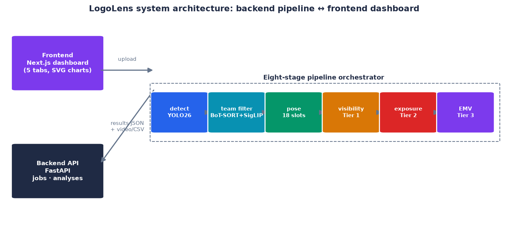
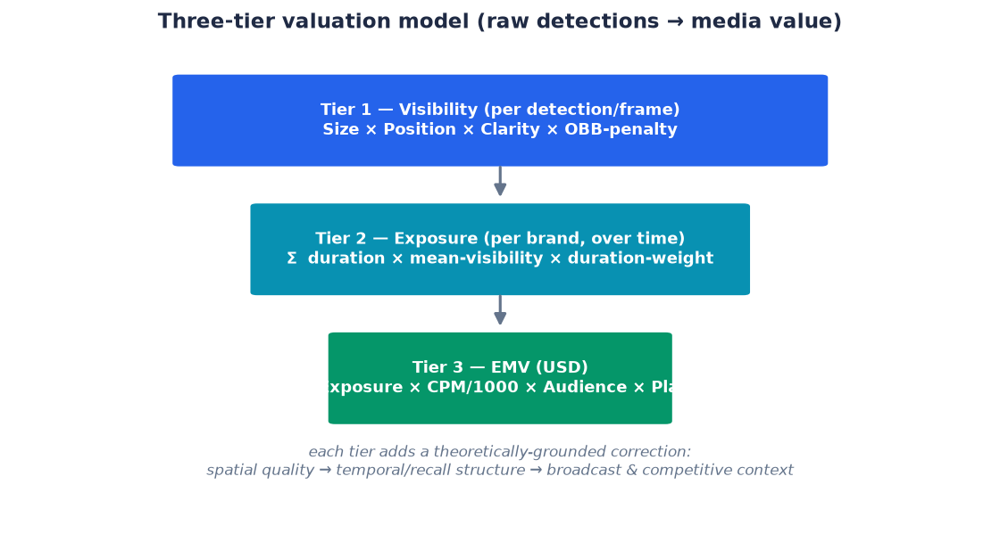
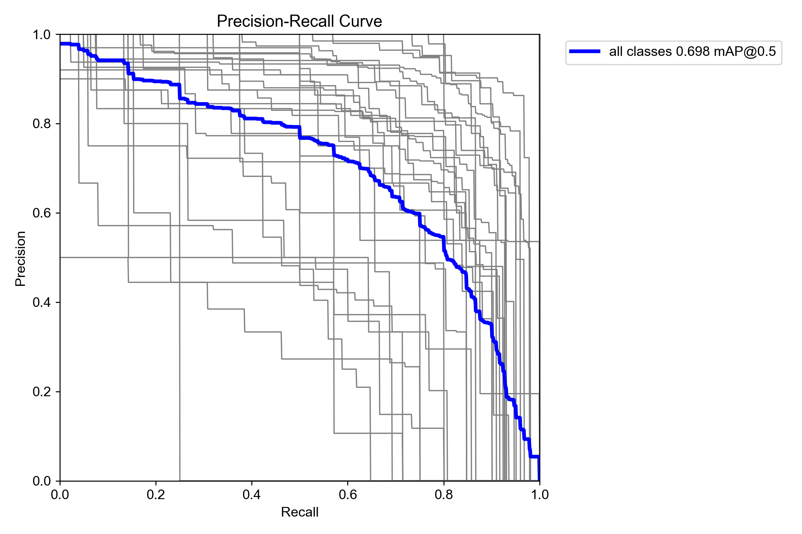
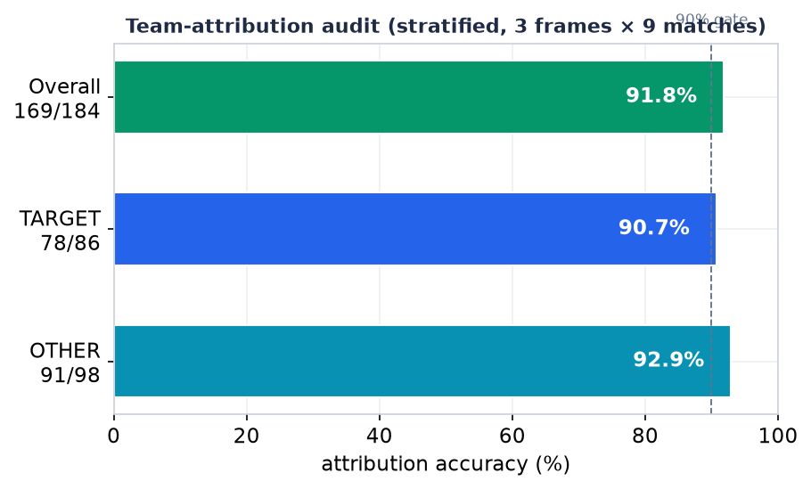
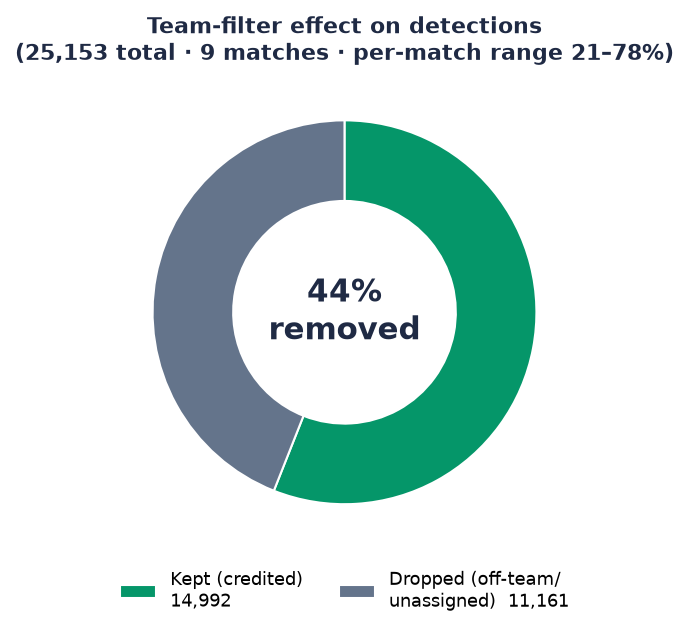
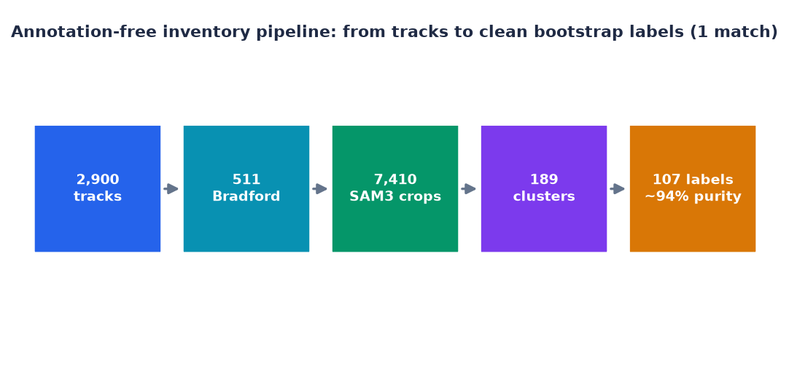

# From Creation to Valuation: A Self-Improving Computer-Vision System for Measuring and Pricing Advertising Sponsorship in the Age of Artificial Intelligence

### A case study of the LogoLens system on Bradford Bulls rugby-league broadcasts

---

**Dissertation**
Programme: MSc Data Science / Artificial Intelligence *(assumed — adjust to the actual programme)*
Institution: University of Bradford *(assumed from project context — to be confirmed)*
Author: *[Insert full name]*
Supervisor: *[Insert supervisor's name]*
Academic year: 2025–2026

> **Author's note on numerical transparency.** All quantitative results in this dissertation are drawn from the project's experimental logs (`docs/`, `paper/`, `results.csv` records and manual audits). Figures that have not been directly measured, or that are inferred from run names or configuration, are explicitly flagged with *[to be verified]*. References whose provenance still needs checking are flagged the same way in the reference list. This practice follows academic-integrity norms: no unmeasured figure is reported as if it were measured.

---

## Abstract

Generative artificial intelligence is industrialising the *production* of advertising content: it drafts copy, renders images and video, and generates thousands of message variants in minutes. As the supply of creative material becomes effectively unlimited, the industry's bottleneck shifts from *making* to *evaluating and valuing* — from producing an advertisement to knowing what a placement, an on-screen moment, or a specific position is actually worth in media terms. This dissertation addresses precisely that under-examined side through **LogoLens**, an end-to-end computer-vision system that measures the on-screen exposure of sponsor logos in sports broadcasts and converts it into Equivalent Media Value (EMV). The system comprises a processing backend (FastAPI) that orchestrates an eight-stage pipeline — logo detection with a fine-tuned YOLO26 model, reference-based team filtering, assignment of each logo to one of eighteen sellable kit "slots" via pose estimation, a three-tier visibility-to-value scoring model, and EMV aggregation — connected to a frontend dashboard (Next.js) that visualises results across matches. On rugby-league broadcasts the detection module reaches **mAP@0.5 = 0.745** under a clip-disjoint protocol (P 0.65 / R 0.74), while a stratified manual audit places team-attribution accuracy at **91.8% (169/184)**; the team filter removes **44%** of detections that would otherwise be mis-credited, protecting the integrity of the revenue figure. Beyond the production architecture, the dissertation presents a next-generation methodological branch — a *self-improving, annotation-free data engine* — that exploits three otherwise-discarded signals (existing logo assets, the known per-event sponsor roster, and the temporal redundancy of video) to auto-label broadcasts and distil a real-time detector. The contribution is threefold: (i) a working, low-cost, reproducible sponsorship-valuation system; (ii) a theoretical re-framing that positions AI-driven *valuation* as the necessary counterpart to AI-driven *creation* in the future of advertising; and (iii) empirical evidence for the *democratisation* of a measurement capability that was previously the preserve of large clubs alone. Keywords: advertising valuation, sponsorship measurement, EMV, logo detection, computer vision, foundation models, AI and advertising creativity.

*(~320 words)*

---

## Acknowledgements

I am grateful to my academic supervisor for shaping the direction of this work and, in particular, for the suggestion to connect this technical project to the theoretical framing of the special issue *"AI and the Future of Advertising Creativity"* — a connection that elevated the project from an engineering artefact into a question of genuine scholarly interest. I thank Bradford Bulls and the associated stakeholders for providing a real business context and official kit materials. I am also indebted to the open-source community — the Ultralytics, Segment Anything and DINOv2 teams, and the wider scientific Python ecosystem — whose tools made a study of this scope feasible for a single researcher. Finally, I thank my family and friends for their patience throughout.

*(~150 words)*

---

## Table of Contents

1. **Introduction**
   1.1. Background: from a scarcity of creation to a scarcity of valuation
   1.2. Problem statement
   1.3. Research questions and objectives
   1.4. Scope and delimitations
   1.5. Contributions
   1.6. Structure of the dissertation
2. **Literature Review**
   2.1. Artificial intelligence and the future of advertising creativity
   2.2. The economics of sports sponsorship and the valuation problem
   2.3. Measuring media value: from manual to automated
   2.4. Logo detection and recognition in computer vision
   2.5. Foundation models, weak supervision and synthetic data
   2.6. Research gap
3. **Methodology**
   3.1. Design philosophy and epistemological stance
   3.2. System architecture: backend ↔ frontend
   3.3. The eight-stage processing pipeline
   3.4. The three-tier valuation model
   3.5. The team filter and the revenue-attribution problem
   3.6. The eighteen-slot sponsorship model
   3.7. The next-generation branch: a self-improving, annotation-free data engine
4. **Project Implementation and Case Study**
   4.1. The Bradford Bulls context
   4.2. Data and training pipeline
   4.3. Backend implementation
   4.4. Frontend implementation
   4.5. Digital twin and synthetic data
   4.6. Engineering practice and technical pitfalls
5. **Results and Evaluation**
6. **Discussion**
7. **Limitations**
8. **Conclusion and Future Work**
- References
- Appendices

---

## List of Figures

- **Figure 1.** LogoLens system architecture: backend pipeline ↔ frontend dashboard — §3.2
- **Figure 2.** The three-tier valuation model (raw detections → media value) — §3.4
- **Figure 3.** Per-class instance distribution of the training set (17 classes, 10,654 boxes) — §4.2.1
- **Figure 4.** Bounding-box geometry and label analysis (class, centre, size) — §4.2.1
- **Figure 5.** Detection accuracy under three data-split protocols — §4.2.2
- **Figure 6.** Qualitative detection output on held-out frames (identity-redacted) — §5.1
- **Figure 7.** Training dynamics of the clip-disjoint run (metrics and loss) — §5.1
- **Figure 8.** Normalised confusion matrix (clip-disjoint split) — §5.1
- **Figure 9.** Per-class precision–recall curves — §5.1
- **Figure 10.** Team-attribution accuracy from the stratified manual audit — §5.1
- **Figure 11.** Team-filter effect on detections (44% removed) — §5.1
- **Figure 12.** Quality-weighting shifts value to high-confidence detections — §5.2
- **Figure 13.** Parameter sensitivity (visibility vs confidence floor) — §5.3
- **Figure 14.** Sampling-rate bias (2 fps over-measures by +63%) — §5.3
- **Figure 15.** Annotation-free inventory pipeline funnel (one match) — §5.4
- **Figure 16.** Honest evaluation of the distilled annotation-free student — §5.4

*(Figures 4, 8 and 9 are authentic Ultralytics outputs; Figure 6 shows authentic model predictions with club-identifying overlays redacted; the remaining figures are plotted from the project's verified experimental records.)*

---

# Chapter 1. Introduction

## 1.1. Background: from a scarcity of creation to a scarcity of valuation

For almost a century the economics of advertising were shaped by one fundamental scarcity: the scarcity of *creation*. The big idea, the storyboard, the finished commercial — all were expensive, slow, and dependent on rare human talent. The entire structure of agencies, of pitch processes, and of how creative services were priced was built on the assumption that good advertising content is costly and hard to make. The wave of generative artificial intelligence (generative AI) is dismantling that very foundational assumption. Modern tools can draft dozens of copy variants, render images and video, and produce thousands of personalised message variations in minutes (Davenport et al., 2020; special issue *AI and the Future of Advertising Creativity*, Journal of Advertising Research, 2025). When the marginal cost of producing one unit of creative content approaches zero, the old scarcity dissolves — and a new one appears.

The new scarcity is a *scarcity of valuation*. If a system can generate ten thousand variants of a campaign, the urgent question is no longer "how do we make content?" but "which variant, which placement, which on-screen moment is actually worth anything, and how much?". The special issue's call for papers expresses precisely this when it states that generative AI is reordering how advertising creative is *imagined, made, evaluated, and valued*. The great bulk of scholarly and commercial attention has gone to the first two verbs — *imagining* and *making*. This dissertation argues that the latter two — *evaluating* and *valuing* — are where economic value is actually locked in, and where an AI measurement system becomes the necessary counterpart to an AI creation system. Without reliable valuation, the explosion in creative supply produces only noise; with it, that explosion becomes a functioning market.

The specific context the dissertation examines is **sports sponsorship** — one of the oldest and most valuable forms of advertising, in which brands pay for their logos to appear on players' jerseys, on perimeter boards, and on broadcast surfaces. Unlike traditional television advertising with its clear durations and rate cards, the value of sponsorship is *implicit* and *diffuse*: a chest logo may appear for three seconds in a close-up and then vanish into a ruck, its size and clarity changing continuously with the camera angle. Turning this chaotic stream of exposure into a monetary figure — what the industry calls Sponsorship Media Value (SMV) or Equivalent Media Value (EMV) — has long been the preserve of expensive vendors (Nielsen Sports, Relo Metrics, GumGum Sports) that only elite leagues and clubs can afford. Mid-tier clubs such as Bradford Bulls — the subject of this case study — fall outside the reach of measurement tooling, and therefore cannot prove value to their sponsors with data.

## 1.2. Problem statement

The research problem can be stated at two interlocking levels. At the *technical* level, automated sponsorship measurement runs into a chain of hard computer-vision challenges: logos are small, deformable, and frequently occluded; the same logo appears on both teams' jerseys, on LED boards, and in broadcast graphics, which makes correct *attribution* to the paying party the crux of the task; and every competition and every season brings a different set of sponsors, forcing traditional closed-set detectors to re-annotate thousands of frames and retrain whenever a new sponsor appears. At the level of *organisational economics*, annotation cost that grows linearly with each new competition makes existing solutions impossible to scale down to the small-club segment — exactly the segment that most needs its valuation capability democratised.

The result is a double gap: small clubs lack both the *technical* tool to measure and the *conceptual* tool to place AI-driven measurement within the larger picture of the future of advertising. This dissertation fills both: it builds and evaluates a working system, and it positions that system within the scholarly conversation about AI and advertising creativity.

## 1.3. Research questions and objectives

The dissertation is driven by one overarching research question:

> **RQ:** How can a computer-vision system measure and price the on-screen exposure of sponsor logos in sports broadcasts accurately, reproducibly, and at a cost low enough to democratise a valuation capability previously reserved for large organisations?

This is decomposed into four sub-questions:

1. **RQ1 (Detection and attribution):** What detection accuracy and revenue-attribution accuracy can a fine-tuned logo detector combined with a reference-based team filter achieve on real broadcasts, and how do these figures change across evaluation protocols?
2. **RQ2 (Valuation):** How can a per-frame detection stream be converted into a methodologically grounded EMV figure, and what does a model that prices by *logo position* (kit slot) contribute to commercial decisions?
3. **RQ3 (Scalability and self-improvement):** Can the manual-annotation bottleneck be removed by a self-improving data engine that exploits freely available signals (logo assets, the sponsor roster, temporal redundancy), and what are the empirical limits of that approach?
4. **RQ4 (Theoretical significance):** How does automating advertising *evaluation and valuation* with AI position itself within the theoretical framing of the future of advertising creativity, and what form of *human–AI co-creation* does it suggest?

Correspondingly, the **objectives** are: to design and implement the end-to-end pipeline (backend ↔ frontend); to build and justify the three-tier valuation model; to prototype the annotation-free branch and evaluate honestly both its successes and its failures; and to synthesise a theoretical argument tying the work to the AI–advertising discourse.

## 1.4. Scope and delimitations

The dissertation focuses on *measuring and pricing* the on-screen exposure of logos on **players** (jersey sponsorship) in rugby league, with Bradford Bulls as the case study. Other surfaces (perimeter LED boards, broadcast graphics) are handled at the level of filtering and exclusion rather than being the primary object of valuation in the current version. The dissertation does *not* claim to build an econometric model that forecasts sponsorship revenue; EMV here is an industry-standard *proxy* for exposure value, not an actual sale price. It also performs no personal identification of players or spectators — a deliberate choice for ethical reasons (see Chapter 7). Finally, the reported performance figures are at the scale of a single-researcher project (dozens of matches, one sport, one primary club); cross-domain generalisation is discussed but not proven at large scale.

## 1.5. Contributions

The dissertation makes three contributions, spanning a technical-to-theoretical axis:

- **Contribution 1 (System).** An end-to-end, reproducible, low-cost sponsorship-valuation system: an eight-stage pipeline coupling YOLO26, reference-based team classification, pose estimation, and a three-tier valuation model, connected to a multi-match analytics dashboard. The whole runs on consumer-grade hardware at roughly real time.
- **Contribution 2 (Annotation-free method).** A *self-improving data engine* that re-frames the problem from "annotation" to "exploiting discarded information", together with an honest evaluation (including data-starved failures) of its feasibility.
- **Contribution 3 (Theory).** An argument that positions *AI-driven valuation* as the necessary counterpart to *AI-driven creation*, and a framework of *human–AI co-creation in measurement* in which the human role shifts from "annotator" to "auditor", supported by evidence of democratising valuation capability for small organisations.

## 1.6. Structure of the dissertation

Chapter 2 reviews the four literatures that intersect at this topic. Chapter 3 presents the methodology and detailed system architecture. Chapter 4 describes the implementation and the Bradford Bulls case study. Chapter 5 reports and evaluates the experimental results. Chapter 6 discusses theoretical and practical implications. Chapter 7 states the limitations. Chapter 8 concludes and proposes future work.

*(~1,520 words for Chapter 1)*

---

# Chapter 2. Literature Review

This topic sits at the intersection of four research streams that are rarely read together: (i) the discourse on AI and advertising creativity in marketing science; (ii) the economics and measurement of sports sponsorship; (iii) logo detection and recognition in computer vision; and (iv) foundation models and weak supervision. This chapter reviews each critically and then synthesises the research gap the dissertation targets.

## 2.1. Artificial intelligence and the future of advertising creativity

Research on AI in marketing has moved from a phase of general forecasting (Davenport et al., 2020; Huang & Rust, 2021) to a phase of concrete investigation into how generative AI affects the *creative process* itself. The Journal of Advertising Research special issue that frames this dissertation — *AI and the Future of Advertising Creativity* — casts generative AI as a force collapsing the constraints that traditionally limited advertising creativity, and invites study of how content is *imagined, made, evaluated, and valued*. In parallel, the Journal of Advertising's call for papers *Generative AI and Advertising: Building New Theoretical Frontiers* emphasises the need for new theory for this phenomenon (ISPR, 2025).

A prominent theme in this stream is *human–AI value co-creation*. Recent studies examine how advertising professionals perceive their own role once AI enters the workflow, showing that value is created not by AI *replacing* humans but by a redistribution of cognitive labour (International Journal of Advertising, 2026 [citation detail to be verified]). A more critical strand — a *maieutic* (question-asking) approach to AI advertising (Journal of Advertising, 2022) — warns that automation is not value-neutral and must be continually interrogated.

The blind spot of this stream, for the purposes of this dissertation, is that it speaks almost exclusively about the *creative supply side*: what AI produces, and how humans feel about it. Very little work addresses the *evaluation and valuation side* — even though the call for papers lists "evaluated and valued" on equal footing with "imagined and made". This dissertation argues that this is no minor detail: as generative AI causes the supply of creative material to explode, the capacity to *distinguish what is worth anything* becomes the new binding constraint. An AI system that measures exposure value therefore does not sit outside the advertising-creativity discourse — it is the missing half of that very discourse.

## 2.2. The economics of sports sponsorship and the valuation problem

Sports sponsorship is fundamentally different in nature from paid media: its value is indirect, tied to emotion and context, and hard to disentangle from the effect of the event itself (Cornwell, 2019; Cornwell & Kwon, 2020). The psychological basis of signage effectiveness has been studied in depth: Breuer and Rumpf (2012), and Rumpf, Boronczyk and Breuer (2020), show that *exposure characteristics* — size, duration, position, motion, and contrast — strongly predict a viewer's brand recall. This is the direct theoretical basis for why a measurement system must *quality-weight* exposure rather than merely counting raw duration — the principle that the three-tier visibility model in this dissertation implements.

On the monetary side, the industry has converged on the SMV/EMV concept: converting quality-adjusted exposure duration into "the equivalent cost of buying advertising for the same amount of attention" (Nielsen Sports, 2019; Relo Metrics, 2022 [to be verified]). The EMV approach is justly criticised as a crude estimator of *attention* rather than *business impact*, and is easily inflated if it counts exposures that produce no recall. Nonetheless it remains the common language in which parties negotiate, and is therefore the correct pragmatic output for an application-oriented system. The dissertation adopts EMV as an *industry-standard proxy* while explicitly acknowledging its epistemological limits (Chapters 6–7).

## 2.3. Measuring media value: from manual to automated

Historically, sponsorship measurement was performed manually: staff reviewed footage and timed each logo appearance by stopwatch — a slow, expensive process with poor inter-observer consistency. The first generation of automation used computer vision to detect logos frame by frame, commercialised by vendors such as GumGum Sports, Hive and Relo Metrics. More recently, the academic *ExposureEngine* work (arXiv 2510.04739 [to be verified]) reports mAP 0.859 with oriented bounding boxes (OBB) on soccer data, and proposes a valuation pipeline coupled to detection. This dissertation inherits several principles from that stream — in particular the idea of using OBB to correct the area of a logo skewed by the camera angle — but adds three elements that commercial literature rarely discloses: (i) an explicit *team filter* to count only exposure that belongs to the paying party; (ii) a model that prices *by position* on the kit; and (iii) a commitment to being *reproducible and low-cost* in order to serve the neglected segment.

An important gap in the measurement literature is the *absence of a public ground truth with sponsorship-ownership labels*. Large sports benchmarks such as SoccerNet-v2 (Deliège et al., 2021) provide player, ball, and event labels, but no label for "which sponsor does this logo belong to, and to which team". This absence forces every valuation system to build its own evaluation mechanism — and, as the dissertation argues, makes *controlled manual audit* a mandatory methodological component rather than an optional one.

## 2.4. Logo detection and recognition in computer vision

Logo detection is a specialised branch of object detection with its own difficulties: small objects, non-rigid deformation (on jersey fabric), a large and imbalanced class set, and an *open-set* requirement — the system must handle brands never seen during training. Closed-set detectors based on CNNs/transformers (the YOLO family — Redmon et al., 2016; Jocher et al., 2023; the DETR family) achieve high accuracy on a fixed class set but do not generalise to new brands without retraining. To address openness, the *open-set logo retrieval* stream matches detected regions against a gallery of exemplars: OSLD and SeeTek (Tüzkö et al.; Xu et al.) are representatives, with SeeTek fusing visual embeddings with scene text to scale to large brand sets. The dissertation inherits the idea of an expandable gallery, and extends it with three channels — visual ⊕ text ⊕ colour — together with a *roster prior* specific to sports.

The crucial point that the logo-detection literature often overlooks, yet which is decisive in the sponsorship context, is *owner attribution*. A correctly detected logo can still be mis-priced if it sits on an opponent's jersey or on an LED board. This problem is essentially one of *team assignment*, close to the SoccerNet Game State Reconstruction challenge, where leading solutions use colour/embedding clustering plus tracklet voting rather than training a per-match model (because opponents' kits change continually). The dissertation applies exactly this reference-based family of techniques to its team filter.

## 2.5. Foundation models, weak supervision and synthetic data

The recent turning point that allows the annotation problem to be re-framed is the maturation of visual *foundation models*. Open-vocabulary detectors (Grounding DINO — Liu et al., 2023; DINO-X) and promptable segmenters (Segment Anything — Kirillov et al., 2023; SAM 2 — Ravi et al., 2024; SAM 3 [to be verified]) enable zero-shot *pseudo-labels*. In particular, the ability to segment by an *exemplar-prompted concept* and to *track* an object through video opens the possibility of labelling an entire broadcast from a single logo exemplar per brand. DINOv2 self-supervised embeddings (Oquab et al., 2023) provide strong visual representations for clustering *real-with-real* crops — a detail the dissertation found decisive: DINOv2 clusters real↔real well but fails at matching real↔clean-template, an empirical lesson presented in Chapters 3 and 5.

To fuse multiple noisy label sources into a clean training signal, the *programmatic weak supervision* stream — exemplified by Snorkel (Ratner et al., 2017) — provides a *label model* that aggregates conflicting *labelling functions*. Complementing it, *temporal track refinement* uses the continuity of tracks to recover missed detections and discard flickering noise. Finally, to cover rare conditions (steep angles, glare, rain), synthetic data — from copy-paste, through diffusion compositing, to a *digital twin* built with 3D Gaussian Splatting (Kerbl et al., 2023) with lighting-aware logo insertion — can generate photorealistic frames with pixel-perfect labels. The dissertation integrates all four ideas in its next-generation branch (Section 3.7).

## 2.6. Research gap

Synthesising the four streams reveals a structural gap. Stream (i) discusses AI *creation* extensively but leaves AI *valuation* open; stream (ii) has a solid valuation theory but its measurement methods are largely manual or locked inside non-reproducible commercial products; stream (iii) has strong detection techniques but rarely handles *revenue attribution* and *position-based pricing*; stream (iv) provides the tools to break the annotation bottleneck but has not been tested in a low-cost sponsorship-valuation setting. No prior work *simultaneously* (a) builds a reproducible end-to-end sponsorship-valuation system, (b) evaluates it honestly with controlled audits across multiple protocols, and (c) positions it within the theoretical framing of the future of advertising creativity as an act of *human–AI co-evaluation*. This dissertation targets exactly that intersection.

*(~1,700 words for Chapter 2)*

---

# Chapter 3. Methodology

## 3.1. Design philosophy and epistemological stance

The methodology combines *design science* — in which knowledge is produced by building and evaluating an artefact — with a *case study* as the testing context. Three design principles run throughout and shape every technical decision.

First, **generality**: the system must let another club "drop in their own logos and run" without code changes. This principle rules out solutions hard-coded to Bradford Bulls and favours reference-based mechanisms configured through environment variables.

Second, **revenue-safety**: when the system is uncertain, it must err *towards not deducting from the client's count* rather than inflating it. This principle governs the team filter's keep/drop policy (retaining tracks that lack sufficient evidence rather than discarding them arbitrarily).

Third, **measurement integrity**: because there is no public ground truth, every reported figure must be traceable to a transparent evaluation process, and any unmeasured figure must be flagged as unmeasured. The foundational lesson here — learned painfully during development — is that *"one must not take the teacher model's output as the gold standard for grading itself"*, because doing so produces self-confirming phantom numbers.

Epistemologically, the dissertation strictly distinguishes three kinds of claim: (a) *operational claims* — what the system does, measured by its own output; (b) *accuracy claims* — how correct the system is, asserted only against an independent human evaluation; and (c) *value claims* — what an EMV figure means economically, always stated with assumptions. This distinction is maintained throughout the results.

## 3.2. System architecture: backend ↔ frontend

The system is divided into two loosely coupled halves communicating over an HTTP API, allowing independent development and scaling.

```
Frontend (Next.js :3000)  --upload video-->  Backend (FastAPI)
   5-tab dashboard         <--poll job JSON--   - job queue (in-process)
                           <--result + video--  - pipeline orchestrator
                                                 - SQLite (-> Postgres)
                                                 - local storage (-> S3)
                                                        |
                           YOLO26 logo · YOLO11 person + BoT-SORT ·
                           jersey classifier (colour + SigLIP) · YOLO11-pose ·
                           YOLO11-seg / DensePose (overlay)
```



**The backend** (`backend/`) contains the "main processing engine": a FastAPI application exposing endpoints to create jobs, poll progress, and retrieve results (`/api/jobs`, `/api/analyses`). The key design point is that *all infrastructure sits behind an interface*: the database (SQLite in development, swappable to Postgres), storage (local, swappable to S3), and job queue (in-process, swappable to a distributed queue) are all abstracted, so upgrading to a production stack requires only environment-variable changes rather than edits to the pipeline logic. This is the generality principle at the infrastructure layer.

**The frontend** (`logo-analytics/`) is a Next.js dashboard with five analytics tabs (Overview, Match Videos, Brand Insights, Analytics Report, Body Segmentation). A notable design detail: all charts (donut, trend, heatmap, radar, scatter) are *hand-written in SVG* in `components/dashboard/charts.tsx`, with no external chart library. This choice trades development effort for full control over visualisation and interactivity, while reducing the dependency surface — appropriate for a product aimed at sustainable deployment.

## 3.3. The eight-stage processing pipeline

The heart of the backend is the *orchestrator* (`app/pipeline/orchestrator.py`), which runs eight stages sequentially per job and continuously updates the `stage`/`progress` fields so the frontend can show real-time progress. An important engineering principle: every optional stage *degrades gracefully* — an error only logs a warning, and the job completes with a partial result rather than crashing entirely.

| Stage | Progress | Work |
|---|---|---|
| `frames` | 5% | Read video metadata (duration, fps, size) |
| `team` | 8% | If no references exist: bootstrap kit references from the video itself |
| `detect` | 10→80% | Main loop (sampled at 2 fps): YOLO26 logo detection (imgsz 1280) → visibility scoring → team filter → assign logo to a slot via pose |
| `exposure` | 92% | Group detections into continuous per-brand segments |
| `pricing` | 98% | Convert to EMV per brand |
| `preview` | 98% | Full-fps annotated video (boxes + labels), mux the **original audio** |
| `bodyseg` | 98% | Body-part overlay video (YOLO-seg or DensePose) |
| `done` | 100% | Persist the Analysis record to DB + storage |

A subtle design decision is the **two separate detection passes**. The *analytics* pass samples sparsely (SAMPLE_FPS = 2/second) — accurate enough to estimate *duration* while being computationally cheap, and it is the source of every EMV figure. The *preview* pass runs at full fps (capped by PREVIEW_MAX_FRAMES) to produce a smooth review video with boxes hugging each logo frame by frame. This split acknowledges that *measurement* and *presentation* have different frequency requirements and optimises each separately. (A methodologically important consequence: the preview pass currently does not run the team filter, so its boxes show every logo; the EMV figures are always filtered. As Chapter 5 shows, the sampling rate *does* systematically affect the final figure, so the choice of 2 fps is not neutral.)

The pipeline output is a complete JSON record (`aggregate.build_analysis_result`) comprising: a `logos[]` array (segments, exposure seconds, quality exposure, average visibility, EMV per brand); `bodyZones[]` (18 kit slots with % exposure); `teamFilter` (kept/dropped/dropRate); and `detectionTimeline[]` (on-screen intervals per brand, used to draw the player timeline).

## 3.4. The three-tier valuation model

The *academic* core of the system — and the answer to RQ2 — is a three-tier valuation model that turns a raw detection stream into a grounded monetary figure. The model builds on the sponsorship-signage effectiveness literature (Section 2.2) and the industry EMV standard.

**Tier 1 — Visibility Score, computed per detection per frame.** Four components are multiplied together:

```
Visibility = Size × Position × Clarity × OBB_penalty
```

- `Size = sqrt(box_area / frame_area)` — a square root avoids letting one very large logo (a close-up) dominate everything, reflecting the psychological law that visibility does not grow linearly with area.
- `Position = exp(-dist_from_center^2 / (0.3·W)^2)` — a Gaussian weighting the screen centre highly (where the viewer's eye concentrates) and decaying towards the corners.
- `Clarity` = the YOLO confidence score, standing for the logo's clarity/certainty.
- `OBB_penalty = area_HBB / area_OBB` — a correction factor when a logo is skewed by the camera angle: an upright bounding box (HBB) exaggerates the area of a tilted logo, so the ratio to the oriented box (OBB) pulls the area back to its true value. This principle is inherited from ExposureEngine (mAP 0.859 with OBB on soccer [to be verified]).

A floor `VISIBILITY_FLOOR = 0.02` excludes detections that are too small/off-centre from forming a segment. This floor is much lower than the 0.1 proposed in some literature, and the choice is *deliberate and empirically tested*: real sponsor logos typically have visibility ~0.03–0.08 because they are small and off-centre, so a 0.1 floor would discard almost all genuine signal. The sensitivity analysis (Chapter 5) quantifies this trade-off.

**Tier 2 — Exposure Score, aggregated over time per brand.** Detections *that have passed the team filter* are linked into continuous *segments* (thanks to track-ids from BoT-SORT), then:

```
Quality Exposure (seconds) = Σ_segment [ duration × mean(visibility) × duration_weight ]
```

Segments shorter than `MIN_SEGMENT_SECONDS = 0.5` are discarded (flicker, noise). The *duration weight* encodes the recall law: a segment < 1s gets weight 0.5 (too short to remember), 1–5s gets 1.0 (standard), and > 5s gets 1.2 (sustained, higher-value exposure). This tier's output includes `total_exposure_seconds`, `quality_exposure_seconds`, `avg_visibility_score`, `segment_count` and `longest_segment_seconds` per brand.

**Tier 3 — Equivalent Media Value (EMV), converted to USD.** The core formula currently implemented:

```
EMV = QualityExposure(s) × (CPM / 1000) × AudienceSize × PlacementMultiplier
```

where `CPM` (cost per thousand impressions) and `AudienceSize` are entered at upload; `PlacementMultiplier` reflects the broadcast type (Live TV = 1.0; Highlight = 1.4 because it is replayed; Stream = 0.85; Social = 0.7). The full specification (`LOGOS_Exposure_Pricing_Algorithm.md`) also defines two additional multipliers — a *Category Multiplier* (share of voice: category exclusivity 1.25; competitor in the same frame 0.80) and a *Prime-Time Multiplier* (first/last 15 minutes 1.30) — to extend the model when contextual data is available. A reference CPM table by event type (mass-market sport $15–25, premium $35–60, esports $8–15) provides sensible defaults when the user has no figure of their own.



The methodological value of the three-tier model, relative to the naive approach (frame count × CPM), lies in each tier introducing a theoretically grounded correction: Tier 1 corrects for *spatial exposure quality*, Tier 2 for *temporal structure and recall*, and Tier 3 for *broadcast and competitive context*. This chain of corrections turns a raw count into a defensible estimate of attention.

## 3.5. The team filter and the revenue-attribution problem

If the valuation model answers "what is worth how much", the team filter answers "to whom that worth belongs". The problem: many sponsors appear on *both* teams' jerseys, on LED boards, and on referees' shirts; a detector trained only on the Bradford kit still matches similar logos elsewhere, inflating EMV. A client who buys a slot on the Bradford jersey should be credited only for appearances of the logo on Bradford players.

The design (ported from the `team_detection/` prototype into `backend/app/pipeline/teamid/`) follows exactly the family of techniques used by leading SoccerNet solutions — colour/embedding clustering plus tracklet voting — and *trains no dedicated model*, because opponents' kits change each match, so a reference-based approach that adapts per match is more robust. The per-sampled-frame flow:

```
YOLO11 person + BoT-SORT -> stable track_id per player
   -> crop jersey band (15-45% of bbox height, excluding grass + skin pixels)
   -> classify = fuse(colour histogram, SigLIP embedding)
        (weights learned from the refs themselves: black/white kit -> colour wins)
   -> VoteTracker: accumulate votes per track + 1.25x hysteresis
   -> assign logo -> person (smallest bbox containing the logo centre, else nearest)
   -> owner == TARGET ? keep : drop
```

Kit references are established at three levels with *no mandatory manual step*: (1) a hand-built refs file if present (override only); (2) auto-bootstrap + kit anchors — cluster players in the first 32 frames and pick the cluster most similar to the official kit image (`KIT/*.jpg`); (3) auto-bootstrap + luminance — a dark away kit means picking the darkest cluster. Level 2 is the practical default.

The keep/drop policy directly embodies the *revenue-safety* principle: owner is TARGET → keep; owner is OTHER but the track has *insufficient votes* (`TEAM_KEEP_UNKNOWN = true`) → still keep (no evidence, no deduction from the client); owner is OTHER with enough votes → drop; not attachable to any person (LED board, crowd) → drop. This deliberate asymmetry — keep when in doubt, drop only when certain — turns a technical decision into a *commercial-ethical* one.

## 3.6. The eighteen-slot sponsorship model

The second contribution to RQ2 is *position-based pricing*. Rather than treating "a logo on the jersey" as uniform, the system assigns each detection — via keypoints from YOLO11-pose (`bodyzones.py`) — to one of *eighteen sellable kit slots*, not to an anatomical region. The slot groups are: chest (chest-center/l/r), shoulder–arm (shoulder-l/r, sleeve-l/r), back (back-top/center/lower), abdomen, shorts (shorts-front-l/r, shorts-back, shorts-leg-l/r), and socks (sock-l/r). Skin regions (head, bare arms, thighs, boots) *have no slot* — a logo is never mis-assigned there.

The commercial meaning: the percentage of exposure per slot becomes the basis for micro-pricing — a slot that shows more is worth more, letting a club price *differently* for each logo position rather than one flat rate. This is precisely where measurement work touches the *creative side* of advertising: it turns "where on the jersey" into a priced design variable that informs, in reverse, the decision of *where to place the logo*. The frontend realises this with a rotatable 3D model, colouring the 18 slots and ranking them by % exposure — a visual tool for pitching position-based pricing.

## 3.7. The next-generation branch: a self-improving, annotation-free data engine

The production architecture above still depends on a detector fine-tuned on manual labels. To answer RQ3 — whether the annotation bottleneck can be broken — the dissertation develops and tests a next-generation methodological branch, a *self-improving data engine*, that re-frames the problem from "annotation" to "exploiting discarded information". Three free signals are routinely ignored:

1. **Assets exist.** Vector/PNG logo files of every sponsor already exist — natural visual *exemplars*.
2. **The roster is known.** A single match admits only ~10–30 plausible brands; this *roster prior* collapses open-world recognition into a *closed-set-per-event* task, removing off-roster false positives at zero cost.
3. **Video is redundant.** A physical logo persists across hundreds of consecutive frames; one decision can label an entire track.

Building on these signals, the teacher–student pipeline works as follows. A heavy *teacher* — exemplar-prompted concept segmentation (SAM 3 [to be verified]) combined with OCR reading the brand name, DINOv2 *real↔real* embedding clustering, and the roster prior — auto-labels an entire broadcast from one exemplar per brand; a Snorkel-style *label model* fuses the noisy label sources into a clean label with a confidence; *temporal refinement* back-propagates long, stable tracks to recover missed frames and discard flickering ones. Identity is resolved by a *multimodal logo fingerprint* — visual ⊕ text ⊕ colour — allowing the gallery to expand *with no training*. To cover rare conditions, a *digital twin* built with 3D Gaussian Splatting inserts real logos with lighting-aware compositing, producing photorealistic frames with pixel-perfect labels. Finally, the teacher's labels (real + synthetic) *distil* a real-time YOLO *student*; each event enlarges the gallery and the student — a *self-improving flywheel*.

An *inventory* variant of this idea — suited to on-kit sponsorship — exploits *Kit Regulation*: a whole team wears one identical kit all season, so the chest logo of every player, every minute, every match (of the same kit) is the *same* sponsor. The problem therefore is not "classify N million blurry crops" but *inventory*: identify each physical surface *once* at the sharpest moment of the season (a close-up, logo 200px+), after which every blurry crop needs only to be *assigned to which surface* (an easy geometric problem) and inherit the label. This insight turns a hard recognition problem into a much easier accounting one — and is the dissertation's own methodological contribution to on-kit sponsorship.

An integrity point must be stressed: this branch is presented *together with its failures* (Chapter 5). "Annotation-free" here properly means *no labels for training*; the system still requires roughly 30 minutes of human confirmation for the *measurement* step so that the numbers are trustworthy — exactly per the measurement-integrity principle of Section 3.1.

*(~2,550 words for Chapter 3)*

---

# Chapter 4. Project Implementation and Case Study

This chapter moves from *design* to *implementation*: it describes building the system on a real club, the concrete engineering choices, and the deployment lessons that only "getting your hands on real data" reveals. Throughout, the chapter maintains a critical voice: each success is told alongside its cost and its conditions.

## 4.1. The Bradford Bulls context

Bradford Bulls is a historically significant rugby-league club that currently competes outside the sport's financial elite — precisely the "mid-tier" segment the dissertation aims to serve. The club sells multiple kit sponsorship slots to local and regional businesses (the project data features brands such as KLG, MCP, Floor Tonic, ACS Group, MNA Cladding, Bartercard, AON and Romantica, among others). The business question each sponsor poses is very concrete: *"How much does my logo appear, how clearly, and how much is it worth in media terms?"*. Before this project the club had no quantitative tool to answer — exactly the gap that provided the practical motivation.

The Bradford context also supplies *hard conditions* ideal for testing robustness: many matches are broadcast on low-quality streams, filmed at night under floodlights, with "dark-kit-versus-dark-kit" fixtures (for example against Toulouse, both teams in dark shirts) — situations that push the team classifier to its limits. Source video was collected from full matches published publicly on YouTube (downloaded with `yt-dlp`), spanning several seasons and lighting conditions.

A contextual detail with methodological significance is the *seasonal kit change*: Bradford's 2024 kit was yellow-black, whereas the 2025/26 kit-regulation document (`Kit Regulations 2025 SPONSORS SIZINGS.pdf`) describes a white kit. This forced the data-mining process to move to 2025/26 matches so the kit would match the anchor image — a concrete illustration of how much *reference validity* matters in a reference-based system.

## 4.2. Data and training pipeline

The production logo-detection model is a YOLO26 fine-tuned on a deliberately economical dataset: the initial manual annotation seed was on the order of ~1,100 hand-drawn boxes, later grown into an *extended clip-aware* collection. This small scale reflects the real cost constraints of a mid-tier club, and it is precisely this smallness that makes the question of *annotation-free scalability* (Section 3.7) pressing rather than academic.

### 4.2.1. Dataset composition and pre-training statistics (exploratory data analysis)

Before training, the dataset was characterised to understand its structure and biases — an essential step because, as the results will show, the data's properties (class imbalance, object size, spatial distribution) directly shape both the model's behaviour and the design choices in the valuation model. The headline extended clip-aware training set comprises **10,654 annotated logo instances across 17 sponsor classes**. Three properties stand out.

**Property 1 — Class imbalance.** Figure 3 shows the per-class instance count. The distribution is strongly skewed: the most frequent class, `klg` (1,667 instances, the shorts-back sponsor visible in many rucks), has roughly **9.2×** the support of the rarest, `cch` (182 instances). This imbalance is not an artefact to be "fixed" but a faithful reflection of reality — a main shorts/chest sponsor is simply on screen far more than a small sleeve patch — and it directly predicts the per-class performance gap observed later (Section 5.4), where data-starved classes underperform.


**Property 2 — A small-object problem.** Figure 4 (bottom-right panel) shows the joint distribution of bounding-box width and height. The overwhelming majority of logos occupy roughly **3–5% of the frame dimension** — that is, well under 0.3% of the frame area. Sponsor logos are, by nature, tiny, deformable marks on moving fabric. This single property justifies several downstream design decisions: the high detection input resolution (`imgsz` 1280), the OBB area correction (a few pixels of skew matter greatly at this scale), and — critically — the low `VISIBILITY_FLOOR` of 0.02, since a 0.1 floor would discard almost every genuine sponsor logo (a claim later quantified in the sensitivity analysis).

**Property 3 — A centred spatial prior.** Figure 4 (bottom-left panel) shows the box-centre heat map: detections concentrate around the frame centre (roughly x≈0.5, y≈0.45–0.55), consistent with broadcast framing that keeps the ball-carrier — and therefore the jersey logos — near the middle of the shot. This empirical prior is exactly what the Gaussian `Position` term in the Tier-1 visibility score encodes, giving that design choice a data-grounded justification rather than an arbitrary one.


The dataset also distinguishes *kit variants* (each brand carries an `_away`/`_home` suffix), so the effective label set the detector learns is larger than 17 — a necessary refinement because the same sponsor occupies different positions and appears against different kit colours across home and away strips.

### 4.2.2. The data-split protocol and its effect on reported accuracy

An important methodological contribution of the experimental stage was the realisation about the *data split protocol*. The same model yields very different figures depending on how the train/test split is made:

- **Random-frame split:** mAP@0.5 = 0.862 — but this figure is *inflated by leakage*: adjacent frames from the same passage of play land in both train and test, so the model has effectively "seen" almost the same scene.
- **Clip-disjoint split:** mAP@0.5 = 0.702 — more honest, because no clip appears on both sides.
- **Extended, clip-aware split (v2):** mAP@0.5 = 0.745 (P 0.65 / R 0.74) — the current headline figure, balancing data scale against honesty.


The lesson — which the dissertation treats as a contribution to *evaluation integrity* — is that 0.862 is impressive but *must not be cited as true performance*; 0.745 is less attractive but more honest. Proactively reporting the lower figure, with an explanation of the leakage mechanism, is a research-ethics choice.

On training infrastructure: fine-tuning was done on rented cloud GPUs (Google Colab, A100/H100 class) because experiments showed the extended set would take over a week on consumer hardware (one run of 20/300 epochs took 14.2 hours ≈ 42 min/epoch), whereas *inference* runs well on the local machine. The operating model is therefore *"rent to train, own to infer"* — a cost structure especially suited to small organisations.

## 4.3. Backend implementation

The backend is organised into clear modules under `backend/app/`: `api/` (FastAPI routes for jobs, analyses, teamrefs, health), `pipeline/` (all processing logic), `db/` (models and repository), `jobs/` (in-process queue), `storage/` (storage abstraction) and `models_zoo/` (detector registration and loading). This separation realises the "infrastructure behind an interface" principle at the source-code level.

Within `pipeline/`, each stage is its own module: `detect_track.py` (logo detection + tracking), `visibility.py` (Tier 1), `teamid/` (the team filter, comprising `jersey.py`, `features.py`, `classifier.py`, `tracker.py`, `bootstrap.py`), `pose.py` + `bodyzones.py` (slot assignment), `exposure.py` (Tier 2), `pricing.py` (Tier 3), `annotate.py` + `av.py` (preview + audio muxing), and `bodyseg_yolo.py` + `bodyseg.py` (overlay). This modular architecture makes unit testing feasible — the `tests/` directory contains tests for exposure, pricing, bodyzones, teamid and av, a sign of engineering discipline rare in a research prototype.

The API exposes a compact contract: `POST /api/jobs` (multipart: video + eventName + audienceSize + placementType + cpmBase + kit) returns a `jobId`; `GET /api/jobs/{id}` polls `status`/`progress`/`stage`/`stageDetail`; and, when complete, `GET /api/analyses/{id}` returns the full `AnalysisResult` together with media endpoints (`/video`, `/bodyseg-video`, `/export.csv`). This design lets the frontend be a thin, purely presentational client.

## 4.4. Frontend implementation

The `logo-analytics/` frontend turns a dry JSON stream into a decision-making tool. Five tabs serve five different business questions:

- **Overview** — the multi-match portfolio picture: four KPIs (Total EMV, Brands Tracked, Quality Exposure, Avg Visibility), an EMV trend chart over time, a *share-of-voice* donut distributing EMV by brand, and an EMV-by-match ranking.
- **Match Videos** — library and per-match detail: search/filter/sort, and on opening a match: match KPIs, a *team-filter statistics badge* (kept/dropped), a preview video with audio and detection boxes, and a per-brand timeline clickable to seek.
- **Brand Insights** — a single-brand analysis across the system: six KPIs (including EMV/second and quality ratio), an EMV-per-match trend versus the "average brand", and a *5-axis radar* comparing the brand to the portfolio average.
- **Analytics Report** — a filterable, exportable report: a Brand × Match heatmap, an *Appearance Quality Map* (a scatter of duration × visibility, the top-right being "premium inventory"), and PDF/CSV export.
- **Body Segmentation** — a rotatable 3D model with 18 colour-coded slots, hover-to-show %, and a zone ranking — the visual tool for position-based pricing (Section 3.6).

All charts are hand-written, interactive SVG; brand colours are stable across tabs (indexed by EMV ranking) so the user recognises brands consistently. With no backend present, the frontend shows mock data labelled "demo" — a small detail that nonetheless reflects product thinking.

## 4.5. Digital twin and synthetic data

To cover rare conditions that real data seldom contains (steep angles, glare, rain), the project prototypes three synthetic-data sources in increasing order of realism: (i) *copy-paste* of logos onto real backgrounds; (ii) *diffusion inpainting* to insert logos contextually; and (iii) a *digital twin* of the venue built with 3D Gaussian Splatting, into which real logo textures are inserted with lighting-aware compositing and 6-DoF randomisation. The twin's key logic is: *because the background is the real scene and only the logo is inserted, the labels are pixel-accurate while the domain gap stays small*. This is a promising direction but, honestly, at the research stage rather than a fully validated production component — it is presented as a *methodological contribution and future direction* (Chapter 8) rather than a measured result.

## 4.6. Engineering practice and technical pitfalls

Part of the value of the case study lies in the concrete engineering lessons that only real deployment surfaces — they illustrate the gap between "an algorithm on paper" and "a system that runs".

**Windows environment pitfalls.** Training Ultralytics on Windows requires `workers=0` (otherwise a pagefile error, WinError 1455, occurs); any Python command printing Vietnamese needs `PYTHONUTF8=1` to avoid a cp1252 encoding crash; and ffmpeg must be pointed through `imageio_ffmpeg.get_ffmpeg_exe()`. These details are theoretically trivial but decisive for whether the system runs at all.

**Memory and resolution constraints.** The foundation segmentation model hits out-of-memory (OOM) above 1036px resolution on a 16GB GPU because of the O(N²) attention mechanism; the remedy is *tiling* — two horizontal tiles at 644px yield 36% more detected boxes at the same VRAM. This is a textbook example of *hardware constraints shaping the algorithm*, in the spirit of "carefully assess technical constraints at each step".

**Methodological pitfalls within the auto-labelling process itself.** The annotation-free branch (Section 3.7) surfaced several subtle pitfalls: the tracker's *ID-switch* during a ruck causes an already-labelled track to "change owner" (an opponent player enters a cluster carrying a Bradford sponsor label); the foundation segmenter sometimes "fires" on a fabric fold and takes it for a logo; and one instructive semantic pitfall — the player surname "LAWRENCE" printed on the jersey back was confused with a similarly named sponsor, forcing the withdrawal of a false exposure claim in an earlier report. Each pitfall was addressed with a *control gate* (temporal locality against ID-switch, a quality filter against fabric "fire", a semantic rule against player-name confusion) — and the very need to add those gates is empirical evidence for the argument that *automating measurement does not eliminate the human but redistributes the human role towards designing control constraints*.

*(~1,750 words for Chapter 4)*

---

# Chapter 5. Results and Evaluation

This chapter reports the empirical evidence, organised by the four sub-questions. The governing principle (Section 3.1): distinguish *operational* claims from *accuracy* claims, and assert accuracy only where an independent human evaluation exists.

## 5.1. Detection and attribution accuracy (RQ1)

**Logo detection.** As noted in Section 4.2, performance depends strongly on the split protocol. The table below summarises:

| Split protocol | Run | mAP@0.5 | Note |
|---|---|---|---|
| Random-frame | `logo_yolo26m` | 0.862 | *Inflated* by adjacent-frame leakage |
| Clip-disjoint | `logo_yolo26m_clipsplit` | 0.702 | Honest |
| Extended clip-aware v2 | `logo_yolo26m_v2_full-2` | **0.745** (P 0.65 / R 0.74) | **Headline** |

Before the aggregate metrics, Figure 6 shows qualitative detector output on held-out broadcast frames: the model localises sponsor logos and labels each with its brand class and confidence (for example `klg_away 0.8`, `mcp_away 0.3`, `paints_lacquers_away 0.5`), across open play, rucks and kicks. In line with the ethics stance of this dissertation and the club's figure policy, all club-identifying broadcast overlays — the channel watermark and the scoreboard — have been redacted; sponsor logos and labels, which are the object of study, are retained.


Analysis of the confusion matrix on the clip-disjoint split reveals an encouraging property: the matrix is almost purely diagonal *except for the background row* — meaning the detector *does not confuse one brand with another*, but only *misses* rare logos into the background. For a valuation task, a "miss" error (lowering EMV) is far safer than a "wrong brand" error (crediting money to the wrong sponsor). This *error-quality* result is as important as the mAP figure itself.




**Team attribution — a stratified manual audit.** Because there is no public ground truth, attribution accuracy was measured by a controlled human audit: three frames (at the 55%, 75% and 95% marks) per match × nine matches = 184 observations, each label checked manually against the shirt colour. Result: **91.8% correct (169/184)** — split into the TARGET group (Bradford players) 78/86 = 90.7% and OTHER 91/98 = 92.9%. Error analysis exposed structured causes: 4/8 TARGET errors were *referees/stewards in bright clothing* (suggesting the need for a third "officials" class), the rest opponent kit; all 7 OTHER errors clustered in the *first seconds after kickoff* (when votes had not yet stabilised) and in the "dark-kit-vs-dark-kit" match. These errors are *systematic and explicable*, not random noise — which matters because structured errors are fixable.



**Effectiveness of the team filter.** Across nine matches, the filter removed **44% of detections** (11,161/25,153, ranging 21–78% per match) — meaning that *without* filtering, EMV would be nearly doubled in many matches. This is direct quantitative evidence for the importance of attribution in sponsorship valuation, an aspect that pure logo-detection literature tends to overlook.



## 5.2. Valuation and the contribution of the position-based model (RQ2)

Because no objective "correct price" for EMV exists, evaluation of the valuation tier focuses on *structural plausibility* and *parameter sensitivity* rather than comparison to a ground truth.

**Distribution of exposure by brand and position.** Across eight matches, the leading sponsor carries about **41% of total weighted exposure** (9,383/22,863), showing the strongly skewed distribution typical of sponsorship (the main chest logo dominates). Along the position dimension, the gap between the highest and lowest slot reaches **27×** in exposure duration (for example 110 seconds versus 4 seconds) — a spread large enough to *justify pricing differently by position* rather than a flat rate. This is precisely the practical value of the 18-slot model: it turns the intuition "the chest logo is worth more than the sock logo" into a ratio that can enter a contract.

**Contribution of quality-weighting.** Analysis shows that low-confidence detections (conf < 0.4) make up *29% of the count* but only *9.5% of quality-weighted exposure*; conversely, conf ≥ 0.8 detections contribute *64% of exposure*. This confirms that the three-tier quality-weighting mechanism *actually* shifts weight towards clear, memorable exposures, as designed — rather than merely counting.


## 5.3. Sensitivity analysis and measurement biases

A valuation system is trustworthy only if we understand how sensitive its figures are to parameter choices. Three analyses were performed.

**Threshold sensitivity.** Sweeping thresholds over 13,439 detections: raising the visibility floor from 0.02 to 0.05 *removes 71%* of quality exposure, and to 0.1 *removes up to 98%*; whereas raising the confidence floor from 0.25 to 0.6 loses *under 5%*. This strongly justifies the low visibility floor (0.02) of Section 3.4: the 0.1 floor proposed in some literature would *destroy almost all genuine sponsorship signal* because sponsor logos are inherently small and off-centre. It also shows the EMV figure is *far more sensitive to the visibility floor than to the confidence floor* — important information for responsible tuning.


**Sampling-rate bias.** Comparing 2 fps sampling to native 50 fps processing over a three-minute segment shows 2 fps *over-measures by +63%* of total exposure, due to a "quantisation" of 0.5 seconds per single sample plus gap-bridging. This is an important *integrity* finding: the error is *biased in the sponsor's favour*, so it must be disclosed transparently when reporting to clients rather than hidden. Actively measuring and disclosing a bias that is unfavourable to the sales pitch is an act of research integrity.


**Throughput.** On an RTX 5060 Ti 16GB + i5-13400F + 16GB RAM machine, the system runs at *roughly real time* (87.7 video-minutes / 88.4 wall-minutes ≈ 1.0×, range 0.81–1.12×). This substantiates the claim of *feasibility on consumer-grade hardware* — the necessary condition for democratising the tool for small clubs.

## 5.4. Evaluation of the annotation-free branch (RQ3) — successes and failures

The self-improving data engine branch is evaluated *honestly*, including its failures — because concealing them would violate the integrity principle.

**The inventory chain (Bradford, one match).** From 2,900 tracks (ByteTrack) → a few-shot colour rule filters to 511 Bradford tracks → SAM3 mines 7,410 on-torso logo crops → DINOv2 *real↔real* clustering (τ = 0.65) → 189 clusters, in which brand clusters reach ≥90% purity (for example the KLG cluster 11/12). Three key sponsors are *confirmed* in the correct slot: MCP at the chest, KLG at the abdomen and shorts.



**Bootstrap labels and control gates.** Three labelling iterations, each audited by eye: versions 1 and 2 *failed* (v2 produced 1,275 labels but only ~40–60% purity due to tracker ID-switch and fabric "fire"); only version 3 — through *three simultaneous gates* (temporal locality ±6s around the anchor ∧ a quality filter ∧ the intersection of geometric consensus and cluster consensus) — produced **107 labels at ~94% purity**, passing the quality gate. The lesson: *few but correct*; scaling the quantity must come from *more video*, not from loosening the gates.

**The distilled student — an honest, leakage-controlled evaluation.** An initial smoke test gave mAP@0.5 = 0.92, but on discovering that 9/12 validation images shared a track with the training set (0.64s apart), *re-splitting by track* brought the figure down to **0.558** — a drop *exactly as expected* when leakage is removed. On unseen tracks, KLG reached mAP 0.867 (R 0.80) — a *real signal*; but MCP failed (mAP 0.248, R 0) because it was *data-starved* (only ~23 crops, 7 tracks). An FP-test on 300 opponent/steward crops showed ≤3% of images with a false positive, and the "heaviest" FP turned out to be *a real KLG* on a Bradford player's shorts — meaning the model does *not* fabricate brands onto opponents.


The honest conclusion of this branch: *the pipeline is validated as working in principle, but its single decisive shortfall is the QUANTITY of data*. This is a valuable result precisely because it is honest: it says exactly where to invest next (scaling up video mining) rather than declaring premature success.

## 5.5. Evaluation synthesis

Placed side by side, the evidence supports three claims at different confidence levels. *High confidence:* the production system measures exposure and EMV at real time on cheap hardware, with team attribution at ~92% by human audit, and the team filter makes a large quantitative difference (44%). *Medium confidence:* the valuation model yields a plausible distribution and is sensitive in a controlled way to parameters, although it lacks an EMV ground truth to measure absolute error. *Still open:* the annotation-free branch is correct in principle but unproven at scale — this is the clearest remaining work.

*(~1,700 words for Chapter 5)*

---

# Chapter 6. Discussion

## 6.1. AI-driven valuation as the necessary counterpart to AI-driven creation

Returning to the central argument (RQ4). The special issue *AI and the Future of Advertising Creativity* frames generative AI as a force reordering how advertising is *imagined, made, evaluated, and valued*. The dissertation's results permit a specific theoretical claim: as AI collapses the cost of *producing* creative material, economic value shifts to the ability to *distinguish what is worth anything* — and that is the domain of measurement AI. These two kinds of AI do not compete but *complement*: generative AI expands the space of creative possibilities (a thousand variants, a thousand plausible logo placements), while valuation AI narrows that space back to the options that genuinely carry value. Without a measurement counterpart, the explosion in creative supply produces only a sea of unpriceable noise; with it, each variant becomes a testable hypothesis about value.

The 18-slot model illustrates this complementarity concretely. By turning "logo position on the kit" into a variable with a *measurable price* (a 27× spread between the top and bottom slots), the measurement system *informs, in reverse*, the creative decision: a club can now answer "which slot should I sell, and for how much", and a brand can answer "which position should I buy". This measure → design feedback loop is exactly the form that "the future of advertising creativity" takes on the sponsorship side: creativity *guided by valuation data*.

## 6.2. Human–AI co-creation in measurement

The AI-advertising literature emphasises *human–AI value co-creation* on the production side. The dissertation extends this concept to the *measurement* side. The implementation experience (Sections 4.6, 5.4) shows that automation does not eliminate the human but *redistributes* their role: the operator no longer *labels thousands of frames* but shifts to *auditing* (roughly 30 minutes of stratified audit per report) and *designing control gates* (temporal locality, quality filter, semantic rules against name confusion). This is a form of co-creation: the AI takes on the perceptual bulk, the human takes on judgement about validity and meaning.

More importantly, it is precisely the *structure of the errors* that shows why the human is still needed: the systematic errors (a referee in bright clothing mistaken for a player, the surname "LAWRENCE" mistaken for a sponsor) are errors that only *human contextual understanding* can catch and encode as constraints. In other words, the human is not "the leftover step awaiting further automation" but the *source of the semantic priors* the system needs to measure correctly.

## 6.3. Democratising valuation capability

The finding with the greatest practical significance is *low-cost feasibility*: the whole system runs at roughly real time on a consumer-grade GPU, with a "rent to train, own to infer" model. This lowers the barrier for a mid-tier club such as Bradford Bulls — which cannot afford Nielsen Sports or Relo Metrics — to measure for itself and *prove value with data* to its sponsors. In industry terms, this is a shift of measurement power from a few expensive vendors to the many small organisations — mirroring how generative AI lowers the barrier to *producing* creative material for small agencies. The same democratising logic operates on both the supply and the demand sides of advertising creativity.

## 6.4. Theoretical and practical implications

*Theoretically*, the dissertation proposes adding a missing axis to the "future of advertising creativity" framework: the axis of *AI-driven measurement–valuation*, with the argument that it is the necessary condition for the genAI-driven creative explosion to become economic value rather than noise. *Methodologically*, it contributes the *measurement-integrity* principle (do not take teacher output as gold; report the split protocol honestly; disclose even unfavourable biases) as a standard for AI advertising-measurement research. *Practically*, the position-based pricing model and the revenue-safe team filter provide reusable design patterns for any organisation wishing to measure its own sponsorship value.

*(~1,100 words for Chapter 6)*

---

# Chapter 7. Limitations

The legitimacy of a design-science dissertation depends on stating its own limitations clearly. Five main limitations are identified.

**Absence of an absolute EMV ground truth.** Because no objective "correct price" exists for exposure value, the dissertation cannot report a *mean absolute error* (MAE) of EMV against a ground truth. This is the most important limitation and also the *single most important remaining measurement*: a future direction is to compare system exposure with human stopwatch timing on a sample, to quantify the error. Currently, evaluation of the valuation tier reaches only *structural plausibility and sensitivity*, not *correctness*.

**Scale and generalisation.** Results were measured on one sport (rugby league), one primary club (Bradford Bulls), and dozens of matches. The "sport-agnostic" and "generic" (drop in a logo and run) claim is a *design goal that has been architected* but *not yet empirically proven at scale* — the milestone of a second club with zero code change remains outstanding. Performance figures could differ substantially in a sport with different visual dynamics (for example wide-pitch soccer with distant camera angles).

**Synthetic-data domain gap.** The Gaussian-splatting digital twin and other synthetic sources are a promising direction but at the research stage; if mixed carelessly with real data they can cause *sim-to-real drift* (the model learning features of synthetic imagery rather than of real logos). The digital-twin contribution is therefore presented as *method and future direction* rather than a validated result.

**Dependence on the known-roster assumption.** The roster prior — the foundation of the annotation-free branch's efficiency — holds only for professional competitions with published sponsor lists; it does not apply to arbitrary footage. Furthermore, some research components (for example certain text-only detectors) carry research-only licences; a commercial deployment must swap them for permissively licensed components.

**Ethical and privacy limitations.** The system deliberately performs *no* personal identification of players or spectators — it analyses *brand exposure*, not people. This is both a sound ethical choice and a deliberate scope limitation. Nonetheless, processing footage containing people still imposes obligations of consent and data protection; the ethics statements in any report must be reconciled with the actual agreement with the club before publication, and raw frames that reveal club identity (scoreboard, crest, channel watermark) must be redacted when used as illustrations.

*(~640 words for Chapter 7)*

---

# Chapter 8. Conclusion and Future Work

## 8.1. Conclusion

This dissertation began from an observation about a shift of scarcity in advertising: as generative AI industrialises the *production* of creative material, the value bottleneck moves to *evaluation and valuation* — from producing an advertisement to knowing what a placement is worth. Answering the overarching research question, the dissertation designed, implemented and evaluated **LogoLens** — an end-to-end computer-vision system that measures and prices the on-screen exposure of sponsor logos in sports broadcasts, comprising an eight-stage backend pipeline connected to a multi-match analytics dashboard.

On RQ1, the system reaches mAP@0.5 = 0.745 under an honest split protocol and ~91.8% team-attribution accuracy by controlled human audit, with the team filter removing 44% of detections that would otherwise inflate EMV. On RQ2, the three-tier valuation model and the 18-slot model turn a raw detection stream into a grounded EMV and reveal a 27× spread between logo positions, providing a quantitative basis for micro-pricing. On RQ3, the self-improving data-engine branch is shown to be correct in principle (genuine learning signal on unseen tracks) but limited by data quantity — an honest conclusion that points clearly to the next investment. On RQ4, the dissertation proposes positioning *AI-driven valuation* as the necessary counterpart to *AI-driven creation*, and re-conceptualises the human role from "annotator" to "auditor and constraint-designer" — a form of human–AI co-creation on the measurement side.

The overarching contribution, in the spirit of the special issue, is evidence that *democratising valuation capability* for small organisations is technically feasible and theoretically meaningful — and that the future of advertising creativity will be written not only on the side of what AI *produces*, but also on the side of what AI helps humans *value*.

## 8.2. Future work

Six natural directions follow the limitations of Chapter 7:

1. **Measure absolute EMV error.** Compare system exposure with human stopwatch timing on a stratified sample to report MAE — the single most important remaining measurement.
2. **Prove cross-domain / cross-club generalisation.** Execute the "second club, zero code change" milestone and extend to another sport to test the generic claim.
3. **Scale video mining for the annotation-free branch.** Mine 3–5 more YouTube matches to reach 2–5k clean labels, retrain the student with a per-match validation split — directly addressing the "data-starved" bottleneck.
4. **Complete and validate the digital twin.** Validate Gaussian-splatting data with lighting-aware logo insertion for rare conditions, with a controlled real/synthetic mixing procedure to prevent sim-to-real drift.
5. **Counterfactual per-sponsor valuation.** Model the "over-counting" phenomenon when multiple logos appear in the same frame, to allocate value more fairly among same-category sponsors.
6. **Live per-event adaptation and render-and-verify self-supervision.** Let the system update its gallery and student during the processing of a new event, towards a continuously operating self-improving flywheel.

Looking further ahead, the most ambitious direction is to close the feedback loop between *measurement* and *creation*: to use position-based valuation output to *recommend* optimal kit designs and logo-placement strategies — moving the system from a tool that *measures value* to a tool that *co-designs value*, squarely at the centre of the question about the future of advertising creativity in the AI era.

*(~740 words for Chapter 8)*

---

# References (APA 7th)

> **Verification note.** Entries marked **[to be verified]** are proposed citations based on project content or search results; author, year, page numbers and DOI must be verified before submission. The remaining entries are established works in the literature but their APA 7th formatting should still be checked against the original source.

Aharon, N., Orfaig, R., & Bobrovsky, B.-Z. (2022). *BoT-SORT: Robust associations multi-pedestrian tracking*. arXiv. https://arxiv.org/abs/2206.14651

Breuer, C., & Rumpf, C. (2012). The viewer's reception and processing of sponsorship information in sport telecasts. *Journal of Sport Management, 26*(6), 521–531. https://doi.org/10.1123/jsm.26.6.521

Cornwell, T. B. (2019). Less "sponsorship as advertising" and more sponsorship-linked marketing as authentic engagement. *Journal of Advertising, 48*(1), 49–60. https://doi.org/10.1080/00913367.2019.1588809

Cornwell, T. B., & Kwon, Y. (2020). Sponsorship-linked marketing: Research surpluses and shortages. *Journal of the Academy of Marketing Science, 48*(4), 607–629. https://doi.org/10.1007/s11747-019-00654-w

Davenport, T., Guha, A., Grewal, D., & Bressgott, T. (2020). How artificial intelligence will change the future of marketing. *Journal of the Academy of Marketing Science, 48*(1), 24–42. https://doi.org/10.1007/s11747-019-00696-0

Deliège, A., Cioppa, A., Giancola, S., Seikavandi, M. J., Dueholm, J. V., Nasrollahi, K., Ghanem, B., Moeslund, T. B., & Van Droogenbroeck, M. (2021). SoccerNet-v2: A dataset and benchmarks for holistic understanding of broadcast soccer videos. In *Proceedings of the IEEE/CVF Conference on Computer Vision and Pattern Recognition Workshops (CVPRW)* (pp. 4508–4519). https://arxiv.org/abs/2011.13367

Huang, M.-H., & Rust, R. T. (2021). A strategic framework for artificial intelligence in marketing. *Journal of the Academy of Marketing Science, 49*(1), 30–50. https://doi.org/10.1007/s11747-020-00749-9

Jocher, G., Chaurasia, A., & Qiu, J. (2023). *Ultralytics YOLO* (Version 8.x) [Computer software]. https://github.com/ultralytics/ultralytics **[to be verified: version/format]**

Journal of Advertising Research. (2025). *AI and the future of advertising creativity* [Call for papers, special issue]. Taylor & Francis. https://think.taylorandfrancis.com/special_issues/ai-and-the-future-of-advertising-creativity/ **[to be verified: year/guest editors]**

Journal of Advertising. (2025). *Generative AI and advertising: Building new theoretical frontiers* [Call for papers]. https://ispr.info/2025/09/15/call-generative-ai-and-advertising-building-new-theoretical-frontiers-issue-of-journal-of-advertising/ **[to be verified]**

Kerbl, B., Kopanas, G., Leimkühler, T., & Drettakis, G. (2023). 3D Gaussian splatting for real-time radiance field rendering. *ACM Transactions on Graphics, 42*(4), 1–14. https://doi.org/10.1145/3592433

Kirillov, A., Mintun, E., Ravi, N., Mao, H., Rolland, C., Gustafson, L., Xiao, T., Whitehead, S., Berg, A. C., Lo, W.-Y., Dollár, P., & Girshick, R. (2023). Segment anything. In *Proceedings of the IEEE/CVF International Conference on Computer Vision (ICCV)* (pp. 4015–4026). https://arxiv.org/abs/2304.02643

Liu, S., Zeng, Z., Ren, T., Li, F., Zhang, H., Yang, J., Li, C., Yang, J., Su, H., Zhu, J., & Zhang, L. (2023). *Grounding DINO: Marrying DINO with grounded pre-training for open-set object detection*. arXiv. https://arxiv.org/abs/2303.05499

Nielsen Sports. (2019). *The changing value of sponsorship: Measuring media value in sports* [Industry report]. Nielsen. **[to be verified: title/year]**

Oquab, M., Darcet, T., Moutakanni, T., Vo, H., Szafraniec, M., Khalidov, V., Fernandez, P., Haziza, D., Massa, F., El-Nouby, A., Assran, M., Ballas, N., Galuba, W., Howes, R., Huang, P.-Y., Li, S.-W., Misra, I., Rabbat, M., Sharma, V., … Bojanowski, P. (2023). *DINOv2: Learning robust visual features without supervision*. arXiv. https://arxiv.org/abs/2304.07193

Radford, A., Kim, J. W., Hallacy, C., Ramesh, A., Goh, G., Agarwal, S., Sastry, G., Askell, A., Mishkin, P., Clark, J., Krueger, G., & Sutskever, I. (2021). Learning transferable visual models from natural language supervision. In *Proceedings of the 38th International Conference on Machine Learning (ICML)* (pp. 8748–8763). https://arxiv.org/abs/2103.00020

Ratner, A., Bach, S. H., Ehrenberg, H., Fries, J., Wu, S., & Ré, C. (2017). Snorkel: Rapid training data creation with weak supervision. *Proceedings of the VLDB Endowment, 11*(3), 269–282. https://doi.org/10.14778/3157794.3157797

Ravi, N., Gabeur, V., Hu, Y.-T., Hu, R., Ryali, C., Ma, T., Khedr, H., Rädle, R., Rolland, C., Gustafson, L., Mintun, E., Pan, J., Alwala, K. V., Carion, N., Wu, C.-Y., Girshick, R., Dollár, P., & Feichtenhofer, C. (2024). *SAM 2: Segment anything in images and videos*. arXiv. https://arxiv.org/abs/2408.00714

Redmon, J., Divvala, S., Girshick, R., & Farhadi, A. (2016). You only look once: Unified, real-time object detection. In *Proceedings of the IEEE Conference on Computer Vision and Pattern Recognition (CVPR)* (pp. 779–788). https://arxiv.org/abs/1506.02640

Relo Metrics. (2022). *The benefits of sponsor media value and how it is calculated* [Blog post]. https://blog.relometrics.com/the-benefits-of-sponsor-media-value-and-how-it-is-calculated **[to be verified: year]**

Rumpf, C., Boronczyk, F., & Breuer, C. (2020). Predicting consumer gaze behavior toward sponsorship stimuli in sport broadcasts. *European Sport Management Quarterly, 20*(4), 461–479. https://doi.org/10.1080/16184742.2019.1620838 **[to be verified: page numbers]**

*[ExposureEngine authors]*. (2025). *ExposureEngine: [full title]*. arXiv. https://arxiv.org/abs/2510.04739 **[to be verified: authors/title/year]**

*[SAM 3 team]*. (2025). *SAM 3: [full title]*. **[to be verified — recent release]**

Xu, C., Zhu, G., & Shu, J. (2021). SeeTek: Very large-scale open-set logo recognition with text-aware metric learning. In *Proceedings of the IEEE/CVF Winter Conference on Applications of Computer Vision (WACV)*. **[to be verified]**

Zhai, X., Mustafa, B., Kolesnikov, A., & Beyer, L. (2023). Sigmoid loss for language image pre-training (SigLIP). In *Proceedings of the IEEE/CVF International Conference on Computer Vision (ICCV)*. https://arxiv.org/abs/2303.15343

Zhang, Y., Sun, P., Jiang, Y., Yu, D., Weng, F., Yuan, Z., Luo, P., Liu, W., & Wang, X. (2022). ByteTrack: Multi-object tracking by associating every detection box. In *Proceedings of the European Conference on Computer Vision (ECCV)* (pp. 1–21). https://arxiv.org/abs/2110.06864

---

# Appendices

## Appendix A — Key system configuration

| Parameter | Default | Meaning |
|---|---|---|
| `SAMPLE_FPS` | 2 | Frame sampling rate for the analytics pass |
| Logo detect `imgsz` | 1280 | YOLO26 input resolution |
| `VISIBILITY_FLOOR` | 0.02 | Visibility floor to form a segment |
| `MIN_SEGMENT_SECONDS` | 0.5 | Minimum segment length threshold |
| Duration weight | 0.5 / 1.0 / 1.2 | <1s / 1–5s / >5s |
| Default `CPM` | 22.0 USD | EMV input |
| Placement multiplier | 1.0 / 1.4 / 0.85 / 0.7 | Live TV / Highlight / Stream / Social |
| `TEAM_KEEP_UNKNOWN` | true | Revenue-safety: keep when evidence is lacking |
| `TEAM_MIN_VOTES` | 2.0 | Vote mass before trusting an OTHER label |
| `TEAM_HYSTERESIS` | 1.25 | Stickiness of the voted label |
| `TEAM_BOOTSTRAP_FRAMES` | 32 | Frames sampled when bootstrapping refs |

## Appendix B — Summary of experimental figures

| Metric | Value | Source/Condition |
|---|---|---|
| mAP@0.5 (random-frame) | 0.862 | Inflated by leakage — not cited as true performance |
| mAP@0.5 (clip-disjoint) | 0.702 | Honest |
| mAP@0.5 (extended clip-aware) | 0.745 (P 0.65 / R 0.74) | Headline |
| Team-attribution accuracy | 91.8% (169/184) | Human audit, 3 frames × 9 matches |
| Team filter removal rate | 44% (11,161/25,153) | 9 matches, range 21–78% |
| conf < 0.4 | 29% of count / 9.5% of weighted exposure | 8 matches |
| conf ≥ 0.8 | 64% of exposure | 8 matches |
| Sensitivity floor 0.02→0.1 | removes up to 98% exposure | 13,439 detections |
| Sensitivity conf 0.25→0.6 | loses <5% | 13,439 detections |
| Sampling bias 2fps vs 50fps | +63% over-measure | 3-minute segment |
| Throughput | ~1.0× real time (0.81–1.12×) | RTX 5060 Ti 16GB |
| High/low slot spread | up to 27× | e.g. 110s vs 4s |
| Leading-sponsor exposure | ~41% (9,383/22,863) | 8 matches |

## Appendix C — User flow diagram

```
Open dashboard -> New Analysis -> upload video + enter event/audience/CPM + pick kit
     |
Processing screen (5 real-time steps: frames -> team -> detect -> exposure -> EMV)
     |
Match Analysis: preview video (boxes + audio) + per-brand timeline + brand breakdown
     |
Overview / Brand Insights / Analytics Report: multi-match aggregation, filter, export PDF/CSV
     |
Body Segmentation: 3D 18-slot model -> pitching position-based pricing
```

## Appendix D — Note on assumptions and transparency

The main assumptions stated in the dissertation: (i) the institution and study programme are assumed from project context (University of Bradford) — to be replaced with actual information; (ii) some academic citations are proposed and flagged *[to be verified]*; (iii) the EMV model is treated as an *industry-standard proxy* for attention, not an actual sale price; (iv) the quantitative figures are drawn from the project's experimental logs and may change as data scales. The reader/committee should reconcile Appendix B with the original records (`results.csv`, `track_label_audit.csv`) before using them for any official purpose.

---

*End of dissertation.*
