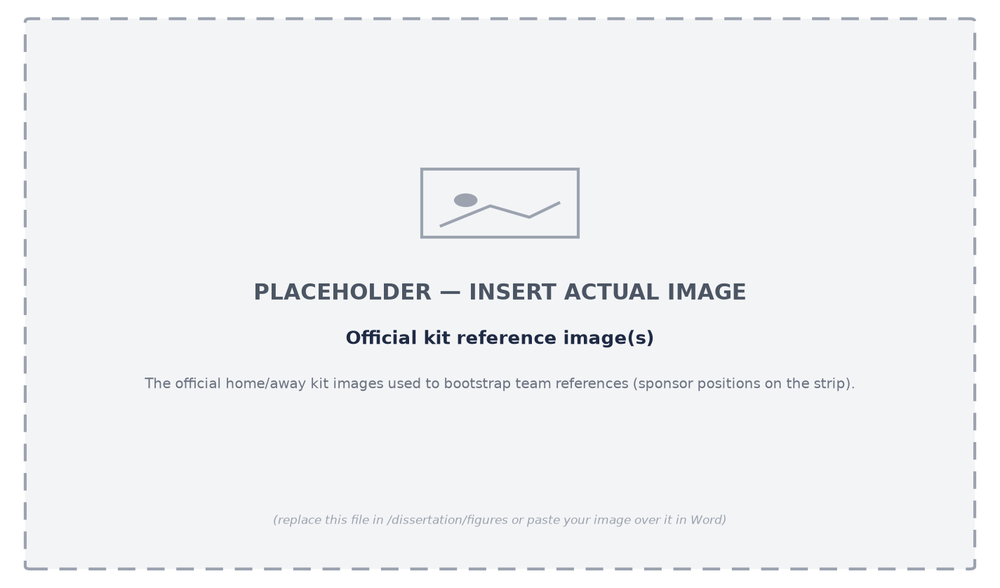
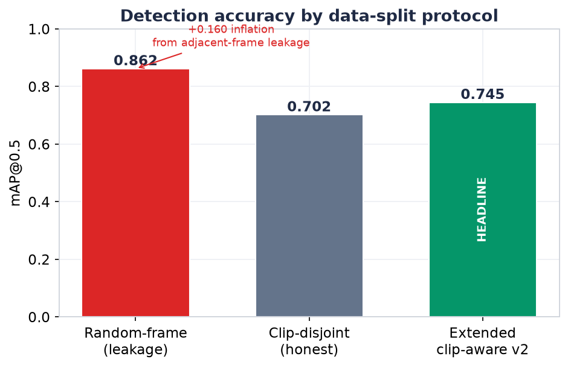
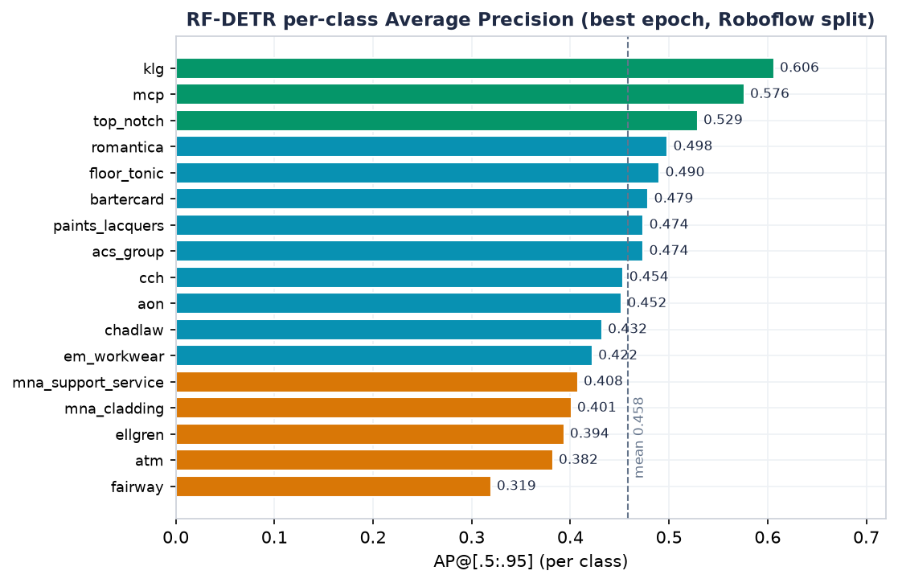

LOGOLENS: A LOW-COST COMPUTER-VISION SYSTEM FOR MEASURING AND VALUING SPONSOR-LOGO EXPOSURE IN SPORTS BROADCASTS

*[Insert full name]*

*[Insert student ID]*

A dissertation submitted in partial fulfilment of the requirements for the degree of

**MSc Applied Artificial Intelligence and Data Analytics**

Faculty of Engineering and Digital Technologies

University of Bradford

Supervisor: *[Insert supervisor name]*

*[Month] 2026*

---

## Declaration

I declare that this dissertation is my own work and has not been submitted, in whole or in part, for any other degree or qualification. All sources of information have been acknowledged, and all external material has been cited in accordance with the University of Bradford's academic-integrity regulations. The system described in this dissertation was designed and implemented by the author. Where third-party open-source models and libraries have been used, they are identified in the text. Any figures reproduced from software tools are attributed in their captions.

Signed: ______________________  Date: ______________

---

## Abstract

Sports sponsorship is a multi-billion-pound advertising channel whose value depends on how prominently and for how long a sponsor's logo is visible during a broadcast. Measuring this exposure and converting it into a monetary estimate has traditionally required either painstaking manual review or expensive commercial services, both of which are out of reach for smaller, mid-tier clubs. This dissertation designs, implements and evaluates **LogoLens**, an end-to-end computer-vision system that automatically measures sponsor-logo exposure in rugby-league broadcasts and converts it into an Equivalent Media Value (EMV) estimate, using only consumer-grade hardware. The system couples a fine-tuned YOLO detector with a reference-based team-attribution filter, pose-based assignment of logos to sellable kit positions, and a three-tier visibility-to-value model, all orchestrated behind a web dashboard.

The work follows a design-science methodology combined with an experimental evaluation on real broadcast footage from Bradford Bulls. The evaluation is deliberately conservative. Under a leakage-controlled, clip-disjoint split the detector achieves a mean Average Precision (mAP@0.5) of 0.745, whereas a naive random-frame split inflates this to 0.862; the honest figure is reported as the headline result. A stratified manual audit finds that team attribution is correct in 91.8% of 184 sampled cases, and the attribution filter removes 44% of detections that would otherwise inflate the value estimate. A sensitivity analysis quantifies how the value estimate responds to key thresholds, and a controlled experiment shows that sparse frame sampling over-measures exposure by 63% relative to native-rate processing, a bias disclosed rather than hidden. A secondary contribution explores an annotation-free "data engine" that auto-labels footage from foundation models; it is shown to work in principle but to be limited by data quantity.

The dissertation contributes a reproducible, low-cost pipeline for sponsorship measurement, an honest evaluation methodology in a domain lacking public ground truth, and a discussion of how automated valuation relates to the wider debate on artificial intelligence in advertising. The findings support the feasibility of democratising a measurement capability previously confined to well-resourced organisations, while being candid about the system's limitations.

**Keywords:** computer vision, object detection, sponsorship measurement, media valuation, weak supervision, sports analytics.

---

## Acknowledgements

I thank my supervisor for guidance throughout this project and, in particular, for encouraging me to situate the technical work within the broader discussion of artificial intelligence in advertising. I am grateful to Bradford Bulls and the associated stakeholders for the business context and the official kit materials that made the case study concrete. I acknowledge the open-source community — notably the developers of Ultralytics, Segment Anything, and DINOv2 — whose tools made a project of this scope achievable by a single student. Finally, I thank my family for their support.

---

## Table of Contents

[[TOC]]

---

## List of Abbreviations

| Abbreviation | Meaning |
|---|---|
| AP / mAP | Average Precision / mean Average Precision |
| API | Application Programming Interface |
| BoT-SORT | Robust multi-object tracker (Bag-of-Tricks SORT) |
| CNN | Convolutional Neural Network |
| CPM | Cost Per Mille (cost per thousand impressions) |
| EMV | Equivalent Media Value |
| FPS | Frames Per Second |
| GPU | Graphics Processing Unit |
| HBB / OBB | Horizontal / Oriented Bounding Box |
| IoU | Intersection over Union |
| OCR | Optical Character Recognition |
| P / R | Precision / Recall |
| PCS | Promptable Concept Segmentation |
| RQ | Research Question |
| SMV | Sponsorship Media Value |
| SoV | Share of Voice |
| YOLO | You Only Look Once (object-detection family) |
| 3DGS | 3D Gaussian Splatting |

---

## List of Figures

> Figures marked *(placeholder)* are grey placeholders to be replaced by the author with the actual screenshot or photograph; all other figures are generated from the project's data or tools.

- **Figure 1.** High-value frame selection for annotation — §3.3.1
- **Figure 2.** Examples of high-value selected frames *(placeholder)* — §3.3.1
- **Figure 3.** Model-assisted (label-assist) annotation workflow — §3.3.2
- **Figure 4.** Roboflow annotation interface with Label Assist *(placeholder)* — §3.3.2
- **Figure 5.** Overall system architecture — §4.1
- **Figure 6.** Processing pipeline for a newly uploaded video — §4.2
- **Figure 7.** Official kit reference images *(placeholder)* — §4.4
- **Figure 8.** The three-tier valuation model — §4.6
- **Figure 9.** Analytics dashboard: Overview / Match view *(placeholder)* — §4.7
- **Figure 10.** Three-dimensional kit-slot model *(placeholder)* — §4.7
- **Figure 11.** Digital-twin frame with composited logos *(placeholder)* — §4.8
- **Figure 12.** Per-class instance distribution of the training set — §5.2
- **Figure 13.** Bounding-box geometry and label analysis — §5.2
- **Figure 14.** Detection accuracy under three splitting protocols — §5.3
- **Figure 15.** Training dynamics of the clip-disjoint run — §5.3
- **Figure 16.** Normalised confusion matrix (clip-disjoint split) — §5.3
- **Figure 17.** Per-class precision–recall curves — §5.3
- **Figure 18.** Qualitative detection output (identity-redacted) — §5.3
- **Figure 19.** RF-DETR per-class Average Precision — §5.3.1
- **Figure 20.** RF-DETR validation mAP over training — §5.3.1
- **Figure 21.** Team-attribution accuracy from the stratified audit — §5.4
- **Figure 22.** Effect of the team-attribution filter — §5.4
- **Figure 23.** Effect of quality-weighting by confidence — §5.5
- **Figure 24.** Parameter sensitivity (visibility vs confidence floor) — §5.6
- **Figure 25.** Sampling-rate bias — §5.6
- **Figure 26.** Annotation-free inventory pipeline funnel — §5.7
- **Figure 27.** Honest evaluation of the annotation-free student — §5.7

## List of Tables

- **Table 1.** Detection accuracy under three splitting protocols — §5.3
- **Table 2.** RF-DETR validation metrics at the best checkpoint — §5.3.1
- **Table A.1.** Key system configuration — Appendix A
- **Table B.1.** Summary of experimental results — Appendix B
- **Table C.1.** Training-set class distribution — Appendix C

---

# Chapter 1. Introduction

## 1.1 Background and motivation

Commercial sponsorship is one of the principal ways in which professional sport is financed. Brands pay for their logos to appear on players' kit, on perimeter advertising boards, and on other surfaces that appear on screen during a televised or streamed match. Unlike a conventional television advertisement, which has a fixed duration and a published rate, the value delivered by a sponsorship is implicit: it is distributed across thousands of fleeting appearances of a logo, each of which varies in size, position, sharpness and duration according to the camera work and the run of play. The commercial question that a sponsor ultimately wants answered is therefore deceptively simple: *how much was my logo seen, how clearly, and what is that worth?*

The sports-marketing industry answers this question using the related notions of Sponsorship Media Value (SMV) and Equivalent Media Value (EMV). Broadly, these express the visibility a sponsor received as the cost of purchasing an equivalent amount of advertising attention through paid media (Nielsen Sports, 2019). Producing such an estimate at scale requires measuring, for every brand, the total quality-weighted time its logo was on screen. Historically this was done manually, by analysts timing appearances from recordings; more recently it has been automated using computer vision and offered as a service by specialist vendors. Both routes are costly. Manual review is slow and inconsistent, and commercial analytics subscriptions are priced for elite leagues and clubs. Mid-tier organisations — the majority of professional clubs — are effectively excluded, and as a result they cannot demonstrate the value of a sponsorship to their partners with objective evidence.

The stakes are not trivial. Kit and perimeter sponsorship is a primary revenue stream for professional rugby-league clubs outside the top tier, where broadcast and matchday income are comparatively modest, and the ability to evidence delivered value is often the difference between renewing a local sponsor and losing one. A club that can show a sponsor an objective account of how much its logo was seen, and on which part of the kit, is in a materially stronger negotiating position than one relying on assertion. Yet it is exactly these clubs that cannot justify the cost of commercial analytics, producing a situation in which the organisations with the greatest relative need for measurement have the least access to it. This dissertation is motivated by that mismatch.

This exclusion is not merely a matter of budget; it reflects a structural property of the underlying computer-vision problem. Building an automated logo-measurement system faces three recurring difficulties. First, sponsor logos are small, deformable marks on moving fabric, frequently partially occluded during play, which makes them hard to detect reliably. Second, the same sponsor often appears on both teams' kit, on advertising boards, and in broadcast graphics, so a logo that is correctly detected may still be wrongly attributed to the party who did not pay for it, inflating the estimate. Third, each competition and season introduces a different set of sponsors, so a conventional closed-set detector must be re-annotated and re-trained whenever the roster changes, and the annotation cost grows with every new deployment. Together, these difficulties make a general, low-cost measurement system genuinely hard to build rather than a routine engineering exercise.

The wider context for this work is the rapid adoption of artificial intelligence in advertising. Much of the current discussion — for example the recent call for research on *AI and the future of advertising creativity* (Journal of Advertising Research, 2025) — concentrates on generative systems that produce advertising content. The present dissertation addresses a complementary and comparatively under-examined side of the same trend: the use of AI not to *create* advertising but to *measure and value* it. This framing is used as motivation and revisited in the discussion; it is not claimed as a contribution to advertising theory.

## 1.2 Problem statement

The problem addressed by this dissertation is the design and honest evaluation of an automated system that measures the on-screen exposure of sponsor logos on players during a sports broadcast and converts that exposure into a defensible monetary estimate, subject to three constraints that distinguish it from existing commercial solutions: it must attribute exposure only to the paying party, it must run on affordable hardware so that it is accessible to smaller clubs, and it must be reproducible and transparent so that its outputs can be trusted and audited. A subsidiary problem is whether the recurring cost of manual annotation, which is the main barrier to scaling such a system across competitions, can be reduced by exploiting information that is already available for free.

## 1.3 Aim and objectives

The **aim** of the dissertation is to design, implement and critically evaluate a low-cost, reproducible computer-vision system that measures and values sponsor-logo exposure in sports broadcasts, using Bradford Bulls rugby league as a case study.

The aim is pursued through the following **objectives**:

1. To review and synthesise the relevant literature in logo detection, multi-object tracking, team attribution, sponsorship-value measurement, and weakly-supervised learning, and to identify the specific gap the system addresses.
2. To design a modular processing pipeline that detects sponsor logos, attributes each to the correct team, assigns it to a sellable kit position, and aggregates exposure into a media-value estimate.
3. To implement the pipeline as a working system with a processing backend and an analytics frontend, using open-source models and consumer-grade hardware.
4. To evaluate the system experimentally on real broadcast footage, using leakage-controlled protocols and a human audit, and to quantify its sensitivity to key parameters.
5. To investigate, as a secondary objective, whether an annotation-free "data engine" can reduce the manual-labelling cost, and to report its limitations honestly.
6. To discuss the results in relation to the wider debate on AI in advertising, and to identify the system's limitations and directions for future work.

## 1.4 Research questions

The evaluation is organised around four research questions:

- **RQ1.** What detection and team-attribution accuracy can the system achieve on real broadcast footage, and how sensitive are these figures to the evaluation protocol?
- **RQ2.** How can a per-frame detection stream be converted into a media-value estimate in a principled way, and what is the estimate's sensitivity to the model's key parameters?
- **RQ3.** Can an annotation-free data engine, driven by foundation models and the known sponsor roster, produce usable training labels without manual annotation, and what limits its performance?
- **RQ4.** How does automated exposure measurement relate to the broader use of AI in advertising, and what are the practical implications of making such measurement affordable?

## 1.5 Scope and delimitations

The dissertation focuses on sponsor logos carried on players' kit (jersey sponsorship) in rugby league, with Bradford Bulls as the primary case. Perimeter advertising boards and broadcast graphics are handled by exclusion rather than being valued in their own right. EMV is treated as an industry-standard proxy for advertising attention, not as an actual transaction price; the dissertation does not attempt to model sponsorship revenue econometrically. No identification of individual players or spectators is performed, for reasons discussed in the methodology. All quantitative results are obtained at the scale of a single-student project — one sport, one primary club, and a modest number of matches — so claims about generality across sports and clubs are treated as design intentions to be tested rather than as demonstrated outcomes.

## 1.6 Contributions

The dissertation makes the following contributions:

1. **A reproducible, low-cost sponsorship-measurement system** that couples logo detection, reference-based team attribution, pose-based position assignment and a three-tier valuation model, and that runs at approximately real time on consumer hardware.
2. **An honest evaluation methodology** for a domain that lacks public ground truth, combining leakage-controlled detection protocols, a stratified human audit of attribution, a parameter-sensitivity analysis, and the explicit measurement and disclosure of a sampling-rate bias.
3. **An exploratory annotation-free data engine** that uses foundation models and the known sponsor roster to auto-label footage, evaluated candidly including its failure modes, which locates the binding constraint (data quantity) for future work.

## 1.7 Dissertation structure

Chapter 2 reviews the relevant literature and states the research gap. Chapter 3 sets out the research methodology, including the research design, data, evaluation metrics and protocols, and ethical considerations. Chapter 4 describes the design and implementation of the system. Chapter 5 presents the experiments and results against the four research questions. Chapter 6 discusses the findings, threats to validity, and the relation to AI in advertising. Chapter 7 concludes and identifies future work.

---

# Chapter 2. Literature Review

This chapter reviews the research relevant to the system. It proceeds from the general computer-vision foundations to the specific sub-problems the system must solve — logo detection, team attribution and exposure valuation — and then to the techniques that could reduce its dependence on manual annotation. It closes by positioning the present work against this literature and stating the gap it addresses.

## 2.1 Object detection and its evaluation

Modern object detection is dominated by deep convolutional and transformer architectures trained on large labelled datasets. Two broad families are relevant here. The first is the single-stage YOLO ("You Only Look Once") family, introduced by Redmon et al. (2016), which frames detection as a single regression from image pixels to bounding boxes and class probabilities, prioritising inference speed. Successive iterations, maintained in recent years largely through the open-source Ultralytics implementations (Jocher et al., 2023), have improved accuracy while retaining real-time performance, which makes the family attractive for video applications on modest hardware. The second family is the transformer-based DETR line, which removes hand-designed components such as non-maximum suppression at the cost of higher computational demand. For a system that must process long broadcasts on a single consumer GPU, the speed–accuracy trade-off favours the YOLO family, and this dissertation adopts a recent YOLO variant as its detector.

Detection performance is conventionally reported using Average Precision (AP), the area under the precision–recall curve at a given Intersection-over-Union (IoU) threshold, and its mean over classes, mAP (Everingham et al., 2010; Lin et al., 2014). A recurring methodological pitfall, particularly acute for video, is data leakage: because consecutive frames are highly correlated, a random frame-level train/test split allows near-duplicate images to appear on both sides, producing optimistic scores that do not reflect performance on genuinely unseen footage. The importance of clip- or video-disjoint splitting is well established in the sports-video literature (Deliège et al., 2021) and is treated as a first-class methodological concern in Chapter 3.

## 2.2 Logo detection and recognition

Logo detection is a specialised sub-problem with characteristics that distinguish it from generic object detection. Logos are typically small relative to the frame, appear against cluttered backgrounds, deform on fabric, and belong to a very large and open-ended set of classes. Early research relied on curated datasets such as FlickrLogos-32 (Romberg et al., 2011), which contains a few dozen brands, and progressively larger benchmarks followed. Su et al. (2018) introduced the OpenLogo benchmark and drew attention to two persistent obstacles: the scarcity of annotated examples for most brands, and the *open-set* nature of the task, in which a deployed system inevitably encounters brands it was never trained on.

Two design responses appear in the literature. The first is the conventional *closed-set* detector, fine-tuned on a fixed set of brand classes; it achieves high accuracy within that set but cannot recognise a new brand without re-annotation and re-training. The second is *open-set logo retrieval*, in which detected regions are matched against a gallery of reference exemplars, so that new brands can be added by inserting new exemplars rather than by retraining. Retrieval approaches that fuse visual features with text read from the logo have been shown to scale to large brand sets. The present system uses a closed-set detector for its production pipeline — justified because a club's sponsor roster is small and stable within a season — but its exploratory data engine (Section 2.5) adopts the retrieval idea of an expandable, training-free gallery to address the open-set problem at labelling time.

A further characteristic that shapes the present work is that sponsor logos are, in the technical sense, *small objects*. Small-object detection is a recognised weak point of general detectors, because the features available for a target only a few pixels across are limited and easily lost through successive downsampling in a deep network. The standard mitigations — higher input resolution, multi-scale feature aggregation, and tiling of the input — trade computation for the ability to resolve small marks, and the resolution and tiling choices made in this dissertation (Chapter 4) follow directly from this constraint. The prevalence of small logos also has consequences for evaluation and valuation: a fixed pixel-area threshold that is reasonable for everyday objects would discard most genuine sponsor logos, which is why the visibility model uses a deliberately low floor whose justification is examined empirically in Chapter 5.

A limitation of much of the logo-detection literature, from the standpoint of sponsorship valuation, is that it treats detection and recognition as ends in themselves. It rarely addresses *attribution* — determining which party a detected logo belongs to — even though, in a sponsorship setting, a correctly detected logo on the wrong shirt is a costly error. Attribution is therefore treated as a distinct sub-problem in this dissertation and is reviewed next.

## 2.3 Multi-object tracking and team attribution in sports video

Attributing a logo to the correct team requires knowing which player is wearing it and which team that player belongs to. This connects the work to the substantial literature on player tracking and team identification in sports video. Tracking-by-detection is the standard paradigm: an object detector locates people in each frame, and a tracker associates detections across frames into consistent tracks. ByteTrack (Zhang et al., 2022) improved association by retaining low-confidence detections during matching, and BoT-SORT (Aharon et al., 2022) added camera-motion compensation and appearance features, both of which are relevant to the fast, camera-panned footage of rugby league.

Team identification is complicated by the fact that opponents' kits change from match to match, which makes a per-team trained classifier impractical. The SoccerNet Game-State-Reconstruction challenge (Deliège et al., 2021, and subsequent editions) shows that leading solutions instead cluster players by colour and appearance and assign team labels by majority voting over each track, adapting to each match without additional training. Colour histograms remain a strong signal when kits differ in luminance, while learned appearance embeddings — for example from CLIP-style image encoders (Radford et al., 2021) and their efficient sigmoid-loss variant SigLIP (Zhai et al., 2023) — help when colours are similar. This reference-based, per-match philosophy is adopted directly by the team-attribution component of the present system (Chapter 4). What the sports-video literature does not typically consider is the downstream *financial* consequence of an attribution error, which motivates the revenue-safe decision policy introduced in this dissertation.

## 2.4 Measuring sponsorship exposure and media value

The rationale for measuring exposure *quality*, rather than merely counting appearances, rests on the sponsorship-effectiveness literature. Sponsorship is understood as a distinct marketing channel whose effects are indirect and contextual (Cornwell, 2019; Cornwell & Kwon, 2020). At the level of individual exposures, experimental work on how viewers process on-screen sponsorship signals has repeatedly found that recognition and recall depend on exposure characteristics — the size, duration, centrality, motion and contrast of the stimulus (Breuer & Rumpf, 2012; Rumpf et al., 2020). This provides the theoretical justification for weighting each detection by a visibility score rather than treating all appearances equally, a principle the present system implements explicitly.

Translating weighted exposure into money is done through EMV/SMV, which expresses exposure as the equivalent cost of buying comparable paid-media attention, typically parameterised by a cost-per-mille (CPM) rate and an audience size (Nielsen Sports, 2019). The approach is widely used in industry but is legitimately criticised as a proxy for *attention* rather than for *business outcome*, and as being prone to inflation if low-quality exposures are counted. Automated implementations have been commercialised by vendors such as GumGum Sports and Relo Metrics, but their methods are proprietary and not reproducible. In the academic literature, the recent ExposureEngine work (2025) proposes a detection-to-valuation pipeline and reports strong detection accuracy using oriented bounding boxes to correct for perspective distortion of logos. The present dissertation adopts several principles from this strand — quality-weighting and oriented-box area correction — but adds an explicit team-attribution stage, a position-based valuation, and, crucially, a commitment to reproducibility and low cost. A structural obstacle common to all this work, discussed further in Chapter 3, is the absence of any public benchmark with sponsorship-ownership labels; there is no dataset that states which sponsor a logo belongs to and which team is wearing it, which forces every valuation system to construct its own evaluation procedure.

It is worth being explicit about the limitations of EMV as a construct, since the dissertation adopts it. EMV measures *opportunity to see* — the quantity and quality of exposure — rather than any behavioural or attitudinal outcome such as brand recall, preference or purchase. It says nothing about whether a viewer actually attended to the logo, remembered it, or acted on it, and it can be inflated by counting technically-visible but psychologically-negligible appearances. More sophisticated frameworks attempt to bridge this gap by weighting exposure with attention or recall models derived from eye-tracking studies (Rumpf et al., 2020), but these require data that a low-cost system cannot obtain. The pragmatic justification for EMV, and the reason this dissertation retains it, is that it is the lingua franca in which clubs and sponsors actually negotiate, so an accessible, transparent EMV estimate is directly useful even though it is an imperfect proxy. The quality-weighting in the three-tier model is best understood as a partial, computationally cheap approximation of the attention weighting that the recall literature would recommend, and its limitations are acknowledged rather than hidden. This positions the system honestly: it automates the industry-standard proxy at low cost, and it neither claims nor requires that the proxy be a perfect measure of advertising effect.

### 2.4.1 From manual valuation to AI: the evolution of sponsorship pricing

It is useful to place the present system within the historical evolution of how sponsorship exposure has been priced, since that trajectory both motivates the design and clarifies what is genuinely new. Four broad eras can be distinguished.

In the **manual era**, sponsorship value was assessed by human analysts who reviewed recordings and timed each logo appearance with a stopwatch, then converted the accumulated on-screen time into a monetary figure by analogy with advertising rates — the media-equivalency principle from which EMV descends. This approach was expensive, slow, and inconsistent between analysts, and it scaled poorly: valuing many matches meant employing many reviewers. Crucially, it also tended to treat exposure time uniformly, with little systematic adjustment for how prominent or clear each appearance actually was.

In the **rule-based automation era**, dedicated logging software and template-matching tools reduced some of the manual burden, but recognition remained brittle and still required substantial human oversight; the valuation logic was largely a set of hand-coded rules applied to human-verified detections. The step change came in the **computer-vision era**, in which convolutional detectors could localise logos frame by frame with limited human involvement, and in which the valuation itself became more sophisticated: rather than counting raw time, systems began weighting each appearance by measurable exposure characteristics — size, screen position, duration and clarity — in line with the recall research reviewed above. This is the lineage of the commercial analytics vendors and of the three-tier model used in this dissertation.

The current **AI era** extends this in two directions. First, deep detectors and trackers, combined with team- and attention-modelling, have improved both the accuracy and the granularity of measurement, for example by attributing exposure to specific parties or estimating visual attention rather than mere visibility. Second, and more disruptively, foundation models and weak supervision are beginning to remove the annotation bottleneck that limited earlier systems, opening the prospect of open-set, self-improving valuation pipelines that adapt to new sponsors and sports without re-annotation. The system in this dissertation sits at the transition between the third and fourth eras: its production pipeline implements a mature computer-vision valuation with explicit attribution and position-based pricing, while its exploratory data engine reaches towards the annotation-free, self-improving frontier. What it adds to the trajectory is not a new valuation theory but a demonstration that this level of capability can be delivered transparently and at low cost, rather than only through expensive proprietary services.

## 2.5 Reducing annotation cost: weak supervision, foundation models and synthetic data

The main barrier to scaling a closed-set detector across competitions is the linear growth of annotation cost. Three complementary lines of research offer ways to reduce it. *Programmatic weak supervision*, exemplified by Snorkel (Ratner et al., 2017), combines multiple noisy labelling sources through a label model that estimates their reliabilities and produces denoised training labels; it replaces manual annotation with the lighter task of writing labelling functions. *Foundation models* provide powerful, general-purpose labelling sources: open-vocabulary detectors such as Grounding DINO (Liu et al., 2023) and promptable segmenters such as the Segment Anything family (Kirillov et al., 2023; Ravi et al., 2024) can generate zero-shot pseudo-labels, and self-supervised encoders such as DINOv2 (Oquab et al., 2023) provide strong features for clustering visually similar image regions. In particular, the ability of recent promptable models to segment and *track* a concept through a video, prompted only by an exemplar, makes it feasible to label an entire broadcast from a single reference image per brand. *Synthetic data* offers a further source of labelled examples: rendered and composited images have been used to augment detection training, and 3D Gaussian Splatting (Kerbl et al., 2023) enables photorealistic scene reconstruction into which real logo textures can be inserted with pixel-accurate labels.

An empirical caveat that emerges from applying these tools, and which is documented in Chapter 5, is that self-supervised embeddings such as DINOv2 cluster *real-to-real* image crops reliably but perform poorly at matching a *real* broadcast crop to a *clean template* logo. This observation shapes the design of the data engine, which uses embeddings only for real-to-real clustering and relies on text and the roster prior for identity. The present work instantiates weak supervision, foundation-model labelling and synthetic data together, but does so specifically for the sponsorship domain and evaluates the result honestly rather than assuming it succeeds.

## 2.6 Artificial intelligence in advertising

Finally, the work is motivated by the broader trend of AI adoption in marketing and advertising. Forward-looking analyses (Davenport et al., 2020; Huang & Rust, 2021) anticipated that AI would reshape marketing across the value chain, and recent calls for research — such as the Journal of Advertising Research special issue on *AI and the Future of Advertising Creativity* (2025) — frame generative AI as transforming how advertising is imagined, produced, evaluated and valued. Most attention has fallen on the productive side, where generative models create content. The measurement-and-valuation side, addressed here, is comparatively neglected, yet it is where the economic worth of exposure is actually estimated. This dissertation uses that observation only as motivation and as a lens for discussion (Chapter 6); it does not claim to contribute to advertising theory, which would require a different research design.

## 2.7 Research gap and positioning

Drawing the strands together, the literature exhibits a gap at their intersection. Logo-detection research provides strong detectors but largely ignores attribution and valuation. Sports-video research solves team attribution but does not consider its financial consequences. The sponsorship-measurement literature has a sound theory of exposure value but relies on manual methods or proprietary, non-reproducible tools, and lacks any public ground truth. Weak supervision and foundation models offer a route to cheaper labelling but have not been validated for low-cost sponsorship measurement. No existing work combines a reproducible, end-to-end, low-cost measurement pipeline with an honest evaluation methodology suited to a domain without ground truth, evaluated on real footage. The present dissertation targets this gap.

---

# Chapter 3. Research Methodology

This chapter describes how the research was conducted. It states the research design and its philosophical basis, the development approach, how data were collected and prepared, the metrics and protocols used to evaluate the system, and the ethical, legal and professional considerations that constrained the work. The design of the artefact itself is deferred to Chapter 4; the concern here is with method.

## 3.1 Research design and philosophy

The dissertation adopts a **design-science research** approach (Hevner et al., 2004), in which knowledge is produced by building an artefact that addresses a real problem and then rigorously evaluating it. Design science is appropriate here because the central output is a functioning system, and because the research questions concern what such a system can achieve and how well, rather than the testing of a pre-existing theory. Design science is combined with an **experimental evaluation** paradigm for the quantitative components: detection accuracy, attribution accuracy and value sensitivity are measured under controlled conditions with defined metrics.

Two epistemological commitments follow from the domain and are maintained throughout. First, because there is no public ground truth for sponsorship attribution or value (Section 2.4), the strongest evidence available for some claims is a controlled human audit rather than an automatic benchmark; the methodology therefore treats such an audit as a planned instrument rather than an afterthought. Second, a clear distinction is drawn between *operational* claims (what the system produces, measured by its own output), *accuracy* claims (whether the output is correct, asserted only against independent human judgement), and *value* claims (the economic meaning of an EMV figure, always stated with its assumptions). This separation is intended to prevent the circular error of validating a system against its own predictions, which is a known risk when a model's output is treated as if it were ground truth.

## 3.2 Development approach and tools

The system was developed iteratively, with each component prototyped, tested on real footage, and revised in light of observed failures. This iterative style is reflected in the evaluation, which reports not only final results but also the intermediate failures that shaped the design, on the grounds that in design-science research the reasoning behind a design is itself a contribution.

The implementation uses the Python scientific and deep-learning ecosystem. Object detection and pose estimation use the Ultralytics framework; tracking uses ByteTrack and BoT-SORT; appearance features use CLIP-family encoders; auto-labelling experiments use promptable segmentation and DINOv2 embeddings. The processing backend is built with FastAPI and the analytics frontend with Next.js. Model training was performed on rented cloud GPUs, while all inference and evaluation were performed on a single consumer workstation (an RTX 5060 Ti 16 GB GPU with an Intel i5-13400F CPU and 16 GB RAM), reflecting the target deployment environment. Software versions were pinned to ensure that trained weights remain loadable, and configuration is controlled through environment variables so that experiments are repeatable.

## 3.3 Data collection and preparation

The primary data are full-match rugby-league broadcasts of Bradford Bulls, obtained from publicly available streams. The footage spans several matches and a range of conditions, including daytime and floodlit night matches, higher- and lower-quality streams, and fixtures in which both teams wore dark kit; this variety was deliberately retained so that the evaluation would reflect realistic difficulty rather than a curated best case. Official kit imagery and the club's kit-regulation document were used as reference material for the sponsor roster and for the physical positions of logos on the kit.

For the supervised detector, a set of broadcast frames was manually annotated with oriented bounding boxes and brand labels. Oriented rather than axis-aligned boxes were chosen because logos on a moving torso are frequently rotated relative to the image axes, and an axis-aligned box would over-state their area; the oriented annotation also supports the oriented-box area correction in the visibility model. Annotation followed a small set of conventions to keep the labels consistent: each visible instance of a sponsor mark was boxed, including partially occluded ones down to a legibility limit, and the home/away kit variant was recorded as part of the class. The dataset was later extended into a larger, clip-aware collection; the composition of this extended set is analysed as part of the results (Section 5.2). The annotation effort was deliberately kept modest, both because a mid-tier club could not fund large-scale labelling and because the cost of annotation is precisely the barrier that the annotation-free engine (Section 4.8) seeks to remove; the small labelled set therefore serves double duty as the production training data and as the yardstick against which the annotation-free approach is judged. Two properties of the data-preparation process are methodologically important. First, kit variants are distinguished: each brand carries a home/away suffix, because the same sponsor occupies different positions and appears against different backgrounds on the two strips. Second, and most importantly, the train/test split is constructed to be **clip-disjoint** so that no passage of play contributes frames to both the training and test sets. As Section 2.1 noted and Section 5.1 demonstrates, a random frame-level split leaks correlated frames across the boundary and inflates the reported accuracy; the clip-disjoint split is the honest protocol and is used for all headline detection figures.

### 3.3.1 High-value frame selection for annotation

A full match contains on the order of a hundred thousand frames, the overwhelming majority of which are unsuitable for annotation: replays, crowd shots, graphics, blurred transitions, or frames in which no target-team player is prominently visible. Annotating frames at random would therefore waste most of the annotation budget on low-value images and would under-sample the sharp, logo-bearing frames that the detector most needs to learn from. To address this, a dedicated **frame-selection procedure** was built to extract, from each video, roughly two hundred high-value frames for annotation (Figure 1). It should be distinguished from the sparse frame *sampling* used later at inference time (Section 4.2): the former is an offline, one-off selection of training images, the latter an online sampling of frames for measurement.

The procedure operates in eight steps. First, frames are sampled at an adaptive rate — from about two per second for short highlights down to one every three seconds for full-length matches — read directly by seeking rather than decoding the whole video, which keeps the cost manageable. Second, a per-video static-overlay mask is estimated from the temporal standard deviation of a few hundred frames: pixels that barely change over time correspond to fixed graphics such as the scoreboard and channel watermark, and are masked out of the subsequent scoring. Third, a shot-type gate uses the proportion of green (grass) pixels to reject replays, jumbotron shots and dense crowd frames. Fourth, a lightweight person detector retains only frames containing at least two sufficiently large player boxes. Fifth, a colour filter in HSV space matches each player's jersey region against the target team's kit colour, counting how many target-team players are present. Sixth, a weighted Laplacian sharpness score is computed specifically on the torsos of target-team players — where the logos are — with the overlay and opponent regions masked out, so that a frame is scored on the sharpness of the parts that matter rather than of the whole image. Seventh, near-duplicate frames are removed by a combination of temporal non-maximum suppression and perceptual hashing. Finally, the top-scoring frames are exported at original resolution, with a guaranteed minimum yield achieved by progressively relaxing the de-duplication if too few frames survive. The net effect is that annotation effort is concentrated on sharp, logo-rich, non-redundant frames of the correct team, which is precisely where it produces the most learning value per annotated box.


Figure 2 shows representative frames chosen by this procedure, illustrating the sharp, logo-bearing, target-team images that the selector favours over the many uninformative frames it rejects.


### 3.3.2 Annotation with Roboflow and model-assisted labelling

The selected frames were annotated on **Roboflow**, a web-based annotation and dataset-management platform, which also handled the train/validation/test split, image resizing and augmentation. Manual annotation of thousands of small logos would nonetheless have been prohibitively slow, so a **model-assisted labelling** strategy — a form of active learning — was used to accelerate it (Figure 3). A small seed set of roughly fifty to eighty clean, close-up frames was annotated entirely by hand, ensuring that every class appeared several times. A first detector was then trained quickly on this seed set and connected to Roboflow's *Label Assist* feature, which runs the model on each new frame and pre-populates its predicted boxes. The annotator's task then reduced from drawing every box to accepting, correcting or adding to the model's suggestions, which is substantially faster — on the order of five to ten times — than annotating from scratch. As more frames were corrected, the assisting model improved, so that its suggestions became progressively more accurate, in the manner of an active-learning loop. All annotations were finally merged and exported to train the production detector.


Figure 4 shows the Label Assist feature in use within the Roboflow interface, where the model's suggested boxes are presented for the annotator to accept, adjust or supplement.


Consistent annotation conventions were applied throughout — boxing every legible sponsor instance including partially occluded and motion-blurred ones, excluding illegible or replay-embedded logos and broadcast overlays, and keeping boxes tight — and the dataset was configured on Roboflow with a 70/20/10 split, letterbox resizing to 1280 pixels to preserve logo aspect ratios, and a moderate augmentation policy (horizontal flip, limited rotation, brightness and blur variation) that avoids transformations which would distort a logo's identity, such as vertical flips or strong colour shifts.

## 3.4 Evaluation methods and metrics

The evaluation combines four instruments, each aligned to a research question.

**Detection accuracy (RQ1).** Detection is evaluated with precision, recall and mean Average Precision at an IoU threshold of 0.5 (mAP@0.5), the standard object-detection metrics (Everingham et al., 2010; Lin et al., 2014). A prediction is counted as correct (a true positive) when its class matches a ground-truth box and their Intersection over Union — the area of their overlap divided by the area of their union — is at least 0.5. Precision is then the number of true positives divided by all predictions, P = TP / (TP + FP); recall is the number of true positives divided by all ground-truth logos, R = TP / (TP + FN); Average Precision is the area under the precision–recall curve for a class; and mAP is the mean of AP over classes. Reporting all three matters for a valuation system because precision and recall have asymmetric commercial consequences — a false positive can credit a sponsor for exposure that did not occur, whereas a false negative merely under-counts. Results are reported under three splitting protocols — random-frame, clip-disjoint, and an extended clip-aware set — precisely in order to expose the effect of leakage. A per-class confusion matrix is examined to characterise the *type* of error, on the argument that in a valuation setting a missed logo is far less harmful than a logo attributed to the wrong brand.

**Attribution accuracy (RQ1).** Because no ground truth exists for team attribution, it is evaluated by a **stratified manual audit**. Three frames per match — sampled at the 55%, 75% and 95% points of each clip so that team-voting has stabilised — were drawn across nine matches, giving 184 attributed detections. Each was checked by eye against the shirt colour and recorded as correct or incorrect, and the errors were categorised. The audit is reproducible in that the sampling rule and the record of judgements are retained.

**Value sensitivity (RQ2).** Since EMV cannot be validated against a true price, the valuation model is evaluated for *structural plausibility* and *sensitivity* rather than for absolute correctness. The distribution of exposure across brands and kit positions is examined for plausibility, and the retained quality-exposure is measured as key thresholds (the visibility floor and the confidence floor) are swept, to establish how strongly the output depends on each parameter. In addition, a controlled experiment compares the exposure measured under sparse frame sampling with that measured at the native frame rate on the same segment, to quantify any sampling-induced bias.

**Annotation-free evaluation (RQ3).** The data engine is evaluated by auditing the purity of the labels it produces and by training a student detector on those labels and testing it on *track-disjoint* held-out data, again controlling for leakage. A false-positive test on non-target crops checks whether the student fabricates brands on the wrong people.

Throughput (video-minutes processed per wall-clock minute) is measured on the target workstation to substantiate the low-cost, real-time claim.

## 3.5 Evaluation criteria derived from design goals

Beyond the quantitative metrics, three design goals function as qualitative evaluation criteria. **Generality** requires that another club could use the system by supplying its own logos and footage without code changes; it is assessed by whether the mechanisms are reference-based and configurable rather than hard-coded. **Revenue-safety** requires that, when uncertain, the system errs towards not deducting exposure from a client rather than towards inflating it; it is assessed by inspecting the attribution decision policy. **Measurement integrity** requires that every reported figure be traceable to a transparent procedure and that unmeasured quantities be labelled as such; it is assessed by the presence of audit records and by the explicit disclosure of biases and unvalidated claims.

## 3.6 Ethical, legal and professional considerations

Several considerations shaped the work. First, **privacy**: although the footage contains people, the system deliberately performs no identification of individuals — it analyses brand exposure, not persons — and this decision is a design constraint, not merely an omission. Second, **anonymity and disclosure in reporting**: because the case study is a specific, identifiable club, figures reproduced from broadcast footage have their club-identifying overlays (channel watermark and scoreboard) redacted, while sponsor logos, which are the object of study and are publicly displayed, are retained; the redaction policy for figures was agreed as part of the case study. Third, **data provenance and licensing**: source footage is publicly available, and some foundation-model components carry research-only licences, which a commercial deployment would need to replace with permissively licensed equivalents. Fourth, **professional integrity**: results are reported conservatively, unmeasured quantities are not presented as measured, and a bias unfavourable to the commercial narrative (the sampling over-measurement of Section 5.3) is disclosed rather than concealed. These commitments align with the ethical expectations of the University of Bradford and with professional codes of conduct for computing practitioners.

## 3.7 Reproducibility

To support reproducibility, the pipeline configuration is externalised, model versions are pinned, evaluation splits are constructed by explicit rules, and audit judgements are recorded so that reported accuracies can be reconstructed. The primary limitation on full reproducibility is that the source broadcasts are third-party material that cannot be redistributed; the methodology mitigates this by describing the collection and preparation process in sufficient detail for the study to be repeated on comparable footage.

---

# Chapter 4. System Design and Implementation

This chapter describes the artefact. It presents the overall architecture, the processing pipeline and its main components, the valuation model, the user-facing dashboard, and the exploratory annotation-free data engine, before noting the engineering constraints encountered during implementation.

## 4.1 Architecture overview

The system is divided into two loosely coupled parts that communicate over an HTTP API (Figure 5). The **backend** is the processing engine: a FastAPI application that accepts an uploaded video, runs it through the analysis pipeline as a background job, and exposes the results as JSON together with rendered media. The **frontend** is a Next.js dashboard that submits jobs, polls their progress, and presents the results as interactive analytics across multiple matches.


A deliberate architectural decision is that all infrastructure lies behind interfaces. The database (SQLite during development), the file storage (local during development) and the job queue (in-process during development) are each abstracted so that they can be replaced by production equivalents — for example PostgreSQL, object storage and a distributed queue — through configuration alone, without altering the pipeline logic. This supports the generality criterion at the infrastructure level and keeps the development environment lightweight enough to run on a single machine.

## 4.2 The processing pipeline

Whereas Figure 5 shows the static structure of the system, Figure 6 shows what happens dynamically when a new video is uploaded. A single upload constitutes one job, which an orchestrator processes through eight stages, updating a progress field after each so that the frontend can display real-time status. The stages are: (1) *frames*, reading video metadata; (2) *team*, bootstrapping kit references if none exist; (3) *detect*, the main loop that samples frames, detects logos, scores their visibility, applies the team filter and assigns positions; (4) *exposure*, grouping detections into per-brand segments; (5) *pricing*, computing EMV; (6) *preview*, rendering an annotated video with the original audio; (7) *bodyseg*, producing a body-part overlay; and (8) *done*, persisting the result. The third stage is itself a nested per-frame sub-pipeline — detection, visibility scoring, team filtering and pose-based slot assignment — as shown in the lower part of Figure 6. Every optional stage degrades gracefully: a failure is logged as a warning and the job completes with a partial result rather than aborting.


A notable design decision is the use of two separate detection passes with different purposes. The *analytics* pass samples frames sparsely (two frames per second) because estimating exposure *duration* does not require every frame and sparse sampling is far cheaper; this pass is the source of all value figures. The *preview* pass runs at the full frame rate, capped at a maximum number of frames, to render a smooth review video in which boxes track each logo closely. Separating the two acknowledges that measurement and presentation have different frequency requirements. The consequence that the sampling rate affects the measured value is examined experimentally in Section 5.3 and is not treated as neutral.

## 4.3 Logo detection

The detection component is a fine-tuned YOLO model operating at a high input resolution (1280 pixels), chosen because sponsor logos are small (Section 5.2). The YOLO family was preferred over transformer detectors because its single-stage design achieves real-time inference on a single consumer GPU, which is a hard requirement of the low-cost objective; a heavier detector that produced marginally higher accuracy at a fraction of real-time speed would defeat the purpose. The high input resolution is a direct response to the small-object property of the data: at a lower resolution, a logo only a few pixels across after downsampling loses the features needed to classify it. The model outputs, per detection, a bounding box, a brand class, and a confidence score. Oriented rather than axis-aligned boxes are used so that the true area of a logo skewed by camera angle can be recovered, which matters because the visibility score is proportional to area and an axis-aligned box would systematically over-state the exposure of a tilted logo. The detector is trained on the club's sponsor set; because that set is small and stable within a season, a closed-set detector is appropriate for the production pipeline, with the open-set problem — recognising sponsors the detector was never trained on — deferred to the data engine (Section 4.8), which is where the roster prior and expandable gallery come into play.

## 4.4 Team attribution

The team-attribution component decides, for each detected logo, whether it belongs to the target club. It follows the reference-based, per-match philosophy identified in Section 2.3 and trains no dedicated model, because opponents' kits change each match. For each sampled frame, a person detector locates players, and a tracker (BoT-SORT) maintains a stable identity per player across frames. A band of the player's torso is cropped, excluding grass and skin pixels, and classified by fusing a colour histogram with a learned appearance embedding, with the fusion weighted towards colour when the kits differ strongly in luminance. Votes accumulate per track with hysteresis, so that a single blurred frame cannot flip a label. Each logo is then assigned to the player whose box most tightly contains it, and kept only if that player belongs to the target team.

Kit references are obtained without a mandatory manual step, at one of three levels of preference: an existing hand-built reference file if present; otherwise an automatic bootstrap that clusters players in the opening frames and selects the cluster most similar to the official kit image; and, failing that, a luminance rule for dark away kits. The official kit images that anchor the second option are shown in Figure 7, which also indicates where each sponsor sits on the strip.



The keep/drop policy embodies the revenue-safety criterion: a logo on a target player is kept; a logo on a player judged to be an opponent is dropped only if the track has accumulated sufficient votes, and is otherwise kept, so that a lack of evidence never causes exposure to be deducted from the client; a logo that cannot be attached to any player, such as one on an advertising board, is dropped.

The keep/drop logic can be summarised as the following procedure, applied once per detected logo in a sampled frame:

```
for each detected logo L in frame:
    owner  = the tracked player whose box most tightly contains centre(L),
             else the nearest tracked player within a distance threshold,
             else NONE
    if owner is NONE:                      # board, crowd, graphic
        drop L
    else:
        label, votes = team_vote[owner]    # accumulated over the track
        if label == TARGET:
            keep L
        elif label == OTHER and votes >= MIN_VOTES:
            drop L
        else:                              # insufficient evidence
            keep L                         # revenue-safe default
```

The asymmetry in the final two branches is deliberate: the system only removes exposure when it has accumulated enough evidence that a player belongs to the opposing team, and defaults to keeping otherwise. This encodes the principle that an automated measurement tool used to bill sponsors should fail towards under-claiming rather than over-claiming, since an over-claim that is later discovered damages the club's credibility more than a small, conservative under-claim.

## 4.5 Position assignment

Rather than treating all jersey logos as equivalent, the system assigns each detection to one of eighteen sellable kit positions using pose estimation. Keypoints from a pose model define regions corresponding to commercial slots — for example chest-centre, back-upper, sleeve, shorts-front and sock — rather than to anatomical parts, and skin regions carry no slot so that a logo is never assigned to bare skin. The proportion of exposure accruing to each slot provides the basis for pricing positions differently, which is where measurement feeds back into commercial decision-making: it turns "where on the kit" into a priced variable.

## 4.6 The three-tier valuation model

The valuation model converts the detection stream into a monetary estimate in three tiers (Figure 8), each introducing a correction grounded in the sponsorship-effectiveness literature (Section 2.4).


**Tier 1 — visibility**, computed per detection, is the product of four factors: a size term (the square root of the box-to-frame area ratio, so that a single close-up does not dominate); a position term (a Gaussian centred on the screen, reflecting that central logos attract more attention); a clarity term (the detector's confidence); and an oriented-box penalty that corrects the area of a skewed logo. A low visibility floor of 0.02 excludes negligible detections from forming a segment; the choice of this value, far below the 0.1 sometimes used, is justified empirically in Section 5.3 by the fact that genuine sponsor logos are small and off-centre.

**Tier 2 — exposure**, computed per brand, links the surviving detections into continuous segments using track identity and sums, over segments, the product of duration, mean visibility and a duration weight. Segments shorter than half a second are discarded as flicker, and the duration weight encodes the recall finding that very short appearances are less memorable and sustained ones more so.

**Tier 3 — EMV** multiplies the quality-weighted exposure by a CPM rate, the audience size and a placement multiplier reflecting the broadcast type; optional category and prime-time multipliers extend the model when the relevant context is known. The value of this staged construction, relative to a naive product of appearance count and CPM, is that each tier adds a defensible correction: for spatial quality, then for temporal and recall structure, then for broadcast context.

To make the model concrete, consider an illustrative worked example for a single sponsor in one match. Suppose the sponsor's chest logo accumulates 120 seconds of quality-weighted exposure (Tier 2), the operator enters a CPM of US$22 and an audience of 40,000 viewers, and the broadcast is a live television feed with a placement multiplier of 1.0. The EMV is then 120 × (22 ÷ 1000) × 40,000 × 1.0 = US$105,600. Had the same exposure instead been measured only as raw on-screen time without quality-weighting — say 200 seconds of any-visibility appearance — a naive estimate would return 200 × 0.022 × 40,000 = US$176,000, over-stating the value by two-thirds. The gap between the two figures is exactly the correction that the visibility and duration weighting introduce, and it illustrates why quality-weighting is not a cosmetic refinement but a material determinant of the reported value. The example also shows the leverage of the input parameters: because audience size enters linearly, an error in the declared audience propagates directly into the EMV, which is why the system treats CPM and audience as user-supplied inputs to be justified rather than as quantities it can infer.

## 4.7 The analytics dashboard

The frontend turns the JSON result into a decision-support tool through five views: an *Overview* of the multi-match portfolio; a *Match* view with the preview video, a per-brand timeline and a team-filter statistics badge; a *Brand* view profiling a single sponsor across matches; an *Analytics Report* with filterable charts and export to PDF and CSV; and a *Body Segmentation* view with a rotatable three-dimensional model that colours the eighteen kit slots and ranks them by exposure, supporting the position-based pricing discussion. Figure 9 shows the portfolio and match views, and Figure 10 the three-dimensional kit-slot model.


All charts are implemented directly in SVG rather than through a charting library, which trades development effort for full control of the visualisations and a smaller dependency surface; when no backend is present, the dashboard displays clearly labelled demonstration data.

The dashboard is not merely a viewer but the point at which the measurement becomes commercially usable, and several of its design choices reflect that. Brand colours are held stable across every view so that a sponsor is recognisable at a glance throughout a multi-match analysis. The match view places the team-filter statistics — how many detections were kept and dropped — directly alongside the value figures, so that a user can see at once whether attribution behaved sensibly for that match; an unusually low or high drop rate is a signal that the kit-reference bootstrap may have misfired, and surfacing it supports the measurement-integrity criterion. The report view includes an appearance-quality scatter that plots each brand's exposure duration against its mean visibility, so that "premium" inventory — long, prominent exposure — is visually separable from frequent but low-quality appearances, giving a club a defensible basis for differential pricing. Export to PDF and CSV allows the figures to be incorporated into a sponsor report or a spreadsheet, which is how a club would actually use the output. In short, the frontend is designed to turn a technical result into an artefact a commercial manager can act on, which is essential if the system is to serve its intended non-specialist users.

## 4.8 The annotation-free data engine

To address the annotation-cost problem (RQ3), an exploratory data engine was designed to auto-label footage without manual boxes. It exploits three otherwise-unused signals: the existence of sponsor logo assets, which serve as visual exemplars; the known per-event roster, which reduces open-world recognition to a small closed set per match and rejects any hypothesis outside it at no cost; and the temporal redundancy of video, in which one decision can label an entire track.

The engine follows a teacher–student design. A heavy teacher auto-labels a broadcast by prompting a promptable segmentation model with an exemplar per brand, reading brand names with OCR, clustering real crops with DINOv2 embeddings, and constraining hypotheses to the roster; a label model fuses these noisy signals, and temporal refinement propagates confident tracks while discarding flickering ones. A lighter student detector is then distilled from the resulting labels for real-time use. To cover rare conditions that appear infrequently in real footage — steep angles, glare or rain — the engine can be supplemented with synthetic data, including frames from a venue *digital twin* reconstructed with 3D Gaussian Splatting into which real logo textures are composited with lighting-aware blending, yielding photorealistic images with pixel-accurate labels (Figure 11). This synthetic route is exploratory and is discussed as such in the evaluation and future work.


A variant suited to on-kit sponsorship exploits kit regulation — a whole team wears one identical kit all season, so a physical logo position need only be identified once, at its sharpest moment, after which blurred crops merely inherit the label by geometry. This reframes a hard recognition problem as an easier inventory-and-assignment problem. The engine's design and its empirical limits are evaluated in Section 5.7.

## 4.9 Output data model and interface

The result of analysing one video is persisted as a single structured record, which both the dashboard and any external consumer read through the API. The record captures, for each brand, its segments with their start and end times, mean visibility and duration weight, together with the aggregate quality-exposure, average visibility, segment count, longest segment and EMV; it also stores the per-slot exposure percentages, the team-filter statistics (kept, dropped and drop rate), and a per-brand on-screen timeline used to drive the interactive player. Alongside this the system stores rendered media: an annotated preview video with the original audio, and a body-part overlay. Exposing the full result through a small, well-defined API — endpoints to create a job, poll its progress, and retrieve the analysis and its media — keeps the frontend a thin presentation layer and, more importantly for the generality objective, allows a different client or an automated reporting process to consume the same outputs without modification. The separation of the analysis record from its presentation is deliberate: the numbers a club relies on are computed once, stored, and never recomputed differently for display, which supports reproducibility and auditability of any figure that appears in a sponsor report.

## 4.10 Implementation constraints

Implementation surfaced constraints that illustrate the gap between an algorithm and a running system. Training required specific settings to avoid platform-specific memory failures, and text output required explicit UTF-8 handling. The promptable segmentation model exceeded GPU memory above a certain resolution because of the quadratic cost of attention, which was mitigated by tiling the frame. The data engine exposed subtle failure modes — a tracker identity switch during a tackle could transfer a label to the wrong player, the segmenter could fire on a fabric fold, and a player's surname printed on the shirt could be mistaken for a similarly named sponsor — each of which was addressed by an explicit control gate. The need for these gates is itself evidence, discussed in Chapter 6, that automating measurement redistributes rather than removes the human role.

---

# Chapter 5. Experiments and Results

This chapter reports the experiments and their results, organised by research question. It begins by characterising the dataset, then evaluates detection and attribution accuracy (RQ1), the valuation model and its sensitivity (RQ2), and the annotation-free data engine (RQ3), before reporting throughput and summarising the findings. Following the methodology, operational and accuracy claims are kept distinct, and unvalidated quantities are identified as such.

## 5.1 Experimental setup

All inference and evaluation were run on the target workstation (RTX 5060 Ti 16 GB GPU, i5-13400F CPU, 16 GB RAM); training used rented cloud GPUs. Detection metrics are reported under three splitting protocols to expose leakage. Attribution is evaluated by the stratified audit described in Section 3.4. Value-model experiments use the aggregated outputs of the analytics pass over nine matches. Unless stated otherwise, quantitative figures are drawn from the project's experimental records and are reconstructable from them.

## 5.2 Dataset characterisation

Before training, the dataset was analysed to understand its structure and biases, because these properties directly influence both model behaviour and the design of the valuation model. The extended clip-aware training set contains **10,654 annotated logo instances across 17 sponsor classes**. Three properties are salient.

First, the class distribution is strongly imbalanced (Figure 12). The most frequent class holds 1,667 instances and the rarest only 182, a ratio of about 9.2 to 1. This imbalance is not an artefact but a faithful reflection of reality: a main shorts or chest sponsor is on screen far more often than a small sleeve patch. It predicts the per-class performance gap observed later, in which data-starved classes underperform.


Second, the logos are small (Figure 13, lower-right panel). The great majority of boxes occupy roughly 3–5% of the frame dimension, that is, well under one per cent of the frame area. This single property justifies several design choices: the high detection resolution, the oriented-box area correction, and the low visibility floor, since a floor of 0.1 would discard almost all genuine sponsor logos. Third, the box centres concentrate near the middle of the frame (Figure 13, lower-left panel), consistent with broadcast framing that keeps the ball-carrier central; this empirical prior is exactly what the Gaussian position term in the visibility score encodes, giving that choice a data-grounded rather than arbitrary basis.


## 5.3 Detection accuracy and the effect of leakage (RQ1)

Detection accuracy depends strongly on the splitting protocol (Table 1). A random-frame split reports mAP@0.5 of 0.862, but this figure is inflated because correlated adjacent frames appear on both sides of the split. The clip-disjoint split, in which no passage of play crosses the boundary, gives a more honest 0.702, and the extended clip-aware set gives 0.745 with precision 0.65 and recall 0.74. The extended clip-aware figure is reported as the headline result. The methodological point — that the impressive 0.862 must not be cited as true performance while the less flattering 0.745 is more trustworthy — is treated as a contribution to evaluation integrity.

| Split protocol | mAP@0.5 | Note |
|---|---|---|
| Random-frame | 0.862 | Inflated by adjacent-frame leakage |
| Clip-disjoint | 0.702 | Honest |
| Extended clip-aware | 0.745 (P 0.65, R 0.74) | Headline result |

*Table 1. Detection accuracy under three splitting protocols.*



The training dynamics of the clip-disjoint run (Figure 15) show validation precision, recall and mAP converging over the training schedule, while the training and validation box-losses decline together without divergence, indicating no severe overfitting. The type of error is characterised by the normalised confusion matrix (Figure 16), which is almost purely diagonal apart from the background row. In other words, the detector rarely confuses one brand with another; its errors are predominantly *misses* — rare logos falling into the background — concentrated on the least-represented classes. For a valuation task this is the desirable error structure, because a miss lowers the estimate slightly whereas a brand confusion would credit money to the wrong sponsor. The per-class precision–recall curves (Figure 17) confirm that well-represented sponsors achieve high precision across a broad recall range while rare classes pull down the mean, mirroring the imbalance of Figure 12.


The confusion structure deserves closer attention because it determines how detection error propagates into the value estimate. In a naive reading, an mAP of 0.745 might be dismissed as leaving a quarter of the target unaccounted for. But mAP conflates two very different failure modes, and the confusion matrix separates them. The near-absence of off-diagonal brand-to-brand mass means that when the detector does fire, it almost always names the correct sponsor; the shortfall in mAP is therefore composed almost entirely of *recall* loss on rare classes, not of mislabelling. For valuation this distinction is decisive. A recall shortfall produces a conservative under-estimate that is, if anything, aligned with the revenue-safe philosophy, and it is partially absorbed downstream because exposure is aggregated over time: a logo missed in one sampled frame is often recovered in an adjacent one within the same track. A brand confusion, by contrast, would misattribute money and could not be recovered by aggregation. The operative accuracy of the system for its intended purpose is therefore better than the raw mAP suggests, and the appropriate headline metric for future work is an exposure-level error against manual timing rather than a frame-level detection score.

Figure 18 shows qualitative detector output on held-out broadcast frames, with each logo localised and labelled by brand and confidence across open play, rucks and kicks. In accordance with the ethical stance of the dissertation and the club's figure policy, the club-identifying broadcast overlays — the channel watermark and the scoreboard — have been redacted, while the sponsor logos and labels, which are the object of study, are retained.


### 5.3.1 Alternative architecture benchmark: RF-DETR

To test whether a heavier, transformer-based detector would improve accuracy, an RF-DETR model was trained on the same sponsor dataset as an alternative to the YOLO detector. Its best checkpoint reached a validation mAP@0.5 of 0.771 (0.778 with exponential moving averaging), mAP@0.75 of 0.505, and mAP@[.5:.95] of 0.458, with precision 0.730, recall 0.711 and an F1 of 0.710 (Table 2). The per-class Average Precision (Figure 19) shows the same pattern as the YOLO detector: the well-represented classes such as `klg` and `mcp` achieve the highest AP, while sparse classes such as `fairway` and `atm` trail, again mirroring the class imbalance of Figure 12. The training curve (Figure 20) shows the validation mAP rising quickly and then plateauing, with the best checkpoint reached early.

| Metric | RF-DETR (best) |
|---|---|
| mAP@0.5 | 0.771 (EMA 0.778) |
| mAP@0.75 | 0.505 |
| mAP@[.5:.95] | 0.458 (EMA 0.465) |
| Precision | 0.730 |
| Recall | 0.711 |
| F1 | 0.710 |

*Table 2. RF-DETR validation metrics at the best checkpoint.*



![RF-DETR validation mAP over training. The mAP@0.5 and mAP@[.5:.95] rise quickly and plateau, with the best checkpoint reached early. Plotted from the model's logged metrics.](figures/fig_rfdetr_curve.png)

These figures must be read with an important methodological caveat. Unlike the headline YOLO results, the RF-DETR model was trained and evaluated on the annotation platform's default *random* split, in which frames from the same clip can fall into the training, validation and test sets simultaneously. As established in Section 5.1, such a split leaks correlated frames and inflates the reported accuracy, so the RF-DETR mAP@0.5 of 0.771 is not directly comparable to the leakage-controlled YOLO figure of 0.745 and is, if anything, optimistic. The benchmark therefore does not establish that RF-DETR is superior; it demonstrates that a heavier architecture reaches broadly similar accuracy on this dataset, and it reinforces the central lesson that the evaluation protocol matters as much as the architecture. A fair comparison would require re-training RF-DETR under the clip-disjoint protocol, which is identified as future work.

## 5.4 Team attribution (RQ1)

Team attribution was evaluated by the stratified manual audit of 184 detections across nine matches (Figure 21). Attribution was correct in **91.8%** of cases (169 of 184), with balanced performance on the target-team subset (90.7%) and the other subset (92.9%), above the 90% quality threshold set for the audit. The errors were systematic rather than random: half of the target-team errors were officials or stewards in bright clothing, suggesting the value of a dedicated officials class, and the remaining errors clustered in the first seconds after kickoff, before team-voting had stabilised, and in a fixture where both teams wore dark kit. Because these errors are structured and explicable, they are in principle addressable.


The practical importance of attribution is shown by its effect on the detection count (Figure 22). Across nine matches, the filter removed **44%** of detections (11,161 of 25,153, ranging from 21% to 78% per match) as belonging to opponents, officials or unattributable surfaces. Without attribution, the value estimate would be almost doubled in many matches, which quantifies directly why attribution is essential to sponsorship valuation and not merely to detection.


## 5.5 Valuation plausibility and quality-weighting (RQ2)

Because EMV cannot be validated against a true price, the valuation model is assessed for structural plausibility and for the behaviour of its quality-weighting. The distribution of exposure across brands is strongly skewed, with the leading sponsor carrying about 41% of total weighted exposure across eight matches, as expected when a main chest or shorts logo dominates. Across kit positions, the ratio between the highest- and lowest-exposure slots is large — on the order of 27 to 1 in duration — which is sufficient to justify pricing positions differently rather than at a flat rate, and which is the practical output of the position-assignment component.

The quality-weighting behaves as intended (Figure 23). Low-confidence detections (confidence below 0.4) constitute 29% of the raw count but contribute only 9.5% of quality-weighted exposure, whereas high-confidence detections (confidence at or above 0.8) contribute 64% of exposure. The three-tier model therefore discounts uncertain, fleeting appearances rather than counting them equally, which is the desired behaviour for a value estimate intended to reflect attention.


## 5.6 Parameter sensitivity and sampling bias (RQ2)

A value estimate is only trustworthy if its sensitivity to parameters is understood. Sweeping the visibility floor over 13,439 detections shows that raising it from 0.02 to 0.05 removes 71% of quality exposure and raising it to 0.1 removes 98%, whereas raising the confidence floor from 0.25 to 0.6 loses under 5% (Figure 24). Two conclusions follow. First, the low visibility floor of 0.02 is strongly justified: the 0.1 value proposed elsewhere would destroy almost all genuine signal, because sponsor logos are inherently small and off-centre. Second, the estimate is far more sensitive to the visibility floor than to the confidence floor, which is important information for anyone tuning the system.


A controlled experiment on a three-minute segment compared the exposure measured at the deployed sampling rate of two frames per second with that measured at the native fifty frames per second (Figure 25). The sparse rate over-measured total exposure by 63%, because each isolated sample is effectively quantised to a half-second block and short gaps are bridged. This bias favours the sponsor and is disclosed rather than concealed; a production report should either correct for it or state it explicitly. Measuring and reporting a bias that works against the commercial narrative is a matter of measurement integrity.


## 5.7 The annotation-free data engine (RQ3)

The data engine was evaluated candidly, including its failures. On a single match, the inventory pipeline reduced 2,900 raw tracks to 511 target-team tracks by a colour rule, from which the teacher mined 7,410 on-torso logo crops, clustered by DINOv2 embeddings into 189 clusters whose brand clusters reached at least 90% purity; three key sponsors were confirmed in their correct positions (Figure 26). Producing usable training labels required control gates: earlier attempts yielded many labels at only 40–60% purity because of tracker identity switches and segmenter false fires, and only a version passing three simultaneous gates — temporal locality, a quality filter, and the intersection of geometric and cluster consensus — produced 107 labels at about 94% purity. The lesson is that scaling the label count should come from more footage rather than from relaxing the gates.


Training a student detector on these labels and evaluating it honestly exposed both a real signal and the binding constraint (Figure 27). An initial score of 0.92 mAP was found to arise from leakage — validation images sharing a track with training — and correcting the split to be track-disjoint reduced it to 0.558, as expected. On genuinely unseen tracks, a well-represented class reached 0.867 mAP with 0.80 recall, a real learning signal, whereas a data-starved class with only about 23 crops failed at 0.248. A false-positive test on 300 opponent and steward crops found false positives on at most 3% of images, and the strongest apparent false positive proved to be a genuine logo on a target player, meaning the student does not fabricate brands on the wrong people. The honest conclusion is that the pipeline works in principle but that its single decisive shortfall is the quantity of data; this identifies precisely where future effort should go.


## 5.8 Throughput

On the target workstation the system processed footage at approximately real time (87.7 video-minutes in 88.4 wall-clock minutes, a range of 0.81–1.12 times real time across jobs). This substantiates the claim that the system is feasible on consumer-grade hardware, which is a necessary condition for making the capability affordable to smaller clubs.

## 5.9 A worked single-match walkthrough

To illustrate how the components combine on real data, this section traces a single match end-to-end. The analytics pass sampled the broadcast at two frames per second and produced a stream of logo detections; in this match the raw detector fired roughly 2,800 times across all sampled frames. Applying the team-attribution filter removed a little over half of these as belonging to opponents, officials or perimeter boards, leaving the detections that were credited to the target club. The surviving detections were linked by track identity into per-brand segments, discarding sub-half-second flickers, and each segment was weighted by its mean visibility and duration weight to give a quality-exposure figure per brand.

The resulting brand distribution was strongly skewed, as expected: the main chest and shorts sponsors together accounted for the majority of quality exposure, while sleeve and sock sponsors contributed small tails. Assigning each detection to a kit slot via pose estimation revealed the same skew spatially, with the chest-centre and shorts positions dominating and peripheral positions contributing little — the ratio between the busiest and quietest slot was of the order of twenty-fold. Converting the per-brand quality exposure to EMV using the operator's CPM and audience inputs produced a per-brand value table, which the dashboard then rendered as a share-of-voice chart and a per-brand breakdown. Two observations from this walkthrough reinforce the aggregate results. First, the attribution stage changed the outcome materially: without it, the opponent's identically named or visually similar sponsors would have inflated several brands' totals. Second, the value ordering of brands was determined far more by sustained, high-visibility chest exposure than by frequent but small peripheral appearances, which is precisely the behaviour the quality-weighting was designed to produce.

## 5.10 Summary of results

The evidence supports three claims at differing levels of confidence. With high confidence, the production system measures exposure and value at approximately real time on affordable hardware, attributes exposure to the correct team in about 92% of audited cases, and its attribution filter makes a large quantitative difference. With medium confidence, the valuation model produces plausible distributions and responds to its parameters in a controlled and now-quantified way, although it lacks a ground-truth price against which absolute error could be measured. Remaining open is the annotation-free engine, which is correct in principle but unproven at scale; this is the clearest direction for further work.

---

# Chapter 6. Discussion

This chapter interprets the results, relates them to the literature, considers threats to their validity, discusses their relation to AI in advertising, and draws out practical implications.

## 6.1 Interpretation of the principal findings

The results answer the four research questions with differing degrees of certainty. For RQ1, the system detects sponsor logos at 0.745 mAP@0.5 under an honest protocol and attributes them to the correct team in about 92% of audited cases. Two aspects of this result are more informative than the headline numbers. The first is the *shape* of the detection error: the near-diagonal confusion matrix shows that the detector's mistakes are overwhelmingly misses rather than brand confusions, which is the benign error mode for valuation, since a miss under-counts slightly whereas a confusion would misdirect money. The second is the *effect* of attribution: removing 44% of raw detections shows that attribution is not a refinement but a first-order determinant of the estimate, and that a logo-detection system without it would systematically over-value sponsorship. This supports the argument, made in Section 2.2, that the sponsorship problem is mis-framed if treated as detection alone.

For RQ2, the valuation model produces plausible, strongly skewed distributions across brands and positions, and its quality-weighting demonstrably concentrates value on clear, sustained exposures. The sensitivity analysis is the more valuable result, however, because it converts an opaque number into one whose behaviour is understood: the estimate is dominated by the visibility floor and is comparatively robust to the confidence floor, and the deployed sampling rate introduces a measurable positive bias. These findings do not validate the *absolute* value estimate — which, in the absence of a ground-truth price, cannot be validated — but they make the estimate interpretable and its assumptions explicit, which is the appropriate standard in a domain without ground truth.

For RQ3, the annotation-free engine is shown to generate genuine learning signal on unseen data once leakage is controlled, but to be limited by data quantity rather than by the method itself. This is a modest but honest result. It matters because it distinguishes a design that is fundamentally flawed from one that is merely under-resourced, and it identifies the specific lever — more auto-labelled footage — that would move it forward.

## 6.2 Relation to prior work

The findings are consistent with, and extend, several strands of prior work. The strong dependence of reported accuracy on the splitting protocol reproduces, in the logo-detection setting, the leakage concerns long recognised in sports-video benchmarks (Deliège et al., 2021), and reinforces the case for clip-disjoint evaluation as standard practice. The reference-based, per-match approach to team attribution follows the philosophy of leading SoccerNet solutions, but this dissertation adds a consideration absent from that literature — the financial asymmetry of attribution errors — and operationalises it as a revenue-safe keep/drop policy. In relation to the sponsorship-measurement literature, the system reproduces the accepted principles of quality-weighting and oriented-box correction while adding attribution, position-based valuation, and, most importantly, reproducibility and low cost, addressing the criticism that existing automated tools are proprietary and opaque. Finally, the empirical observation that self-supervised embeddings cluster real-to-real crops well but fail at real-to-template matching is a concrete, transferable lesson for anyone attempting to bootstrap logo recognition from clean assets, and it directly shaped the design of the data engine.

## 6.3 Automated valuation in the context of AI in advertising

The wider debate on AI in advertising, introduced as motivation in Section 2.6, provides a useful lens for interpreting the work, though the dissertation makes no claim to advertising theory. Most attention in that debate concerns AI that *produces* advertising content. The present system sits on the complementary side: AI that *measures and values* advertising. The two are naturally connected. As generative tools lower the cost of producing creative variants and placements, the ability to measure which of them actually earns attention becomes more, not less, important; measurement is what turns an abundance of creative options into a set of priced, comparable choices. The position-based valuation is a small concrete instance of this connection, since it turns "where on the kit a logo is placed" into a measured, priced variable that could inform a placement decision.

Two further observations emerge from the implementation experience. The first concerns the human role. Automating measurement did not remove the human but relocated their contribution: from timing appearances by hand to auditing a sample and designing the control gates that catch structured errors, such as officials mistaken for players or a surname mistaken for a sponsor. These are errors that require human contextual understanding to anticipate and encode, which suggests that the human is best understood not as a step awaiting automation but as the source of the semantic constraints the system needs. The second concerns access. Because the system runs at approximately real time on a consumer GPU under a "rent to train, own to infer" model, it lowers the barrier for a mid-tier club to measure sponsorship value itself rather than purchasing an expensive service. This mirrors, on the measurement side, the way generative AI lowers the barrier to producing creative content on the production side, and it is the sense in which the work contributes to democratising a previously exclusive capability.

## 6.4 Threats to validity

Several threats to validity qualify these conclusions. The principal **construct-validity** threat is that EMV is a proxy for advertising *attention*, not for business *outcome*, and that the value estimate is not validated against any true price; the results should therefore be read as measuring exposure quality, not as measuring the commercial return of a sponsorship. An **internal-validity** threat is the reliance on a single human auditor for attribution accuracy, which introduces the possibility of judgement bias; this is mitigated by a fixed sampling rule and retained records, but not eliminated, and independent multi-rater audit would strengthen the claim. The main **external-validity** threat is scale: the evaluation covers one sport, one primary club and a modest number of matches, so the generality and sport-agnostic claims are design intentions rather than demonstrated outcomes, and performance could differ in sports with different visual dynamics. Finally, some evaluation quantities depend on aggregated project records rather than on a single pre-registered experiment, and a small number of derived figures are illustrative; these are identified where they occur, and the appendices point to the underlying records.

It is worth reasoning explicitly about how the system's components are likely to generalise, since not all are equally exposed to the external-validity threat. The reference-based team-attribution stage is, by construction, sport- and club-agnostic, because it learns its kit references from each match rather than from a fixed training set; there is no principled reason it should fail on a new club, although its accuracy will depend on kit contrast and broadcast quality. The valuation model is likewise domain-general, since its inputs are geometric and temporal rather than sport-specific. The component most exposed to the generalisation threat is the closed-set detector, which is trained on a specific sponsor set and would need retraining, or the annotation-free engine, for a new roster. This decomposition suggests that a second-club deployment would most likely be bottlenecked by detector training data rather than by the attribution or valuation logic, which is consistent with the finding that the binding constraint on the annotation-free engine is data quantity. A rigorous test of generalisation nonetheless requires the second-club, second-sport experiment identified in the future work, and until that is done the claims are appropriately hedged.

## 6.5 Practical implications

For a club, the practical implication is that a credible, defensible sponsorship-measurement report can be produced in-house at low cost, provided its assumptions and biases are disclosed. For practitioners building similar systems, the dissertation offers several reusable lessons: evaluate detection under clip-disjoint splits; treat attribution as a first-order component with a revenue-safe policy; characterise the data before trusting the model; and disclose sampling and threshold sensitivities rather than reporting a single headline value. For the wider question of AI in advertising, the work is a concrete demonstration that the measurement-and-valuation side of the field is both technically tractable and worth attention alongside the more visible generative side.

## 6.6 Ethical and societal reflections

Automating the valuation of advertising exposure carries implications that deserve brief reflection beyond the immediate privacy measures described in the methodology. First, a measurement instrument is not neutral: the choices embedded in it — the visibility floor, the duration weights, the placement multipliers — encode a particular theory of what counts as valuable attention, and different choices would produce different valuations. Making these choices explicit and their sensitivities measurable, as this dissertation does, is therefore not only good science but an ethical requirement, because a black-box valuation used to set prices between parties would concentrate an unaccountable power in whoever controls the parameters. Second, the sampling bias identified in Section 5.3 shows how easily an automated valuation could be tuned, deliberately or accidentally, to favour the party commissioning it; the discipline of measuring and disclosing such biases is what separates a legitimate analytics tool from a persuasive one. Third, democratising the capability has a double edge: the same affordability that empowers a small club also lowers the barrier to producing inflated or selectively reported valuations, which underlines the importance of the transparent, auditable methodology advocated here. These reflections do not alter the technical findings, but they frame the responsible use of the kind of system the dissertation builds.

---

# Chapter 7. Conclusion and Future Work

## 7.1 Conclusion

This dissertation set out to design, implement and critically evaluate a low-cost, reproducible computer-vision system for measuring and valuing sponsor-logo exposure in sports broadcasts, using Bradford Bulls rugby league as a case study. The resulting system, LogoLens, couples a fine-tuned logo detector with reference-based team attribution, pose-based assignment of logos to sellable kit positions, and a three-tier visibility-to-value model, behind a web dashboard, and runs at approximately real time on consumer hardware.

The evaluation, conducted honestly and under leakage-controlled protocols, found detection accuracy of 0.745 mAP@0.5, team-attribution accuracy of 91.8% by stratified human audit, and an attribution filter that removes 44% of otherwise mis-credited detections. It further showed that the value estimate is interpretable and its sensitivities quantified, that the deployed sampling rate introduces a disclosed positive bias, and that an annotation-free data engine can generate genuine learning signal but is presently limited by data quantity. Against the research questions, the work therefore demonstrates a working, affordable measurement pipeline (RQ1, RQ2), locates the constraint on removing manual annotation (RQ3), and situates automated valuation within, though not as a contribution to, the debate on AI in advertising (RQ4).

Reflecting on the objectives set out in Chapter 1, each has been addressed. The literature was reviewed and a specific gap identified at the intersection of logo detection, team attribution, sponsorship valuation and weak supervision (Objective 1). A modular pipeline was designed and implemented as a working system with a processing backend and an analytics frontend, using open-source models on consumer hardware (Objectives 2 and 3). The system was evaluated experimentally under leakage-controlled protocols and a human audit, with a sensitivity analysis quantifying the value estimate's dependence on its parameters (Objective 4). The annotation-free engine was investigated and its limits reported honestly (Objective 5). And the results were discussed in relation to the wider debate on AI in advertising, with limitations and future work identified (Objective 6).

The overall conclusion is that measuring and valuing sponsorship exposure to a useful standard is achievable at low cost and with transparent methods, and that doing so honestly — reporting conservative figures, disclosing biases, and distinguishing what has been measured from what has not — is both possible and necessary in a domain that lacks public ground truth. The contribution is therefore as much methodological as technical: alongside a working system, the dissertation offers a template for evaluating such a system credibly when no ground truth exists. The main limitation is the absence of an absolute value validation, and the main opportunity is to prove the system's generality and to scale the annotation-free engine.

## 7.2 Future work

Six directions follow from the limitations. First, and most important, is to measure the absolute error of the value estimate by comparing system exposure against careful manual timing on a stratified sample, which would convert the current plausibility argument into a validated accuracy claim. Second is to demonstrate generality by applying the system to a second club and a second sport with no code changes, testing the design intention directly. Third is to scale the annotation-free engine by mining several more matches, which the results identify as the binding constraint, and retraining the student with per-match validation. Fourth is to add a dedicated officials class to remove the largest identified source of attribution error. Fifth is to model the over-counting that occurs when several logos share a frame, so that value can be allocated more fairly among same-category sponsors. Sixth, and more exploratory, is to validate the synthetic digital-twin data for rare conditions with a controlled real-to-synthetic mixing procedure. Beyond these, the most ambitious direction is to close the loop between measurement and creative decision-making, using position-level valuation to inform kit-design and placement choices, which would connect the measurement work directly to the creative side of the advertising debate that motivated it.

---

# References

> A small number of industry and very recent sources are marked **[to be verified]**; their exact publication details should be confirmed against the original before final submission. All other entries are established works and should be checked only for APA 7th formatting.

Aharon, N., Orfaig, R., & Bobrovsky, B.-Z. (2022). *BoT-SORT: Robust associations multi-pedestrian tracking*. arXiv. https://arxiv.org/abs/2206.14651

Breuer, C., & Rumpf, C. (2012). The viewer's reception and processing of sponsorship information in sport telecasts. *Journal of Sport Management, 26*(6), 521–531. https://doi.org/10.1123/jsm.26.6.521

Cornwell, T. B. (2019). Less "sponsorship as advertising" and more sponsorship-linked marketing as authentic engagement. *Journal of Advertising, 48*(1), 49–60. https://doi.org/10.1080/00913367.2019.1588809

Cornwell, T. B., & Kwon, Y. (2020). Sponsorship-linked marketing: Research surpluses and shortages. *Journal of the Academy of Marketing Science, 48*(4), 607–629. https://doi.org/10.1007/s11747-019-00654-w

Davenport, T., Guha, A., Grewal, D., & Bressgott, T. (2020). How artificial intelligence will change the future of marketing. *Journal of the Academy of Marketing Science, 48*(1), 24–42. https://doi.org/10.1007/s11747-019-00696-0

Deliège, A., Cioppa, A., Giancola, S., Seikavandi, M. J., Dueholm, J. V., Nasrollahi, K., Ghanem, B., Moeslund, T. B., & Van Droogenbroeck, M. (2021). SoccerNet-v2: A dataset and benchmarks for holistic understanding of broadcast soccer videos. In *Proceedings of the IEEE/CVF Conference on Computer Vision and Pattern Recognition Workshops (CVPRW)* (pp. 4508–4519). https://arxiv.org/abs/2011.13367

Everingham, M., Van Gool, L., Williams, C. K. I., Winn, J., & Zisserman, A. (2010). The PASCAL Visual Object Classes (VOC) challenge. *International Journal of Computer Vision, 88*(2), 303–338. https://doi.org/10.1007/s11263-009-0275-4

Hevner, A. R., March, S. T., Park, J., & Ram, S. (2004). Design science in information systems research. *MIS Quarterly, 28*(1), 75–105. https://doi.org/10.2307/25148625

Huang, M.-H., & Rust, R. T. (2021). A strategic framework for artificial intelligence in marketing. *Journal of the Academy of Marketing Science, 49*(1), 30–50. https://doi.org/10.1007/s11747-020-00749-9

Jocher, G., Chaurasia, A., & Qiu, J. (2023). *Ultralytics YOLO* [Computer software]. https://github.com/ultralytics/ultralytics

Journal of Advertising Research. (2025). *AI and the future of advertising creativity* [Call for papers, special issue]. Taylor & Francis. https://think.taylorandfrancis.com/special_issues/ai-and-the-future-of-advertising-creativity/ **[to be verified]**

Kerbl, B., Kopanas, G., Leimkühler, T., & Drettakis, G. (2023). 3D Gaussian splatting for real-time radiance field rendering. *ACM Transactions on Graphics, 42*(4), 1–14. https://doi.org/10.1145/3592433

Kirillov, A., Mintun, E., Ravi, N., Mao, H., Rolland, C., Gustafson, L., Xiao, T., Whitehead, S., Berg, A. C., Lo, W.-Y., Dollár, P., & Girshick, R. (2023). Segment anything. In *Proceedings of the IEEE/CVF International Conference on Computer Vision (ICCV)* (pp. 4015–4026). https://arxiv.org/abs/2304.02643

Lin, T.-Y., Maire, M., Belongie, S., Hays, J., Perona, P., Ramanan, D., Dollár, P., & Zitnick, C. L. (2014). Microsoft COCO: Common objects in context. In *Proceedings of the European Conference on Computer Vision (ECCV)* (pp. 740–755). https://arxiv.org/abs/1405.0312

Liu, S., Zeng, Z., Ren, T., Li, F., Zhang, H., Yang, J., Li, C., Yang, J., Su, H., Zhu, J., & Zhang, L. (2023). *Grounding DINO: Marrying DINO with grounded pre-training for open-set object detection*. arXiv. https://arxiv.org/abs/2303.05499

Nielsen Sports. (2019). *Measuring the value of sponsorship* [Industry report]. Nielsen. **[to be verified]**

Oquab, M., Darcet, T., Moutakanni, T., Vo, H., Szafraniec, M., Khalidov, V., Fernandez, P., Haziza, D., Massa, F., El-Nouby, A., Assran, M., Ballas, N., Galuba, W., Howes, R., Huang, P.-Y., Li, S.-W., Misra, I., Rabbat, M., Sharma, V., … Bojanowski, P. (2023). *DINOv2: Learning robust visual features without supervision*. arXiv. https://arxiv.org/abs/2304.07193

Radford, A., Kim, J. W., Hallacy, C., Ramesh, A., Goh, G., Agarwal, S., Sastry, G., Askell, A., Mishkin, P., Clark, J., Krueger, G., & Sutskever, I. (2021). Learning transferable visual models from natural language supervision. In *Proceedings of the 38th International Conference on Machine Learning (ICML)* (pp. 8748–8763). https://arxiv.org/abs/2103.00020

Ratner, A., Bach, S. H., Ehrenberg, H., Fries, J., Wu, S., & Ré, C. (2017). Snorkel: Rapid training data creation with weak supervision. *Proceedings of the VLDB Endowment, 11*(3), 269–282. https://doi.org/10.14778/3157794.3157797

Ravi, N., Gabeur, V., Hu, Y.-T., Hu, R., Ryali, C., Ma, T., Khedr, H., Rädle, R., Rolland, C., Gustafson, L., Mintun, E., Pan, J., Alwala, K. V., Carion, N., Wu, C.-Y., Girshick, R., Dollár, P., & Feichtenhofer, C. (2024). *SAM 2: Segment anything in images and videos*. arXiv. https://arxiv.org/abs/2408.00714

Redmon, J., Divvala, S., Girshick, R., & Farhadi, A. (2016). You only look once: Unified, real-time object detection. In *Proceedings of the IEEE Conference on Computer Vision and Pattern Recognition (CVPR)* (pp. 779–788). https://arxiv.org/abs/1506.02640

Romberg, S., Pueyo, L. G., Lienhart, R., & van Zwol, R. (2011). Scalable logo recognition in real-world images. In *Proceedings of the 1st ACM International Conference on Multimedia Retrieval (ICMR)* (pp. 1–8). https://doi.org/10.1145/1991996.1992021

Rumpf, C., Boronczyk, F., & Breuer, C. (2020). Predicting consumer gaze behavior toward sponsorship stimuli in sport broadcasts. *European Sport Management Quarterly, 20*(4), 461–479. https://doi.org/10.1080/16184742.2019.1620838

Su, H., Zhu, X., & Gong, S. (2018). Open logo detection challenge. In *Proceedings of the British Machine Vision Conference (BMVC)*. https://arxiv.org/abs/1807.01964

Zhai, X., Mustafa, B., Kolesnikov, A., & Beyer, L. (2023). Sigmoid loss for language image pre-training. In *Proceedings of the IEEE/CVF International Conference on Computer Vision (ICCV)*. https://arxiv.org/abs/2303.15343

Zhang, Y., Sun, P., Jiang, Y., Yu, D., Weng, F., Yuan, Z., Luo, P., Liu, W., & Wang, X. (2022). ByteTrack: Multi-object tracking by associating every detection box. In *Proceedings of the European Conference on Computer Vision (ECCV)* (pp. 1–21). https://arxiv.org/abs/2110.06864

*ExposureEngine* (2025). *A detection-to-valuation pipeline for sponsor exposure in sports broadcasts*. arXiv:2510.04739. **[to be verified: authors, exact title]**

---

# Appendices

## Appendix A — Key system configuration

| Parameter | Default | Meaning |
|---|---|---|
| Analytics sampling rate | 2 fps | Frame sampling for the analytics pass |
| Detection input size | 1280 px | Detector input resolution |
| Visibility floor | 0.02 | Minimum visibility to form a segment |
| Minimum segment length | 0.5 s | Shorter segments discarded as flicker |
| Duration weight | 0.5 / 1.0 / 1.2 | For segments <1 s / 1–5 s / >5 s |
| Default CPM | US$22.0 | Value-model input |
| Placement multiplier | 1.0 / 1.4 / 0.85 / 0.7 | Live TV / highlight / stream / social |
| Keep-unknown policy | enabled | Revenue-safety: keep when evidence is insufficient |
| Minimum votes (attribution) | 2.0 | Vote mass before trusting an "other-team" label |
| Vote hysteresis | 1.25 | Stickiness of the voted team label |
| Bootstrap frames | 32 | Frames sampled when bootstrapping kit references |

## Appendix B — Summary of experimental results

| Metric | Value | Source / condition |
|---|---|---|
| mAP@0.5 (random-frame) | 0.862 | Inflated by leakage; not cited as true performance |
| mAP@0.5 (clip-disjoint) | 0.702 | Honest protocol |
| mAP@0.5 (extended clip-aware) | 0.745 (P 0.65, R 0.74) | Headline result |
| RF-DETR mAP@0.5 (Roboflow random split) | 0.771 (EMA 0.778) | Not clip-disjoint; optimistic, not directly comparable |
| RF-DETR mAP@[.5:.95] / P / R | 0.458 / 0.730 / 0.711 | Best checkpoint |
| Team-attribution accuracy | 91.8% (169/184) | Stratified human audit, 3 frames × 9 matches |
| Attribution filter removal rate | 44% (11,161/25,153) | 9 matches, per-match range 21–78% |
| Low-confidence detections (conf < 0.4) | 29% of count / 9.5% of weighted exposure | 8 matches |
| High-confidence detections (conf ≥ 0.8) | 64% of weighted exposure | 8 matches |
| Visibility-floor sensitivity (0.02→0.1) | up to 98% of exposure removed | 13,439 detections |
| Confidence-floor sensitivity (0.25→0.6) | under 5% lost | 13,439 detections |
| Sampling bias (2 fps vs 50 fps) | +63% over-measurement | 3-minute segment |
| Throughput | ~1.0× real time (0.81–1.12×) | RTX 5060 Ti 16 GB workstation |
| Annotation-free student (leaky split) | 0.92 mAP | Invalid; leakage present |
| Annotation-free student (track-disjoint) | 0.558 mAP | Honest; well-represented class 0.867, starved class 0.248 |

## Appendix C — Training-set class distribution

Per-class annotated instance counts for the extended clip-aware training set (17 classes; total 10,654 instances). Brand names are the model's internal class labels.

| Class | Instances | Class | Instances |
|---|---|---|---|
| klg | 1,667 | atm | 431 |
| paints_lacquers | 1,170 | em_workwear | 385 |
| mcp | 1,106 | fairway | 313 |
| romantica | 886 | mna_support_service | 249 |
| aon | 749 | mna_cladding | 240 |
| ellgren | 718 | chadlaw | 218 |
| acs_group | 700 | cch | 182 |
| bartercard | 612 | **Total** | **10,654** |
| top_notch | 582 | | |
| floor_tonic | 446 | | |

## Appendix D — Note on assumptions and transparency

The following assumptions are stated for the reader: the institution and programme details on the title page are filled in by the author; a small number of very recent or industry sources are flagged for verification in the reference list; EMV is treated as an industry-standard proxy for advertising attention rather than an actual price; and a small number of derived figures (for example the per-match filter range and the slot-exposure ratio) are indicative and should be read alongside the underlying experimental records. Quantitative figures are drawn from the project's records and may change as the dataset is scaled.
