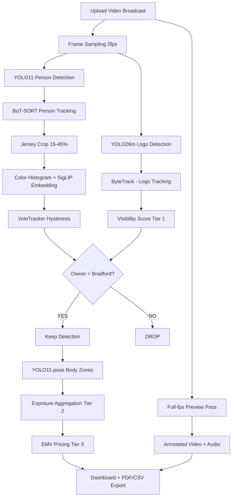

# LogoLense — Tài liệu chi tiết dự án Bradford Bulls Sponsor Logo Analytics

*Tài liệu chuẩn bị cho AI Forum — University of Bradford × Bradford Bulls Rugby League Club*

---

## 1. Dự án là gì?

**LogoLense** là nền tảng phân tích sponsor logo bằng AI, được phát triển bởi sinh viên **MSc Applied Artificial Intelligence and Data Analytics** tại **University of Bradford**, hợp tác với **Bradford Bulls Rugby League Club** và có sự hướng dẫn từ phía câu lạc bộ (Ian Stafford và đội ngũ Bradford Bulls).

**Tên sản phẩm:** LogoLense  
**Đối tác nghiệp vụ:** Bradford Bulls — câu lạc bộ bóng bầu dục chuyên nghiệp (Rugby League)  
**Ngành hàng:** Sponsorship analytics / Media measurement / Sports AI

### Câu hỏi nghiệp vụ cốt lõi

Bradford Bulls bán **vị trí quảng cáo (sponsor slot)** trên kit thi đấu — ngực, lưng, vai, quần shorts, tất... Mỗi vị trí có giá khác nhau. Nhà tài trợ (KLG, Floor Tonic, ACS Group, AON, v.v.) trả tiền để logo xuất hiện trên sóng truyền hình.

Nhưng họ cần biết:

- Logo của tôi **xuất hiện bao lâu** trên broadcast?
- **Rõ đến mức nào** (kích thước, vị trí màn hình, độ nét)?
- **Đáng giá bao nhiêu tiền media** (EMV — Equivalent Media Value)?
- Logo xuất hiện ở **vị trí nào trên cơ thể** (ngực giữa vs lưng vs shorts)?

Hiện tại, phần lớn việc đo lường này vẫn làm **bằng tay** — tốn thời gian, không nhất quán, khó scale. LogoLense tự động hóa toàn bộ quy trình từ video trận đấu → báo cáo số liệu khách quan.

### Ba bên hưởng lợi

| Bên | Giá trị |
|---|---|
| **Nhà tài trợ** | Đo ROI thực tế, biết logo mình được "nhìn thấy" bao nhiêu |
| **Câu lạc bộ** | Pricing có bằng chứng, đàm phán hợp đồng sponsor dựa trên data |
| **Nhà thiết kế brand** | Hiểu logo nào, vị trí nào, kích thước nào "nổi" trên sân |

---

## 2. Bối cảnh ngành — tại sao bài toán này quan trọng?

Sponsorship là ngành **hàng tỷ bảng Anh**. Các công ty lớn như **Nielsen Sports, GumGum Sports, Relo Metrics, Blinkfire, Hawk-Eye** đã làm việc này nhiều năm.

Điểm quan trọng từ nghiên cứu nội bộ (`Production-System-Design.MD`):

> **Production system ≠ "model + API".** Đó là 4 thành phần cân bằng:
> 1. **Detection** — phát hiện logo (ML)
> 2. **Aggregation** — chuyển detection thành metric kinh doanh (logic phức tạp)
> 3. **Delivery** — dashboard, báo cáo, API
> 4. **Operations** — cải tiến liên tục, monitoring

GumGum/Nielsen có detection chỉ 80–90% chính xác nhưng vẫn thắng vì làm tốt phần **Aggregation + Delivery + Operations**. LogoLense được thiết kế theo triết lý này — không chỉ train model rồi dừng.

**Lợi thế của rugby league / Bradford Bulls:**
- Ngách hơn bóng đá → ít cạnh tranh hơn
- Budget sponsor nhỏ hơn Premier League → cần giải pháp **lean, giá hợp lý**
- Hiểu sâu broadcast convention rugby (replay, sin bin, conversion) là moat thực sự

---

## 3. Kiến trúc tổng thể hệ thống

```
┌──────────────────┐    upload video     ┌─────────────────────────────────────┐
│  Frontend        │ ──────────────────► │  Backend (FastAPI)                  │
│  Next.js :3000   │    poll job status  │  - Job queue (in-process)           │
│  Dashboard 5 tab │ ◄────────────────── │  - Pipeline orchestrator            │
└──────────────────┘    JSON + video    │  - SQLite (→ Postgres sau này)       │
                                        │  - Local storage (→ S3 sau này)     │
                                        └──────────────┬──────────────────────┘
                                                       │
              ┌────────────────────────────────────────┼────────────────────────┐
              ▼                    ▼                   ▼                        ▼
       YOLO26m logo          YOLO11 person       YOLO11-pose            YOLO11-seg /
       (fine-tuned)          + BoT-SORT           (body zones)           DensePose
       + ByteTrack           + SigLIP             18 kit slots           (overlay)
                             team filter
```

### Các thành phần trong repo

| Thư mục | Vai trò |
|---|---|
| `backend/` | API FastAPI + toàn bộ ML pipeline (production code) |
| `logo-analytics/` | Dashboard Next.js — upload, xem kết quả, export PDF/CSV |
| `logo_detection/` | Training model logo YOLO26 — dataset, augmentation, weights |
| `team_detection/` | Prototype nghiên cứu team filter (đã port vào backend) |
| `video/` | Video marketing Remotion — trình bày sản phẩm tại forum |
| `KIT/` | Ảnh kit chính thức Home/Away — nguồn sinh kit anchors |
| `docs/` | Tài liệu hệ thống tiếng Việt (9 chương) |

### Nguyên tắc thiết kế production

- Mọi infrastructure (DB, storage, queue) nằm **sau interface** — đổi SQLite → Postgres, local → S3 chỉ bằng env var
- Mỗi stage pipeline **degrade gracefully** — lỗi ở stage phụ chỉ log warning, job vẫn hoàn thành
- **Hai pass detection** riêng biệt: analytics (2 fps) vs preview (full fps) — giải thích ở mục 5

---

## 4. Luồng người dùng (End-to-End)

1. Mở dashboard → **New Analysis**
2. Upload video broadcast (MP4/MOV/AVI/MKV, ≤ 2GB)
3. Nhập: **Event Name**, **Audience Size**, **CPM Base**, **Placement Type**
4. Chọn **Bradford Kit** (Away đen / Home trắng) — quan trọng cho team filter
5. Màn **Processing** hiển thị 5 bước realtime: frames → team → detect → exposure → EMV
6. Tự chuyển sang **Match Videos** — xem video preview có box + audio, timeline per-brand
7. Các tab **Overview / Brand Insights / Analytics Report / Body Segmentation** — phân tích đa trận, export PDF/CSV

---

## 5. Pipeline xử lý AI — chi tiết từng stage

Orchestrator: `backend/app/pipeline/orchestrator.py`

```
Upload video (+ kit home/away)
        │
        ▼
[1] INGEST (5%)        ffprobe — lấy duration, fps, resolution
        │
        ▼
[2] TEAM BOOTSTRAP (8%)  [nếu chưa có refs] Tự động cluster jersey
        │                 từ 32 frame đầu video → chọn cluster Bradford
        ▼
[3] DETECT LOOP (10→80%)  Vòng lặp frame chính @ 2 fps:
        │                    ① YOLO26 logo detect + ByteTrack
        │                    ② Visibility score từng detection
        │                    ③ Team filter: track person → classify áo → vote → DROP logo không thuộc Bradford
        │                    ④ YOLO11-pose → gán logo vào 18 kit slot
        ▼
[4] EXPOSURE (92%)     Gộp detections → segments per brand (Tier 2)
        │
        ▼
[5] PRICING (98%)      EMV per brand (Tier 3)
        │
        ▼
[6] PREVIEW (98%)      Video annotated full-fps + audio gốc
        │
        ▼
[7] BODYSEG (98%)      Overlay body-part (YOLO-seg hoặc DensePose)
        │
        ▼
[8] DONE (100%)        Persist AnalysisResult vào SQLite + storage
```

### Hai pass detection — tại sao cần?

| Pass | Mục đích | Tần suất |
|---|---|---|
| **Analytics** | EMV/exposure — đủ chính xác về thời lượng, chi phí compute thấp | 2 fps |
| **Preview** | Video mượt để xem lại, box dính sát logo từng frame | Full fps (cap ~1800 frame ≈ 60–72 giây đầu) |

**Lý do thiết kế:**
- Chạy YOLO @ full fps trên cả trận 80 phút = quá chậm và tốn GPU
- 2 fps đủ để đo exposure time (sai số ±0.5 giây chấp nhận được cho metric kinh doanh)
- Preview cần mượt cho UX — timeline per-brand lấy từ pass preview
- **Lưu ý quan trọng:** Preview hiện **không** chạy team filter — box hiển thị mọi logo detect được. Con số EMV/exposure thì **luôn đã filter** — tránh nhầm lẫn khi trình bày

---

## 6. Tại sao dùng YOLO26? — Giải thích đầy đủ

### Vai trò trong hệ thống

**YOLO26m (fine-tuned)** là **detector logo sponsor** — trái tim của pipeline. Nhiệm vụ: trên mỗi frame broadcast 1080p, tìm và phân loại 16–17 logo sponsor trên áo cầu thủ.

### Lý do chọn YOLO26 cụ thể

| Tiêu chí | Giải thích |
|---|---|
| **Logo rất nhỏ** | Logo chiếm chỉ ~3–5% bề ngang frame 1080p → cần inference @ **imgsz 1280** (hoặc 1536 trên Colab) để đủ pixel |
| **Dataset nhỏ** | ~2.456 frame, 17 class — YOLO26m cân bằng capacity vs overfitting tốt hơn YOLO26l |
| **Inference nhanh** | ~50ms/frame trên GPU → xử lý 2 fps × 80 phút trận ≈ vài phút |
| **Detect-only** | Logo model chỉ output bounding box + class — pose/body zone dùng model riêng (YOLO11-pose) |
| **Ecosystem Ultralytics** | ByteTrack tích hợp sẵn qua `.track(tracker="bytetrack.yaml")` — một dòng code |

### So sánh với RF-DETR (alternative đã benchmark)

- **RF-DETR** (Detection Transformer, backbone DINOv2): mạnh hơn với dataset lớn
- Quy tắc nội bộ: chỉ đáng benchmark RF-DETR khi dataset ≥ ~3.000 ảnh
- Hiện tại dataset ~2.456 frame → **YOLO26 là lựa chọn đúng**
- RF-DETR vẫn được tích hợp sẵn (`DETECTOR_BACKEND=rfdetr`) để so sánh sau khi mở rộng data
- **Chất lượng annotation quan trọng hơn kiến trúc model** — lesson learned quan trọng

### Augmentation được tinh chỉnh có chủ đích

Từ `logo_detection/train.py` — mỗi quyết định đều có lý do:

| Augmentation | Giá trị | Tại sao |
|---|---|---|
| **fliplr** | **0.0** (tắt) | Nhiều logo là **wordmark** (AON, KLG, MCP). Flip ngang tạo mirror-text không bao giờ xuất hiện trong footage → corrupt brand signature. Ultralytics default 0.5 là **sai** cho logo fine-grained |
| **hsv_h** | 0.010 (rất thấp) | Home vs Away cùng logo, khác màu áo. Hue jitter lớn đẩy màu team này sang team kia |
| **erasing** | 0.40 | Rugby có occlusion nặng — cầu thủ che logo nhau |
| **mixup** | 0.10 | Regularizer nhẹ chống overfit trên dataset nhỏ |
| **MotionBlur** | p=0.30 | **Quan trọng nhất** — xem mục 8 |
| **imgsz** | 1280 + mosaic + scale jitter | Logo tiny ở nhiều scale (cầu thủ gần vs xa) |

### Vấn đề ultralytics version — bài học thực tế

> ⚠️ **ultralytics phải pin đúng 8.3.40**

- Weights `best.pt` train trên kiến trúc YOLO26 **pre-release**
- Trên ultralytics **8.4.x** (bản official YOLO26): weights **load không lỗi** nhưng **detect nothing** — silent failure
- Đã verify trên cả 8.4.33 và 8.4.62
- Đây là bài học MLOps quan trọng cho forum: **luôn test inference sau khi upgrade dependency**, không chỉ check load model

### Model-Assisted Labeling — tăng tốc annotation 5–10×

```
1. Annotate tay 50–80 ảnh "sạch" (close-up, rõ, mỗi class ≥5–8 lần)
2. Train model v1 nhanh (vài chục epoch)
3. Bật Roboflow Label Assist → model gợi ý box
4. Người chỉ accept/sửa/thêm → nhanh hơn vẽ tay ~80%
5. Gộp tất cả → train model production
```

Dataset trên **Roboflow** (workspace `hoamxit`), split **clip-level** (không random frame) để val mAP phản ánh đúng performance trên trận chưa thấy.

---

## 7. Tại sao dùng ByteTrack? — Giải thích đầy đủ

### Vai trò

ByteTrack cung cấp **track_id ổn định cho logo detections** qua các frame — cho phép gộp exposure segments và tránh đếm trùng.

### Cơ chế hoạt động (tóm tắt)

ByteTrack (2022, Zhang et al.) là multi-object tracker dựa trên **association của detections giữa các frame** bằng IoU + Kalman filter. Điểm mạnh: sử dụng cả **high-confidence VÀ low-confidence detections** để recover track bị mất tạm thời — quan trọng khi logo bị blur/occlusion một vài frame.

### Tại sao cần tracking cho logo (không chỉ detect từng frame)?

Không có tracker, mỗi frame là độc lập:
- Cùng một logo trên áo cầu thủ A trong 5 giây = 10 detections @ 2fps
- Exposure stage sẽ đếm **10 lần xuất hiện riêng lẻ** thay vì **1 segment 5 giây**
- EMV bị inflate hoặc metric "segment count" vô nghĩa

Với ByteTrack:
```
Grouping key = (brand_key, track_id)
→ Cùng logo vật lý qua N frame = 1 exposure event
→ De-duplicate chính xác
```

Code trong `exposure.py`:
> "Grouping key is (brand_key, track_id): the ByteTrack id ties one logo across frames so the same exposure event isn't double counted."

### ByteTrack vs DeepSORT vs BoT-SORT — phân biệt rõ

| Tracker | Dùng cho | Lý do |
|---|---|---|
| **ByteTrack** | **Logo detections** | Nhanh, tích hợp sẵn Ultralytics, đủ tốt cho object nhỏ cố định trên áo |
| **BoT-SORT** | **Person tracking** (team filter) | Tốt hơn cho cầu thủ — có ReID feature, handle camera motion tốt hơn |
| DeepSORT | Không dùng | BoT-SORT là successor, performance tốt hơn |

> **Lưu ý khi trình bày:** Video marketing (`video/src/scenes/Pipeline.tsx`) ghi "Multi-object tracking → ByteTrack" cho cả player và logo. Trong production thực tế: **logo = ByteTrack, person = BoT-SORT**. Nên nói rõ để tránh câu hỏi khó từ audience.

### Dependency

`lapx>=0.5.2` trong `pyproject.toml` — thư viện linear assignment problem, bắt buộc cho ByteTrack.

---

## 8. Tại sao dùng SigLIP? — Giải thích đầy đủ

### Vai trò — QUAN TRỌNG: SigLIP KHÔNG dùng để detect logo

SigLIP (`google/siglip-base-patch16-224`) dùng cho **Team Filter** — phân loại cầu thủ nào mặc áo Bradford (TARGET) vs đối thủ/trọng tài (OTHER).

### Vấn đề cần giải quyết

Nhiều sponsor xuất hiện trên áo **cả hai đội** (ví dụ AON, các brand chung). Model logo chỉ train trên kit Bradford nhưng vẫn **match nhầm** logo tương tự trên:
- Áo đối thủ (Hull FC, v.v.)
- Áo trọng tài (xanh lá)
- Biển LED quanh sân
- Khán đài

→ EMV bị **thổi phồng** nếu không filter. Khách hàng mua slot trên áo Bradford thì chỉ được đếm logo trên cầu thủ Bradford.

### Tại sao không train model riêng cho từng đối thủ?

- Kit đối thủ **đổi mỗi trận** — không scalable
- Cần giải pháp **reference-based, tự thích nghi từng trận**
- Cùng họ kỹ thuật với **SoccerNet GSR Challenge** (Global Scene Recognition) — color/embedding clustering + tracklet voting

### Kiến trúc Team Filter

```
Mỗi sampled frame:
  YOLO11 person detect + BoT-SORT  →  track_id ổn định cho từng cầu thủ
        │
  Jersey crop (band 15–45% bbox, loại pixel cỏ + da)
        │
  classify = fuse( color histogram L/H , SigLIP embedding 768-dim )
        │            └ trọng số học tự động từ reference crops
  VoteTracker: vote tích lũy + hysteresis 1.25×
        │            └ một frame mờ không lật được nhãn
  logo → owner person (bbox nhỏ nhất chứa tâm logo, else gần nhất)
        │
  owner == TARGET ? GIỮ : DROP
```

### Tại sao SigLIP cụ thể (không phải CLIP thường)?

| Tiêu chí | SigLIP | CLIP |
|---|---|---|
| **Training objective** | Sigmoid loss — ổn định hơn với batch nhỏ | Softmax contrastive — cần batch lớn |
| **Vision encoder** | `SiglipVisionModel` — chỉ cần vision tower | Cần cả text tower |
| **Embedding quality** | Tốt cho fine-grained visual similarity (màu áo, pattern) | Tốt cho zero-shot text-image |
| **Deployment** | Chỉ load vision model → tránh dependency sentencepiece | Phức tạp hơn |

### Tại sao fuse color + SigLIP (không chỉ dùng một)?

- **Color histogram (L/H channel):** Với kit Bradford Away (đen) vs Home (trắng) → color gần như phân tách hoàn hảo. Trọng số color cao khi refs rõ ràng.
- **SigLIP embedding:** Giúp các cặp khó — trọng tài xanh, kit màu tương tự, ánh sáng thay đổi.
- **Trọng số học tự động** (`classifier.py` → `learn_weights()`) từ chính reference crops của trận đó — không hard-code.

### Kit references — 3 nấc, zero manual step

| Ưu tiên | Cách | Setup |
|---|---|---|
| 1 | File refs thủ công `data/team_refs.pkl` | CLI override — hiếm khi cần |
| 2 | **Auto-bootstrap + kit anchors** | Mặc định — cluster 32 frame đầu, chọn cluster giống ảnh kit `KIT/*.jpg` |
| 3 | Auto-bootstrap + luminance | Fallback — kit away (đen) → cluster tối nhất |

Anchors được cắt tự động từ ảnh kit chính thức (`scripts/make_kit_anchors.py` — chạy một lần).

### Chính sách giữ/bỏ — thiết kế "an toàn cho doanh thu"

| Tình huống | Quyết định | Lý do |
|---|---|---|
| Owner là TARGET | **GIỮ** | Logo trên cầu thủ Bradford |
| Owner là OTHER nhưng chưa đủ phiếu | **GIỮ** (`TEAM_KEEP_UNKNOWN=true`) | Thiếu bằng chứng → không trừ tiền khách |
| Owner là OTHER, đủ phiếu | **BỎ** | Chắc chắn là đối thủ |
| Không gắn được với ai (LED, khán đài) | **BỎ** (`TEAM_KEEP_UNASSIGNED=false`) | Loại false positive từ biển quảng cáo |

### Performance tuning

- `TEAM_SIGLIP_EVERY=5` (default) — không re-embed mỗi frame, cache embedding per track
- Mac M4: tăng lên 8, dùng `yolo11n.pt` thay `yolo11m.pt` cho person detect
- Graceful degradation: không có `transformers` → chạy **colour-only** tự động

### Kết quả test thực tế

| Clip | Bootstrap | Kết quả |
|---|---|---|
| 00-28 (6.6s) vs Hull FC | 31 crops, chọn đúng cluster đen (by anchors) | kept 6 / dropped 0 — KLG đúng zone Shorts Back |
| 01-46 (9.4s) | 39 crops, Bradford chỉ 8 crops, vẫn chọn đúng | kept 15 / dropped 1 — Floor Tonic đúng zone Chest Centre |

---

## 9. Các model AI khác trong hệ thống

### YOLO11-pose — Body zone attribution

| | |
|---|---|
| **Vai trò** | Detect 17 keypoints cơ thể → gán logo vào **18 kit sponsor slot** |
| **Tại sao model riêng** | YOLO26 là detect-only, không có pose variant trong ultralytics |
| **18 slot** | chest-center, chest-l/r, shoulder-l/r, sleeve-l/r, back-top/center/lower, abdomen, shorts-front-l/r, shorts-back, shorts-leg-l/r, sock-l/r |
| **Vùng da** | Đầu, tay trần, đùi, giày — **không có slot**, logo không bao giờ gán vào đó |
| **Giá trị nghiệp vụ** | % exposure per zone → cơ sở **pricing theo vị trí** trên kit |

Ví dụ Away kit Bradford:
- **Floor Tonic** → chest-center (main sponsor)
- **KLG** → shorts-back
- **ACS Group** → back-center

### YOLO11-seg / DensePose — Body segmentation overlay

- **YOLO11-seg** (default): nhanh, chạy được trên Mac MPS
- **DensePose** (optional): pixel-perfect hơn, cần Detectron2, không chạy trên Mac
- Frontend có **model 3D xoay được** (`body-segmentation-3d.tsx`) — 18 zone tô màu, hover hiện %

### YOLO11m/n — Person detection (team filter)

- `yolo11m.pt` trên GPU (Windows RTX)
- `yolo11n.pt` trên Mac M4 (nhẹ hơn, đủ cho team filter)

---

## 10. Thuật toán 3 tầng — Visibility → Exposure → EMV

Dựa trên **ExposureEngine** (arxiv 2510.04739), **Relo Metrics**, **Shikenso**, USPTO Patents.

### Tầng 1 — Visibility Score (mỗi detection, mỗi frame)

```
Visibility = sqrt(area_ratio) × Gaussian(position) × confidence × OBB_penalty
```

| Thành phần | Công thức | Ý nghĩa |
|---|---|---|
| **Size Score** | `sqrt(box_area / frame_area)` | sqrt tránh logo cực lớn dominate metric |
| **Position Score** | Gaussian centered — giữa màn hình = 1.0, góc ≈ 0.1 | Logo ở giữa màn hình viewer nhìn rõ hơn |
| **Clarity Score** | YOLO confidence 0–1 | Độ rõ/nét của detection |
| **OBB Penalty** | `HBB_area / OBB_area` | Hiệu chỉnh khi logo nghiêng do góc camera |

- `VISIBILITY_FLOOR=0.02`: dưới ngưỡng không tính vào segment
- Paper gốc dùng 0.1 — quá cao cho logo sponsor thật (thường score ~0.03–0.08 vì nhỏ và lệch tâm)

### Tầng 2 — Exposure Score (per brand, toàn video)

```
Quality Exposure (giây) = Σ segment: duration × avg_visibility × duration_weight
```

- Group theo `(brand_key, track_id)` — nhờ ByteTrack
- `MIN_SEGMENT_SECONDS=0.5` — flash < 0.5s không tính (flicker/noise)
- Duration weight:
  - < 1 giây → 0.5 (quá ngắn, viewer khó nhớ)
  - 1–5 giây → 1.0 (standard)
  - > 5 giây → 1.2 (sustained exposure, giá trị cao hơn)

### Tầng 3 — EMV (Equivalent Media Value, USD)

```
EMV = QualityExposure(s) × (CPM / 1000) × AudienceSize × PlacementMultiplier
```

| Placement Type | Multiplier |
|---|---|
| Live broadcast TV | 1.00 |
| Live stream online | 0.85 |
| Highlight / clip | 1.40 |
| Social media clip | 0.70 |

**CPM** và **AudienceSize** do user nhập khi upload — phản ánh quy mô sự kiện thực tế.

---

## 11. Thách thức thực tế & cách xử lý

### 6 thách thức chính (từ video marketing + nghiên cứu)

| # | Thách thức | Giải pháp đã triển khai |
|---|---|---|
| 1 | **Overlapping players & occlusion** | Erasing aug 0.40 khi train; annotate cả frame bị che một phần; team filter zero vote weight khi bbox person overlap/contested |
| 2 | **Motion blur trong action nhanh** | MotionBlur augmentation p=0.30; annotate cả frame blur; nghiên cứu 830 dòng trong `Motion-blur.MD`; roadmap deblur Tier 1–3 |
| 3 | **Góc camera thay đổi** | Train đa góc; scale jitter + mosaic; Gaussian position score tự điều chỉnh |
| 4 | **Scale changes (gần/xa)** | imgsz 1280; scale augmentation; visibility score sqrt(area) tự penalize logo xa |
| 5 | **Ánh sáng & thời tiết** | Brightness/exposure jitter ±30%; SigLIP embedding robust hơn pure color |
| 6 | **Logo nhỏ / bị che một phần** | Resolution cao; không annotate logo < 15px; visibility floor 0.02 thay vì 0.1 |

### Motion blur — nghiên cứu sâu

Đây là thách thức **lớn nhất** trong sports video:

**Hai nguồn blur khác nhau:**
- **Camera pan/tilt** — blur toàn frame (global)
- **Player motion** — blur local trong bbox cầu thủ

**Tại sao video "nhìn rõ" nhưng frame đơn lẻ blur?**
Mắt người integrate thông tin theo thời gian. Một frame @ 25fps = exposure 1/25 giây — cầu thủ di chuyển → blur trail.

**Roadmap xử lý blur (đã nghiên cứu, một phần implement):**

| Tier | Phương pháp | Tradeoff |
|---|---|---|
| Tier 1 | Lucky Imaging — chọn frame sắc nhất trong burst | Không artifact, cần có frame sharp gần đó |
| Tier 2 | NAFNet single-image deblur | Cải thiện blind blur, có thể artifact |
| Tier 3 | RAFT optical flow + temporal fusion | Chất lượng tốt nhất, chậm nhất |

**Quyết định hiện tại:** Train model **chịu blur** (MotionBlur aug) thay vì deblur trước detect — đơn giản hơn, ít artifact hơn, phù hợp MVP.

### Shared sponsors trên cả hai đội

→ Team filter SigLIP + color + vote hysteresis (mục 8)

### False positive từ LED board / overlay

→ Logo không gắn được person → DROP (`TEAM_KEEP_UNASSIGNED=false`)

### Clip-aware data split

~2.140/2.456 frame là consecutive video frames. Split random → val mAP inflated (near-duplicate vào val). **Split theo clip** (`scripts/resplit_data.py`) → val mAP phản ánh đúng generalization.

### Annotation pitfalls đã học

| Sai lầm | Hậu quả |
|---|---|
| Annotate logo trong màn replay lồng (Video Ref) | Model học context sai |
| Annotate BullsTV overlay góc màn hình | False positive |
| Bỏ sót frame có logo | Model học "không có logo" ở frame đó |
| Box quá lỏng (>5px padding) | Size score sai → EMV sai |

---

## 12. Các vấn đề kỹ thuật đã gặp & cách xử lý

| Vấn đề | Triệu chứng | Giải pháp |
|---|---|---|
| **ultralytics 8.4.x** | Model load OK, detect nothing | Pin 8.3.40 trong pyproject.toml |
| **SigLIP sentencepiece** | Import error | Chỉ dùng `SiglipVisionModel` (vision-only) |
| **Team filter dropRate ≈ 0% hoặc >90%** | Bootstrap chọn nhầm cluster | Kiểm tra kit anchors; build refs thủ công nếu cần |
| **Preview không play browser** | OpenCV thiếu H.264 | Fallback mp4v; cài opencv-python-headless chuẩn |
| **Video output mất tiếng** | Thiếu ffmpeg | `imageio-ffmpeg` hoặc ffmpeg trong PATH |
| **Apple MPS pose warning** | Log warning | Vô hại — keypoints vẫn đúng |
| **DensePose trên Mac** | Không build được | Dùng `BODYSEG_ENGINE=yolo` |
| **RF-DETR trên Mac** | Chậm | DINOv2 không có MPS path → CPU |
| **Class imbalance** | Một số brand detect kém | Merge home/away classes; ưu tiên thêm data class hiếm |
| **Preview vs analytics mismatch** | User thấy box logo đối thủ trên preview | Thiết kế có chủ đích — giải thích rõ: EMV đã filter, preview chưa |

---

## 13. Dashboard — giao diện & deliverable

Frontend Next.js tại `logo-analytics/` — **5 tab chính:**

### Tab Overview
- 4 KPI portfolio: Total EMV, Brands Tracked, Quality Exposure, Avg Visibility
- EMV Trend line chart, Share of Voice donut, EMV by Match bar chart

### Tab Match Videos
- Thư viện video + search/filter/sort
- **Match Analysis:** KPI trận, badge team-filter stats (kept/dropped/dropRate)
- **Video preview có audio** + box detection + timeline per-brand (click để seek)
- Brand Breakdown table

### Tab Brand Insights
- Phân tích 1 brand xuyên suốt nhiều trận
- Radar profile 5 trục, EMV per Match trend, highlights

### Tab Analytics Report
- Filter: match scope, brand, date range
- Brand × Match heatmap, Appearance Quality Map (scatter duration × visibility)
- **Export PDF** (print CSS) + **Export CSV**

### Tab Body Segmentation
- Video overlay body-part
- **Model 3D interactive** — 18 kit slot, drag xoay, scroll zoom
- Sidebar ranking zone → cơ sở thuyết trình pricing theo vị trí

**Ghi chú kỹ thuật:** Tất cả chart là SVG tự viết — không dependency chart library. Màu brand ổn định xuyên tab.

---

## 14. Video marketing Remotion

Thư mục `video/` — video trình bày sản phẩm cho forum:

| | |
|---|---|
| **Framework** | Remotion 4.x — React components → MP4 frame-by-frame |
| **Composition** | `LogoLense` — 1920×1080 @ 30fps |
| **Render** | `npm run render` → `out/logolense.mp4` |
| **Thời lượng** | ~2:15 với narration tiếng Anh (British English) |

**Scene sequence:** Title → Team → Credits → Motivation → What is LogoLense → Pipeline → DemoStages → HardCases → Dashboard → Results → Challenges → Impact → ProductDemo → Closing

Video Remotion là **presentational** — mô tả pipeline, embed footage thật từ backend. ML inference thực tế chạy trên FastAPI backend.

---

## 15. Tech stack đầy đủ

| Layer | Công nghệ |
|---|---|
| **Backend API** | Python 3.11+, FastAPI, SQLAlchemy, Uvicorn |
| **Logo detection** | YOLO26m fine-tuned, ultralytics 8.3.40, ByteTrack |
| **Person tracking** | YOLO11m/n, BoT-SORT |
| **Team classification** | SigLIP vision + color histogram fusion |
| **Body zones** | YOLO11-pose keypoints |
| **Body overlay** | YOLO11-seg (default) / DensePose (optional) |
| **Alternative detector** | RF-DETR Large (pluggable) |
| **Database** | SQLite (dev) → PostgreSQL (production roadmap) |
| **Storage** | Local filesystem → S3 (production roadmap) |
| **Queue** | In-process (dev) → Celery (production roadmap) |
| **Frontend** | Next.js, React, Tailwind, custom SVG charts |
| **3D visualization** | Three.js + GLB model + GLSL shader |
| **Video/audio** | OpenCV, ffmpeg (audio mux), imageio-ffmpeg |
| **Training** | Roboflow, Albumentations, W&B (optional) |
| **Marketing video** | Remotion 4.x |
| **Testing** | pytest — 27 tests (exposure, teamid, bodyzones, av) |
| **GPU** | CUDA (RTX 4500 Ada) + Apple MPS (M4) |

---

## 16. Dataset & quy mô

| Metric | Giá trị |
|---|---|
| Tổng frame annotated | ~2.456 |
| Số class logo | 17 (home/away merged → kit-agnostic) |
| Nguồn video | Broadcast Bradford Bulls Rugby League |
| Annotation platform | Roboflow (workspace hoamxit) |
| Split | Clip-level 70/20/10 (train/valid/test) |
| Resize | Letterbox 1280×1280 (không stretch) |
| Augmentation multiplier | ~3× trên Roboflow + custom MotionBlur khi train |

**17 brand classes** (ví dụ): Floor Tonic, KLG, ACS Group, AON, Bartercard, Cedar Court, MCP/Fairway, MNA Cladding, Romatica, Ellgren, CCH, EM Workwear, Paints & Lacquers, Top Notch, v.v.

---

## 17. Kết quả demo thực tế

Từ narration script và test clips:

- Trong **một clip 14 giây**, LogoLense detect **9 brand sponsor khác nhau**
- Visibility thay đổi **đáng kể** khi cầu thủ di chuyển và camera shift — metric phản ánh đúng thực tế
- Team filter clip vs Hull FC: KLG correctly assigned **Shorts Back**, Floor Tonic **Chest Centre**
- Dashboard hiển thị dropRate hợp lý ~5–60% tùy clip (trận 2 đội chung sponsor)

---

## 18. Những gì CHƯA làm (honest assessment)

Thẳng thắn cho forum — thể hiện maturity:

| Chưa implement | Lý do / Roadmap |
|---|---|
| **Scene classification** (play/replay/adbreak/crowd) | Replay tính 1 hay 3 lần exposure? — cần stage riêng |
| **OCR logo detection** | Một số sponsor là text thuần — PaddleOCR planned |
| **LED board cycling tracker** | Board đổi quảng cáo mỗi 30s — cần per-board tracking |
| **Multi-tenant auth** | Hiện single-tenant Bradford — architect sẵn cho scale |
| **Real-time inference** | Batch processing — GumGum mất ~5 năm để real-time hóa |
| **Livestream RTMP** | Roadmap tháng 9–12 |
| **Video deblurring production** | Nghiên cứu xong (`Motion-blur.MD`), chưa integrate vào pipeline chính |
| **Retrain trên ultralytics 8.4.x** | Cần để unlock YOLO26-pose và fix version pin |

**Honest assessment từ nghiên cứu chiến lược:**
- Production system đầy đủ = **3–5 năm work** cho team 2–3 người
- Detection model chỉ ~20% effort — Aggregation + Delivery + Sales quan trọng hơn
- Detection accuracy không phải moat — GumGum có 10 năm data. Moat = vertical depth (rugby) + integration + price point

---

## 19. Roadmap phát triển

```
Hiện tại (MVP — đã có):
  ✅ Single match end-to-end pipeline
  ✅ YOLO26 logo detection + ByteTrack
  ✅ SigLIP team filter
  ✅ 3-tier EMV algorithm
  ✅ Web dashboard 5 tab + export PDF/CSV
  ✅ Body zone 18 slot + 3D visualization
  ✅ Remotion marketing video

Giai đoạn tiếp (3–6 tháng):
  → Scene classification (play vs replay)
  → Full season Bradford validation
  → Retrain YOLO26 trên ultralytics 8.4.x
  → Mở rộng dataset ≥ 3000 ảnh → benchmark RF-DETR

Giai đoạn scale (6–12 tháng):
  → Multi-tenant (2–3 team rugby league khác)
  → API integration
  → Active learning loop
  → Postgres + S3 + Celery workers

Tương lai (12–18 tháng):
  → Real-time during-match inference
  → OCR + LED board tracking
  → Video deblurring Tier 2–3
  → Expand: NRL, Super League
```

---

## 20. Sơ đồ pipeline tổng hợp (cho slide)



---

## 21. Câu hỏi thường gặp tại AI Forum — gợi ý trả lời

### "Tại sao không dùng một model end-to-end?"

Sports broadcast quá phức tạp cho một model. Industry thực tế (Nielsen, GumGum) dùng **multi-stage pipeline**: detect region → detect logo → recognize brand → track → aggregate. Mỗi stage có model chuyên biệt, dễ debug và cải thiện độc lập.

### "Độ chính xác bao nhiêu %?"

Không claim con số cụ thể trên stage — thay vào đó:
- Val mAP trên clip-level split (honest estimate)
- Quan trọng hơn: **EMV có hợp lý trên clip thật không?** — validate bằng stakeholder Bradford
- GumGum chỉ 80–90% detection accuracy nhưng vẫn bán được vì aggregation + delivery tốt

### "SigLIP vs CLIP?"

SigLIP dùng sigmoid loss — ổn định hơn với batch nhỏ inference-time. Chỉ cần vision encoder (không cần text tower) → deploy đơn giản hơn CLIP cho task visual similarity.

### "ByteTrack vs DeepSORT?"

ByteTrack recover track tốt hơn khi detection confidence thấp tạm thời (logo bị blur 1–2 frame). Tích hợp sẵn Ultralytics. Person tracking dùng BoT-SORT (successor DeepSORT, có ReID).

### "Xử lý replay thế nào?"

Chưa implement scene classification — thẳng thắn nói đây là limitation hiện tại và roadmap. Industry cũng tranh luận: replay tính 1 lần hay 3 lần exposure?

### "Dataset có đủ lớn không?"

~2.456 frame, 17 class — đủ cho MVP, chưa đủ cho RF-DETR benchmark. Model-Assisted Labeling + clip-aware split + motion blur aug bù phần nào. Mục tiêu mở rộng ≥ 3.000 ảnh.

### "Chạy trên Mac được không?"

Có — test trên M4 Apple Silicon với MPS. Preset nhẹ: yolo11n, imgsz 640 cho person, SigLIP fp32. RF-DETR và DensePose fallback CPU.

### "Khác gì GumGum/Nielsen?"

- **Vertical:** Rugby league specifically, không generic sports
- **Price:** Lean stack, target budget nhỏ hơn Premier League
- **Integration:** Gắn với Bradford Bulls sales pipeline trực tiếp
- **Transparency:** Open về methodology, dashboard cho sponsor tự xem

### "EMV có đáng tin không?"

EMV là **industry standard metric** (Relo Metrics, Shikenso, USPTO patents) — không phải số tuyệt đối mà **benchmark tương đối** giữa các brand/vị trí/thời điểm. CPM và Audience do user nhập → transparent về assumptions.

---

## 22. Thông điệp chính cho buổi trình bày

1. **Bài toán thật, market thật** — sponsorship hàng tỷ bảng, Bradford Bulls cần data-driven pricing
2. **Không chỉ AI model** — production = Detection + Aggregation + Delivery + Operations
3. **Multi-model orchestration** — YOLO26 detect, ByteTrack track logo, SigLIP classify team, YOLO11-pose gán body zone — mỗi model một việc
4. **Reference-based team ID** — không train per-opponent, tự bootstrap từng trận
5. **Dataset engineering quan trọng** — clip split, no-flip wordmarks, motion blur aug, visibility floor tuning
6. **Production realism** — two-pass inference, graceful degradation, revenue-safe filtering policy
7. **Full stack** — ML pipeline + FastAPI + Next.js dashboard + 3D viz + Remotion video
8. **Honest about limitations** — scene classification, replay handling, dataset size — và roadmap rõ ràng

---

## 23. Elevator pitch (30 giây, tiếng Việt)

> *LogoLense biến video trận đấu rugby thành báo cáo sponsor tự động. Hệ thống dùng YOLO26 để phát hiện logo trên áo, ByteTrack để theo dõi qua các frame, SigLIP để lọc chỉ cầu thủ Bradford, rồi tính visibility, exposure và giá trị media (EMV) cho từng nhà tài trợ. Dashboard Next.js cho phép sponsor, câu lạc bộ và designer xem kết quả trực quan và export báo cáo PDF — thay thế hoàn toàn việc đếm logo bằng tay.*

---

Tài liệu này bao phủ toàn bộ dự án từ góc độ nghiệp vụ, kỹ thuật, và trình bày. Nếu bạn muốn, tôi có thể tách thành **slide outline 15–20 slide**, **script nói tiếng Việt từng phút**, hoặc **file Q&A card** in ra mang theo buổi forum.